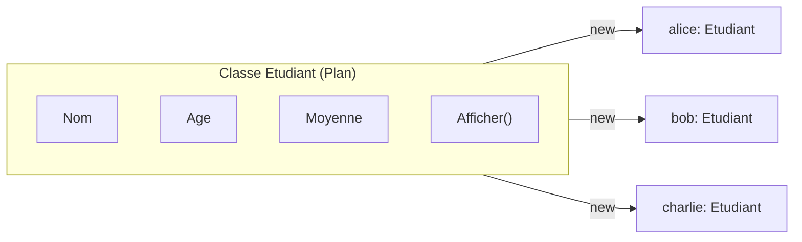
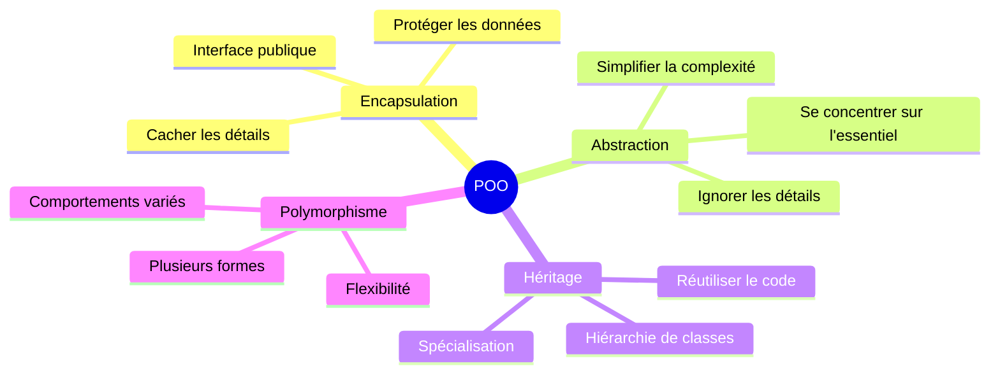

# Introduction à la Programmation Orientée Objet

## Du Procédural à l'Objet

Dans le cours précédent, vous avez appris à programmer de manière **procédurale** : vous avez écrit des fonctions qui manipulent des données stockées dans des variables séparées. Cette approche fonctionne bien pour des programmes simples, mais elle présente des limites lorsque la complexité augmente.

### L'approche procédurale

En programmation procédurale, les **données** (variables) et les **traitements** (fonctions) sont séparés :

```csharp
// Données séparées
string nomEtudiant = "Alice";
int ageEtudiant = 20;
double moyenneEtudiant = 15.5;

// Fonctions qui travaillent sur ces données
void AfficherEtudiant(string nom, int age, double moyenne)
{
    Console.WriteLine($"{nom}, {age} ans, moyenne: {moyenne}");
}

bool EstReussi(double moyenne)
{
    return moyenne >= 10;
}
```

**Problèmes de cette approche :**
- Les données liées à un même concept sont éparpillées
- Rien n'empêche de mélanger les données (passer l'âge d'un étudiant dans la fonction d'un autre)
- Difficile de maintenir la cohérence des données
- Le code devient difficile à gérer quand le nombre de "choses" augmente

### L'approche Objet

La programmation orientée objet (POO) propose de **regrouper les données et les comportements** au sein d'une même entité appelée **objet** :

```csharp
// Tout est regroupé dans une classe
class Etudiant
{
    // Données (attributs)
    public string Nom;
    public int Age;
    public double Moyenne;
    
    // Comportements (méthodes)
    public void Afficher()
    {
        Console.WriteLine($"{Nom}, {Age} ans, moyenne: {Moyenne}");
    }
    
    public bool EstReussi()
    {
        return Moyenne >= 10;
    }
}
```

::: tip Analogie
Pensez à un objet comme à une **boîte** qui contient à la fois ses caractéristiques (données) et sait faire des choses (comportements). Un téléphone est un objet : il a une marque, une couleur, un niveau de batterie (données), et il peut appeler, envoyer des SMS, prendre des photos (comportements).
:::

## Classe vs Objet

Il est crucial de distinguer ces deux concepts :

| Concept | Description | Analogie |
|---------|-------------|----------|
| **Classe** | Le plan de construction, le modèle | Plan d'architecte d'une maison |
| **Objet** | Une instance réelle créée à partir du plan | Une maison construite |



- Une **classe** est définie une seule fois dans le code
- On peut créer autant d'**objets** (instances) que nécessaire à partir de cette classe
- Chaque objet possède ses propres valeurs pour les attributs

## Vocabulaire essentiel

Avant d'aller plus loin, clarifions le vocabulaire que nous utiliserons :

| Terme | Définition |
|-------|------------|
| **Classe** | Modèle/plan qui définit la structure et le comportement des objets |
| **Objet** | Instance concrète d'une classe, créée en mémoire |
| **Instance** | Synonyme d'objet |
| **Instanciation** | Action de créer un objet à partir d'une classe |
| **Attribut/Champ** | Variable définie dans une classe (les données) |
| **Méthode** | Fonction définie dans une classe (les comportements) |
| **Membre** | Terme générique pour attribut ou méthode |

## Les piliers de l'OO

La programmation orientée objet repose sur quatre piliers fondamentaux :



Dans ce cours, nous aborderons ces quatre piliers fondamentaux de la programmation orientée objet.

### 1. Encapsulation

L'encapsulation consiste à **cacher les détails internes** d'un objet et à n'exposer qu'une interface publique contrôlée.

```csharp
class CompteBancaire
{
    private double _solde;  // Caché à l'extérieur
    
    public void Deposer(double montant)  // Interface publique
    {
        if (montant > 0)
            _solde += montant;
    }
    
    public double ObtenirSolde()  // Accès contrôlé
    {
        return _solde;
    }
}
```

**Avantages de l'encapsulation :**
- Protection des données contre les modifications non autorisées
- Possibilité de changer l'implémentation interne sans affecter le code utilisateur
- Validation des données avant modification

### 2. Abstraction

L'abstraction consiste à **simplifier la complexité** en se concentrant sur ce qui est important et en ignorant les détails.

```csharp
// L'utilisateur n'a pas besoin de savoir COMMENT ça fonctionne
voiture.Demarrer();  // Simple à utiliser
voiture.Accelerer(50);

// Il n'a pas besoin de connaître les détails du moteur, 
// de l'injection, de l'allumage...
```

::: tip Analogie
Quand vous utilisez une télécommande, vous appuyez sur un bouton pour changer de chaîne. Vous n'avez pas besoin de comprendre les signaux infrarouges ou le fonctionnement interne du téléviseur. C'est l'abstraction en action !
:::

### 3. Héritage

L'héritage permet à une classe de **réutiliser le code d'une autre classe** tout en ajoutant ses propres caractéristiques. C'est un mécanisme de **spécialisation** : on part d'un concept général pour créer des concepts plus spécifiques.

```csharp
// Classe de base
class Animal
{
    public string Nom;
    public void Manger() => Console.WriteLine($"{Nom} mange.");
}

// Classe dérivée - hérite de Animal
class Chien : Animal
{
    public string Race;
    public void Aboyer() => Console.WriteLine($"{Nom} aboie !");
}
```

```csharp
Chien rex = new Chien();
rex.Nom = "Rex";       // Hérité de Animal
rex.Race = "Berger";   // Propre à Chien
rex.Manger();          // "Rex mange." - méthode héritée
rex.Aboyer();          // "Rex aboie !" - méthode propre
```

::: info Pour aller plus loin
L'héritage est un sujet riche qui mérite un chapitre dédié. Consultez le chapitre [Héritage](/07-heritage) pour découvrir les constructeurs avec `base`, les niveaux d'accès `protected`, et bien plus encore.
:::

### 4. Polymorphisme

Le polymorphisme signifie littéralement "**plusieurs formes**". Il permet à un même code de se comporter différemment selon le type réel de l'objet.

```csharp
class Animal
{
    public string Nom;
    public virtual void Parler() => Console.WriteLine($"{Nom} fait du bruit.");
}

class Chien : Animal
{
    public override void Parler() => Console.WriteLine($"{Nom} aboie !");
}

class Chat : Animal
{
    public override void Parler() => Console.WriteLine($"{Nom} miaule !");
}
```

```csharp
// Un même code pour tous les types !
Animal[] animaux = { new Chien { Nom = "Rex" }, new Chat { Nom = "Minou" } };

foreach (Animal a in animaux)
    a.Parler();  // Le bon comportement est appelé automatiquement

// Rex aboie !
// Minou miaule !
```

::: info Pour aller plus loin
Le polymorphisme est un concept puissant avec de nombreuses applications. Consultez le chapitre [Polymorphisme](/08-polymorphisme) pour découvrir les classes abstraites, les interfaces, et les design patterns associés.
:::

## Premier exemple complet

Mettons tout cela en pratique avec un exemple complet :

```csharp
// Définition de la classe (le plan)
class Livre
{
    // Attributs (données)
    public string Titre;
    public string Auteur;
    public int NombrePages;
    public bool EstLu;
    
    // Méthodes (comportements)
    public void Afficher()
    {
        string statut = EstLu ? "Lu" : "Non lu";
        Console.WriteLine($"'{Titre}' par {Auteur} ({NombrePages} pages) - {statut}");
    }
    
    public void MarquerCommeLu()
    {
        EstLu = true;
        Console.WriteLine($"'{Titre}' a été marqué comme lu.");
    }
}
```

```csharp
// Utilisation de la classe (création d'objets)
Livre livre1 = new Livre();
livre1.Titre = "Le Petit Prince";
livre1.Auteur = "Antoine de Saint-Exupéry";
livre1.NombrePages = 96;
livre1.EstLu = false;

Livre livre2 = new Livre();
livre2.Titre = "1984";
livre2.Auteur = "George Orwell";
livre2.NombrePages = 328;
livre2.EstLu = true;

// Utilisation des méthodes
livre1.Afficher();  // 'Le Petit Prince' par Antoine de Saint-Exupéry (96 pages) - Non lu
livre2.Afficher();  // '1984' par George Orwell (328 pages) - Lu

livre1.MarquerCommeLu();  // 'Le Petit Prince' a été marqué comme lu.
livre1.Afficher();  // 'Le Petit Prince' par Antoine de Saint-Exupéry (96 pages) - Lu
```

## Avantages de l'OO

| Avantage | Description |
|----------|-------------|
| **Organisation** | Le code est mieux structuré, plus facile à naviguer |
| **Réutilisabilité** | Les classes peuvent être réutilisées dans différents projets |
| **Maintenabilité** | Les modifications sont localisées dans les classes concernées |
| **Modélisation** | Représentation naturelle des concepts du monde réel |
| **Collaboration** | Plusieurs développeurs peuvent travailler sur différentes classes |

## Exercice de réflexion

Identifiez les attributs et les méthodes que pourrait avoir chacune de ces classes :

1. `Voiture` - Quelles données caractérisent une voiture ? Que peut-elle faire ?
2. `Rectangle` - Quelles données ? Quelles actions ?
3. `CompteBancaire` - Quelles données ? Quelles opérations ?

::: details Solution possible
**Voiture**
- Attributs : marque, modèle, couleur, vitesseActuelle, niveauEssence
- Méthodes : Demarrer(), Arreter(), Accelerer(), Freiner(), FaireLePlein()

**Rectangle**
- Attributs : largeur, hauteur
- Méthodes : CalculerAire(), CalculerPerimetre(), Afficher()

**CompteBancaire**
- Attributs : numeroCompte, titulaire, solde
- Méthodes : Deposer(), Retirer(), ConsulterSolde(), AfficherHistorique()
:::

## Résumé

- La POO regroupe **données** et **comportements** dans des objets
- Une **classe** est un plan, un **objet** est une instance de ce plan
- Les quatre piliers de la POO :
  - L'**encapsulation** protège les données internes et expose une interface publique
  - L'**abstraction** simplifie l'utilisation des objets en cachant la complexité
  - L'**héritage** permet de réutiliser le code en créant des hiérarchies de classes
  - Le **polymorphisme** permet à un même code de se comporter différemment selon le type de l'objet
- Le passage du procédural à l'objet améliore l'organisation et la maintenabilité du code
