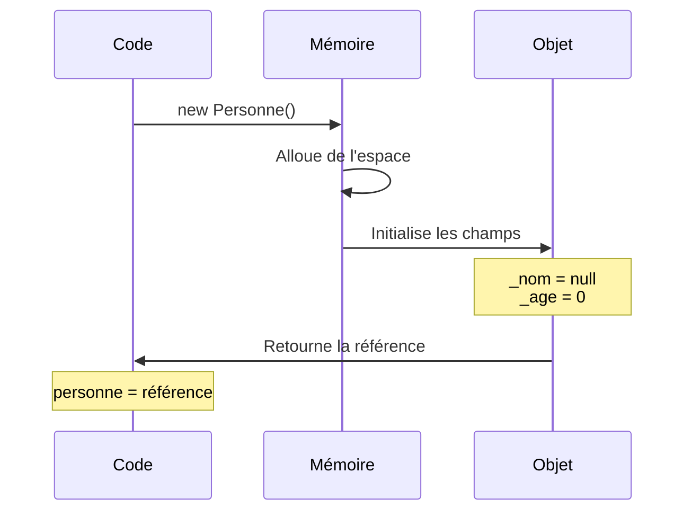

# Classes et Objets

## Introduction : Pourquoi les classes ?

Imaginez que vous êtes architecte et que vous devez construire 100 maisons similaires. Allez-vous dessiner 100 plans différents ? Non ! Vous allez créer **un seul plan** qui servira de modèle pour construire toutes les maisons.

En programmation, c'est exactement la même chose :
- **La classe** = le plan de l'architecte (le modèle, le "moule")
- **L'objet** = une maison construite à partir de ce plan (une instance concrète)

::: info Analogie du quotidien
Pensez à un emporte-pièce pour faire des biscuits :
- L'**emporte-pièce** (la forme en étoile) = la **classe**
- Chaque **biscuit** en forme d'étoile = un **objet** (une instance)

Tous les biscuits ont la même forme, mais chacun est unique (plus ou moins doré, avec des pépites différentes...).
:::

### Classe vs Objet : la différence fondamentale

| Concept | Définition | Exemple concret |
|---------|------------|-----------------|
| **Classe** | Un modèle, un plan, une description | Le plan d'une voiture |
| **Objet** | Une réalisation concrète de ce modèle | VOTRE voiture garée dehors |

```csharp
// La classe Voiture est le PLAN
class Voiture
{
    public string Marque;
    public string Couleur;
}

// Ces lignes créent des OBJETS (des voitures réelles)
Voiture maVoiture = new Voiture();      // Une première voiture
Voiture voitureDePapa = new Voiture();  // Une deuxième voiture
```

Dans cet exemple, nous avons **une seule classe** `Voiture` mais **deux objets** différents : `maVoiture` et `voitureDePapa`. Chaque voiture peut avoir sa propre marque et sa propre couleur.

## Anatomie d'une classe

Une classe en C# est composée de plusieurs éléments qui définissent sa structure et son comportement. Voyons cela étape par étape :

### Vue d'ensemble

```csharp
class NomDeLaClasse
{
    // 1. Champs (attributs) - les données
    private int _champPrive;
    public string ChampPublic;
    
    // 2. Constructeur(s) - initialisation
    public NomDeLaClasse()
    {
        // Code d'initialisation
    }
    
    // 3. Propriétés - accès contrôlé aux données
    public int MaPropriete { get; set; }
    
    // 4. Méthodes - les comportements
    public void FaireQuelqueChose()
    {
        // Code de la méthode
    }
}
```

::: tip Comprendre les 4 composants
Prenons l'exemple d'une **personne** :
1. **Champs** = ce que la personne **possède** (nom, âge, taille)
2. **Constructeur** = comment la personne **naît** (avec quelles informations initiales)
3. **Propriétés** = comment on **accède** aux informations de la personne
4. **Méthodes** = ce que la personne **sait faire** (marcher, parler, manger)
:::

## Les champs (attributs)

Les **champs** sont des variables définies au niveau de la classe. Ils représentent les **données** que chaque objet stockera. Ce sont les "caractéristiques" de vos objets.

::: info Analogie
Si votre classe représente un **étudiant**, les champs pourraient être :
- Son **nom** (texte)
- Son **âge** (nombre entier)
- Sa **moyenne** (nombre décimal)
- S'il est **inscrit** ou non (vrai/faux)

Chaque étudiant (chaque objet) aura ses propres valeurs pour ces champs.
:::

### Déclaration des champs

Voici comment déclarer des champs dans une classe :

```csharp
class Personne
{
    // Champs privés (convention : préfixe underscore)
    private string _nom;
    private int _age;
    private double _taille;
    
    // Champs publics (moins recommandé - nous verrons pourquoi)
    public string Nationalite;
}
```

**Décortiquons cette syntaxe :**

```csharp
private string _nom;
   │       │     └── Nom du champ (avec _ car privé)
   │       └──────── Type de donnée (texte)
   └──────────────── Modificateur d'accès (privé = caché)
```

::: tip Convention de nommage
En C#, les champs **privés** sont généralement préfixés par un underscore `_` et écrits en camelCase (`_monChamp`). Les champs **publics** utilisent le PascalCase (`MonChamp`), mais il est préférable d'utiliser des propriétés plutôt que des champs publics.
:::

### Privé vs Public : quelle différence ?

- **`private`** : Le champ n'est accessible QUE depuis l'intérieur de la classe
- **`public`** : Le champ est accessible de partout

```csharp
class Etudiant
{
    private string _motDePasse;  // Personne ne peut y accéder de l'extérieur
    public string Prenom;        // Tout le monde peut y accéder
}

// Ailleurs dans le code...
Etudiant etu = new Etudiant();
etu.Prenom = "Alice";        // ✅ OK, Prenom est public
etu._motDePasse = "1234";    // ❌ ERREUR ! _motDePasse est privé
```

::: warning Pourquoi utiliser private ?
Imaginez que `_motDePasse` soit public. N'importe quel code pourrait le lire ou le modifier ! En le rendant privé, vous **protégez** cette donnée sensible. C'est le principe d'**encapsulation** (nous approfondirons ce concept plus tard).
:::

### Types de champs

Les champs peuvent être de n'importe quel type. Voici les différentes catégories :

```csharp
class ExempleChamps
{
    // Types valeur (contiennent directement la donnée)
    private int _nombre;         // Nombre entier
    private double _prix;        // Nombre décimal
    private bool _estActif;      // Vrai ou faux
    private char _lettre;        // Un seul caractère
    
    // Types référence (contiennent une référence vers la donnée)
    private string _texte;       // Chaîne de caractères
    private int[] _tableau;      // Tableau de nombres
    private Personne _ami;       // Référence vers un autre objet !
    
    // Avec valeur par défaut (initialisation directe)
    private int _compteur = 0;
    private string _statut = "Nouveau";
}
```

::: info Un champ peut contenir un autre objet !
Remarquez le champ `_ami` de type `Personne`. Cela signifie qu'un objet peut **contenir une référence** vers un autre objet. C'est très puissant !

```csharp
class Personne
{
    private string _nom;
    private Personne _meilleurAmi;  // Une personne a un meilleur ami (qui est aussi une Personne)
}
```
:::

## Les méthodes

Les **méthodes** définissent les **comportements** de l'objet : ce qu'il peut faire. Si les champs sont les "caractéristiques", les méthodes sont les "actions".

::: info Analogie
Pour un **chien** :
- **Champs** (ce qu'il EST) : nom, race, âge, couleur
- **Méthodes** (ce qu'il FAIT) : aboyer, manger, dormir, courir

```csharp
class Chien
{
    // Ce que le chien EST (champs)
    private string _nom;
    private string _race;
    
    // Ce que le chien FAIT (méthodes)
    public void Aboyer()
    {
        Console.WriteLine("Wouf ! Wouf !");
    }
    
    public void Manger(string nourriture)
    {
        Console.WriteLine($"{_nom} mange {nourriture}");
    }
}
```
:::

### Structure d'une méthode

Une méthode se compose de plusieurs éléments :

```csharp
public int Additionner(int a, int b)
   │    │       │            └──────── Paramètres (données d'entrée)
   │    │       └───────────────────── Nom de la méthode
   │    └───────────────────────────── Type de retour (ce que la méthode renvoie)
   └────────────────────────────────── Modificateur d'accès
```

Voyons différents types de méthodes :

```csharp
class Calculatrice
{
    // Méthode sans retour (void) - elle FAIT quelque chose mais ne renvoie rien
    public void AfficherMessage(string message)
    {
        Console.WriteLine(message);
        // Pas de return nécessaire
    }
    
    // Méthode avec retour - elle CALCULE et RENVOIE un résultat
    public int Additionner(int a, int b)
    {
        return a + b;  // On renvoie le résultat
    }
    
    // Méthode qui utilise les champs de l'objet
    private double _dernierResultat;
    
    public double Multiplier(double a, double b)
    {
        _dernierResultat = a * b;  // On modifie un champ
        return _dernierResultat;   // Et on renvoie le résultat
    }
    
    public double ObtenirDernierResultat()
    {
        return _dernierResultat;  // On renvoie la valeur du champ
    }
}
```

::: tip void vs type de retour
- **`void`** = la méthode ne renvoie rien. Elle fait une action (afficher, modifier...)
- **`int`, `string`, etc.** = la méthode renvoie une valeur de ce type. Elle doit contenir `return valeur;`

```csharp
// void : "Fais quelque chose"
public void DireBonjour()
{
    Console.WriteLine("Bonjour !");
}

// int : "Calcule et donne-moi le résultat"
public int CalculerDouble(int nombre)
{
    return nombre * 2;
}
```
:::

### Appeler une méthode

Pour utiliser une méthode, on l'appelle sur un objet :

```csharp
Calculatrice calc = new Calculatrice();

// Appel d'une méthode void
calc.AfficherMessage("Bienvenue !");

// Appel d'une méthode qui retourne une valeur
int resultat = calc.Additionner(5, 3);
Console.WriteLine(resultat);  // Affiche : 8

// On peut aussi utiliser le résultat directement
Console.WriteLine(calc.Additionner(10, 20));  // Affiche : 30
```

### Méthodes qui modifient l'état de l'objet

Une méthode peut modifier les champs de l'objet. On dit qu'elle **modifie l'état** de l'objet.

```csharp
class CompteurClics
{
    private int _nombreClics = 0;  // L'état initial : 0 clic
    
    // Cette méthode MODIFIE l'état (incrémente le compteur)
    public void Cliquer()
    {
        _nombreClics++;
    }
    
    // Cette méthode MODIFIE l'état (remet à zéro)
    public void Reinitialiser()
    {
        _nombreClics = 0;
    }
    
    // Cette méthode LIT l'état (ne le modifie pas)
    public int ObtenirNombreClics()
    {
        return _nombreClics;
    }
}
```

**Exemple d'utilisation :**

```csharp
CompteurClics compteur = new CompteurClics();

Console.WriteLine(compteur.ObtenirNombreClics());  // 0

compteur.Cliquer();
compteur.Cliquer();
compteur.Cliquer();

Console.WriteLine(compteur.ObtenirNombreClics());  // 3

compteur.Reinitialiser();

Console.WriteLine(compteur.ObtenirNombreClics());  // 0
```

::: info L'objet "se souvient"
Remarquez que l'objet `compteur` garde en mémoire le nombre de clics entre les appels. C'est une différence fondamentale avec une simple fonction : **l'objet maintient son état**. Chaque objet a sa propre "mémoire".
:::

## L'opérateur `new`

L'opérateur `new` est utilisé pour **créer une instance** (un objet) d'une classe. Cette opération s'appelle l'**instanciation**.

::: info Analogie de la construction
- La classe `Maison` est le **plan** de l'architecte
- L'opérateur `new` correspond à **construire** la maison
- L'objet `maMaison` est la **maison construite**, prête à être habitée

```csharp
// Le plan existe (la classe Maison)
// Maintenant, construisons une vraie maison !
Maison maMaison = new Maison();
```
:::

### Syntaxe de base

Il existe plusieurs façons d'écrire l'instanciation :

```csharp
// Méthode 1 : Déclaration et instanciation séparées
Personne personne1;           // Déclaration : "Je vais avoir une Personne"
personne1 = new Personne();   // Instanciation : "Je la crée maintenant"

// Méthode 2 : Déclaration et instanciation en une ligne (le plus courant)
Personne personne2 = new Personne();

// Méthode 3 : Syntaxe moderne (C# 9+) - le compilateur déduit le type
Personne personne3 = new();  // Équivalent à new Personne()
```

::: warning Attention à la déclaration sans instanciation !
```csharp
Personne personne;  // Déclarée mais PAS créée !
personne.Nom = "Alice";  // ❌ ERREUR ! L'objet n'existe pas encore

// Il faut d'abord créer l'objet :
Personne personne = new Personne();  // Maintenant il existe
personne.Nom = "Alice";  // ✅ OK
```
:::

### Que se passe-t-il lors du `new` ?

Quand vous écrivez `new Personne()`, voici ce qui se passe en coulisses :



**Étape par étape :**

1. **Allocation** : De l'espace mémoire est réservé pour stocker l'objet
2. **Initialisation** : Les champs sont initialisés à leurs valeurs par défaut
3. **Construction** : Le constructeur est exécuté (nous verrons cela au chapitre suivant)
4. **Référence** : Une référence vers l'objet est retournée et stockée dans la variable

::: info La variable contient une référence, pas l'objet
La variable `personne` ne contient pas directement l'objet. Elle contient une **référence** (une sorte d'adresse) vers l'endroit en mémoire où se trouve l'objet.

C'est comme la différence entre :
- **L'adresse** de votre maison (la référence)
- **La maison** elle-même (l'objet)

Vous pouvez donner votre adresse à plusieurs personnes, mais il n'y a qu'une seule maison !
:::

### Valeurs par défaut

Quand un objet est créé, ses champs reçoivent automatiquement des valeurs par défaut si vous ne les initialisez pas explicitement :

| Type | Valeur par défaut | Exemple |
|------|-------------------|---------|
| `int`, `long`, `short`, `byte` | `0` | `_age` vaut `0` |
| `double`, `float`, `decimal` | `0.0` | `_prix` vaut `0.0` |
| `bool` | `false` | `_estActif` vaut `false` |
| `char` | `'\0'` | `_lettre` vaut le caractère nul |
| Types référence (`string`, objets) | `null` | `_nom` vaut `null` |

```csharp
class Demonstration
{
    public int Nombre;      // Sera 0
    public double Prix;     // Sera 0.0
    public bool Actif;      // Sera false
    public string Nom;      // Sera null (attention !)
}

Demonstration demo = new Demonstration();
Console.WriteLine(demo.Nombre);  // Affiche : 0
Console.WriteLine(demo.Actif);   // Affiche : False
Console.WriteLine(demo.Nom);     // Affiche : (rien - c'est null)
```

::: danger Attention à null !
`null` signifie "rien", "pas d'objet", "vide". Si vous essayez d'utiliser un champ qui vaut `null`, vous aurez une erreur :

```csharp
Demonstration demo = new Demonstration();
Console.WriteLine(demo.Nom.Length);  // ❌ ERREUR ! demo.Nom est null

// Il faut d'abord donner une valeur :
demo.Nom = "Test";
Console.WriteLine(demo.Nom.Length);  // ✅ Affiche : 4
```
:::

### Plusieurs objets de la même classe

Vous pouvez créer autant d'objets que vous voulez à partir d'une même classe. **Chaque objet est indépendant** :

```csharp
class Etudiant
{
    public string Nom;
    public int Age;
}

// Création de 3 étudiants différents
Etudiant etudiant1 = new Etudiant();
Etudiant etudiant2 = new Etudiant();
Etudiant etudiant3 = new Etudiant();

// Chaque étudiant a ses propres valeurs
etudiant1.Nom = "Alice";
etudiant1.Age = 20;

etudiant2.Nom = "Bob";
etudiant2.Age = 22;

etudiant3.Nom = "Charlie";
etudiant3.Age = 19;

// Modifier un étudiant n'affecte pas les autres
etudiant1.Age = 21;
Console.WriteLine(etudiant2.Age);  // Toujours 22 !
```

::: tip Visualisation en mémoire
```
┌─────────────────┐     ┌─────────────────┐     ┌─────────────────┐
│   etudiant1     │     │   etudiant2     │     │   etudiant3     │
├─────────────────┤     ├─────────────────┤     ├─────────────────┤
│ Nom = "Alice"   │     │ Nom = "Bob"     │     │ Nom = "Charlie" │
│ Age = 21        │     │ Age = 22        │     │ Age = 19        │
└─────────────────┘     └─────────────────┘     └─────────────────┘
        ▲                       ▲                       ▲
        │                       │                       │
   3 objets distincts, chacun avec ses propres valeurs
```
:::

## Le mot-clé `this`

Le mot-clé `this` fait référence à **l'instance actuelle** de l'objet. Autrement dit, `this` signifie "moi-même" pour l'objet.

::: info Analogie
Imaginez que vous êtes un robot et qu'on vous demande de lever "votre" bras. Le mot "votre" fait référence à vous-même, pas à un autre robot. En C#, `this` joue ce rôle : il désigne l'objet lui-même.
:::

### 1. Lever l'ambiguïté de nommage

Le cas le plus fréquent : quand un paramètre a le même nom qu'un champ :

```csharp
class Personne
{
    private string nom;
    private int age;
    
    public void Initialiser(string nom, int age)
    {
        // Problème : "nom" désigne le paramètre OU le champ ?
        // Solution : this.nom = le champ de l'objet, nom = le paramètre
        this.nom = nom;
        this.age = age;
    }
}
```

**Sans `this`, le code serait incorrect :**

```csharp
public void Initialiser(string nom, int age)
{
    nom = nom;  // ❌ On assigne le paramètre à lui-même ! Le champ reste inchangé.
}
```

::: tip Bonne pratique alternative
Si vous utilisez la convention du préfixe `_` pour les champs privés, l'ambiguïté est évitée et `this` devient optionnel :
```csharp
class Personne
{
    private string _nom;    // Le champ commence par _
    private int _age;
    
    public void Initialiser(string nom, int age)
    {
        _nom = nom;   // Pas d'ambiguïté : _nom ≠ nom
        _age = age;
    }
}
```
C'est pourquoi cette convention est très répandue !
:::

### 2. Passer l'objet courant à une autre méthode

Parfois, un objet doit se "donner lui-même" à un autre objet :

```csharp
class Joueur
{
    public string Nom { get; set; }
    
    public void RejoindreEquipe(Equipe equipe)
    {
        // Le joueur dit à l'équipe : "Ajoute-MOI à ta liste"
        // this = ce joueur-ci, celui qui appelle la méthode
        equipe.AjouterJoueur(this);
    }
}

class Equipe
{
    private List<Joueur> _joueurs = new List<Joueur>();
    
    public void AjouterJoueur(Joueur joueur)
    {
        _joueurs.Add(joueur);
        Console.WriteLine($"{joueur.Nom} a rejoint l'équipe !");
    }
}

// Utilisation
Joueur alice = new Joueur { Nom = "Alice" };
Equipe equipe = new Equipe();

alice.RejoindreEquipe(equipe);  // Alice s'ajoute elle-même à l'équipe
// Affiche : "Alice a rejoint l'équipe !"
```

::: info Explication
Dans `RejoindreEquipe`, quand on écrit `equipe.AjouterJoueur(this)`, on passe l'objet `alice` lui-même à la méthode `AjouterJoueur`. C'est comme si Alice disait : "Équipe, ajoute-moi !"
:::

### 3. Chaîner les appels de méthodes (Fluent Interface)

Une technique élégante : retourner `this` permet d'enchaîner les appels de méthodes.

```csharp
class ConfigurationEmail
{
    private string _destinataire;
    private string _sujet;
    private string _corps;
    
    public ConfigurationEmail DefinirDestinataire(string email)
    {
        _destinataire = email;
        return this;  // Retourne l'objet lui-même
    }
    
    public ConfigurationEmail DefinirSujet(string sujet)
    {
        _sujet = sujet;
        return this;  // Retourne l'objet lui-même
    }
    
    public ConfigurationEmail DefinirCorps(string corps)
    {
        _corps = corps;
        return this;  // Retourne l'objet lui-même
    }
    
    public void Envoyer()
    {
        Console.WriteLine($"Envoi à {_destinataire}: {_sujet}");
    }
}
```

**L'avantage : un code fluide et lisible !**

```csharp
// Utilisation fluide - on enchaîne les appels
new ConfigurationEmail()
    .DefinirDestinataire("alice@email.com")
    .DefinirSujet("Bonjour")
    .DefinirCorps("Comment ça va?")
    .Envoyer();
```

::: tip Comment ça marche ?
1. `new ConfigurationEmail()` crée un objet et le retourne
2. `.DefinirDestinataire(...)` modifie l'objet et retourne `this` (le même objet)
3. `.DefinirSujet(...)` modifie l'objet et retourne `this` (toujours le même objet)
4. Et ainsi de suite...

C'est comme passer un relais : chaque méthode fait son travail puis passe l'objet à la suivante.
:::

## Initialisation des objets

Nous avons vu comment créer un objet avec `new`. Maintenant, voyons comment **initialiser ses valeurs** facilement.

### Le problème

Créer un objet puis initialiser chaque champ un par un est fastidieux :

```csharp
class Produit
{
    public string Nom { get; set; }
    public double Prix { get; set; }
    public int Stock { get; set; }
}

// Méthode classique : verbose et répétitive
Produit p1 = new Produit();
p1.Nom = "Clavier";
p1.Prix = 49.99;
p1.Stock = 100;
// 4 lignes pour un seul objet... Imaginez pour 10 objets !
```

### La solution : l'initialiseur d'objet

C# propose une syntaxe plus concise pour initialiser les propriétés publiques lors de la création :

```csharp
// Avec initialiseur d'objet : tout en une seule instruction !
Produit p2 = new Produit
{
    Nom = "Souris",
    Prix = 29.99,
    Stock = 150
};

// Syntaxe encore plus courte (C# 9+)
Produit p3 = new()
{
    Nom = "Écran",
    Prix = 299.99,
    Stock = 25
};
```

::: info Comparaison côte à côte
```csharp
// AVANT (4 lignes)          // APRÈS (1 instruction)
Produit p = new Produit();   Produit p = new Produit
p.Nom = "Clavier";           {
p.Prix = 49.99;                  Nom = "Clavier",
p.Stock = 100;                   Prix = 49.99,
                                 Stock = 100
                             };
```
:::

::: warning Attention
L'initialiseur d'objet ne remplace pas le constructeur. Il s'exécute **après** le constructeur. Nous verrons les constructeurs en détail au chapitre suivant.
:::

## Exemple complet : Gestion de tâches

Maintenant que nous avons vu tous les concepts de base, mettons-les en pratique avec un exemple concret. Nous allons créer une classe `Tache` pour gérer une liste de tâches (comme une to-do list).

### Étape 1 : Identifier les besoins

Avant de coder, réfléchissons à ce qu'une tâche doit contenir :
- Un **titre** (obligatoire)
- Une **description** (optionnelle)
- Un **statut** (terminée ou non)
- Une **date de création** (automatique)
- Une **date de terminaison** (quand elle est terminée)

### Étape 2 : Traduire en classe

```csharp
class Tache
{
    // ═══════════════════════════════════════════════════════════
    // CHAMPS PRIVÉS - Les données de la tâche
    // ═══════════════════════════════════════════════════════════
    private string _titre;
    private string _description;
    private bool _estTerminee;
    private DateTime _dateCreation;
    private DateTime? _dateTerminaison;  // Le ? signifie "peut être null"
    
    // ═══════════════════════════════════════════════════════════
    // CONSTRUCTEUR - Comment créer une tâche
    // ═══════════════════════════════════════════════════════════
    public Tache(string titre)
    {
        _titre = titre;
        _description = "";
        _estTerminee = false;
        _dateCreation = DateTime.Now;  // Date et heure actuelles
        _dateTerminaison = null;       // Pas encore terminée
    }
    
    // ═══════════════════════════════════════════════════════════
    // MÉTHODES - Ce qu'on peut faire avec une tâche
    // ═══════════════════════════════════════════════════════════
    
    // Ajouter une description
    public void DefinirDescription(string description)
    {
        _description = description;
    }
    
    // Marquer comme terminée
    public void Terminer()
    {
        if (!_estTerminee)  // Seulement si pas déjà terminée
        {
            _estTerminee = true;
            _dateTerminaison = DateTime.Now;
        }
    }
    
    // Afficher la tâche de façon lisible
    public void Afficher()
    {
        string statut = _estTerminee ? "✓" : "○";
        Console.WriteLine($"[{statut}] {_titre}");
        
        if (!string.IsNullOrEmpty(_description))
        {
            Console.WriteLine($"    {_description}");
        }
        
        Console.WriteLine($"    Créée le: {_dateCreation:dd/MM/yyyy HH:mm}");
        
        if (_estTerminee && _dateTerminaison.HasValue)
        {
            Console.WriteLine($"    Terminée le: {_dateTerminaison:dd/MM/yyyy HH:mm}");
        }
    }
    
    // Vérifier si la tâche est terminée
    public bool EstTerminee()
    {
        return _estTerminee;
    }
}
```

### Étape 3 : Utiliser la classe

```csharp
// Création de deux tâches
Tache tache1 = new Tache("Faire les courses");
tache1.DefinirDescription("Acheter du lait, du pain et des œufs");

Tache tache2 = new Tache("Réviser le chapitre 2");
tache2.Terminer();  // On la marque comme terminée

// Affichage
Console.WriteLine("=== Liste des tâches ===");
tache1.Afficher();
Console.WriteLine();
tache2.Afficher();
```

### Résultat affiché
```
=== Liste des tâches ===
[○] Faire les courses
    Acheter du lait, du pain et des œufs
    Créée le: 17/12/2025 10:30

[✓] Réviser le chapitre 2
    Créée le: 17/12/2025 10:30
    Terminée le: 17/12/2025 10:30
```

::: tip Ce qu'il faut retenir de cet exemple
- La classe `Tache` **encapsule** toutes les données et comportements liés à une tâche
- Les champs sont **privés** : on ne peut pas modifier `_estTerminee` directement de l'extérieur
- Les méthodes sont **publiques** : elles forment l'interface d'utilisation de la classe
- Chaque objet `Tache` est **indépendant** : terminer `tache2` n'affecte pas `tache1`
:::

## Erreurs courantes à éviter

### 1. Oublier le `new`

```csharp
Personne p;
p.Nom = "Alice";  // ❌ ERREUR ! p n'a pas été créé avec new
```

**Solution :**
```csharp
Personne p = new Personne();
p.Nom = "Alice";  // ✅ OK
```

### 2. Confondre classe et objet

```csharp
// ❌ On ne peut pas faire ça :
Personne.Nom = "Alice";  // Personne est la classe, pas un objet !

// ✅ Il faut créer un objet d'abord :
Personne p = new Personne();
p.Nom = "Alice";
```

### 3. Accéder à un champ privé depuis l'extérieur

```csharp
class Personne
{
    private string _nom;
}

Personne p = new Personne();
p._nom = "Alice";  // ❌ ERREUR ! _nom est privé
```

**Solution :** Utiliser une méthode publique ou une propriété :
```csharp
class Personne
{
    private string _nom;
    
    public void DefinirNom(string nom)
    {
        _nom = nom;
    }
}

Personne p = new Personne();
p.DefinirNom("Alice");  // ✅ OK
```

## Exercices

### Exercice 1 : Classe Rectangle

**Objectif :** Pratiquer la création d'une classe simple avec des champs et des méthodes.

Créez une classe `Rectangle` avec :
- Deux champs privés `_largeur` et `_hauteur` (de type `double`)
- Une méthode `Initialiser(double largeur, double hauteur)` pour définir les dimensions
- Une méthode `CalculerAire()` qui retourne l'aire (largeur × hauteur)
- Une méthode `CalculerPerimetre()` qui retourne le périmètre (2 × largeur + 2 × hauteur)
- Une méthode `Afficher()` qui affiche les dimensions et l'aire

**Résultat attendu :**
```csharp
Rectangle rect = new Rectangle();
rect.Initialiser(5.0, 3.0);
rect.Afficher();
// Affiche :
// Rectangle: 5 x 3
// Aire: 15
// Périmètre: 16
```

::: details Solution
```csharp
class Rectangle
{
    private double _largeur;
    private double _hauteur;
    
    public void Initialiser(double largeur, double hauteur)
    {
        _largeur = largeur;
        _hauteur = hauteur;
    }
    
    public double CalculerAire()
    {
        return _largeur * _hauteur;
    }
    
    public double CalculerPerimetre()
    {
        return 2 * _largeur + 2 * _hauteur;
    }
    
    public void Afficher()
    {
        Console.WriteLine($"Rectangle: {_largeur} x {_hauteur}");
        Console.WriteLine($"Aire: {CalculerAire()}");
        Console.WriteLine($"Périmètre: {CalculerPerimetre()}");
    }
}
```
:::

### Exercice 2 : Classe CompteBancaire

**Objectif :** Pratiquer les méthodes qui modifient l'état de l'objet.

Créez une classe `CompteBancaire` avec :
- Un champ privé `_solde` (de type `decimal`, initialisé à 0)
- Un champ privé `_titulaire` (de type `string`)
- Une méthode `Ouvrir(string titulaire)` pour définir le titulaire
- Une méthode `Deposer(decimal montant)` pour ajouter de l'argent
- Une méthode `Retirer(decimal montant)` qui retire de l'argent seulement si le solde est suffisant
- Une méthode `AfficherSolde()` qui affiche le solde

**Résultat attendu :**
```csharp
CompteBancaire compte = new CompteBancaire();
compte.Ouvrir("Alice Dupont");
compte.Deposer(1000);
compte.Retirer(300);
compte.AfficherSolde();  // Affiche : Solde de Alice Dupont : 700 €
compte.Retirer(1000);     // Affiche : Retrait refusé, solde insuffisant
```

::: details Solution
```csharp
class CompteBancaire
{
    private decimal _solde = 0;
    private string _titulaire;
    
    public void Ouvrir(string titulaire)
    {
        _titulaire = titulaire;
    }
    
    public void Deposer(decimal montant)
    {
        if (montant > 0)
        {
            _solde += montant;
        }
    }
    
    public void Retirer(decimal montant)
    {
        if (montant > _solde)
        {
            Console.WriteLine("Retrait refusé, solde insuffisant");
        }
        else
        {
            _solde -= montant;
        }
    }
    
    public void AfficherSolde()
    {
        Console.WriteLine($"Solde de {_titulaire} : {_solde} €");
    }
}
```
:::

### Exercice 3 : Classe Chronometre

**Objectif :** Travailler avec `DateTime` et les états d'un objet.

Créez une classe `Chronometre` avec :
- Des champs pour stocker le temps de départ et si le chronomètre est en marche
- Une méthode `Demarrer()` qui démarre le chronomètre
- Une méthode `Arreter()` qui arrête le chronomètre
- Une méthode `Reinitialiser()` qui remet tout à zéro
- Une méthode `ObtenirTempsEcoule()` qui retourne le temps en secondes

::: details Indice
Utilisez `DateTime.Now` pour obtenir l'heure actuelle et calculez la différence entre deux `DateTime` avec `.TotalSeconds`.
```csharp
DateTime debut = DateTime.Now;
// ... du temps passe ...
DateTime fin = DateTime.Now;
double secondes = (fin - debut).TotalSeconds;
```
:::

## Résumé

Voici les concepts clés de ce chapitre :

| Concept | Description | Exemple |
|---------|-------------|---------|
| **Classe** | Le modèle/plan pour créer des objets | `class Voiture { }` |
| **Objet** | Une instance concrète d'une classe | `Voiture maVoiture = new Voiture();` |
| **Champs** | Variables internes (les données) | `private string _nom;` |
| **Méthodes** | Fonctions internes (les comportements) | `public void Rouler() { }` |
| **`new`** | Opérateur pour créer une instance | `new Personne()` |
| **`this`** | Référence à l'objet lui-même | `this.nom = nom;` |
| **Initialiseur** | Syntaxe raccourcie pour initialiser | `new Produit { Nom = "X" }` |

::: tip Points essentiels à retenir
1. **Une classe = un plan**, un objet = une réalisation concrète
2. Les **champs** stockent les données, les **méthodes** définissent les actions
3. Utilisez **`private`** pour protéger vos données
4. **`new`** est obligatoire pour créer un objet
5. Chaque objet est **indépendant** : modifier un n'affecte pas les autres
:::
