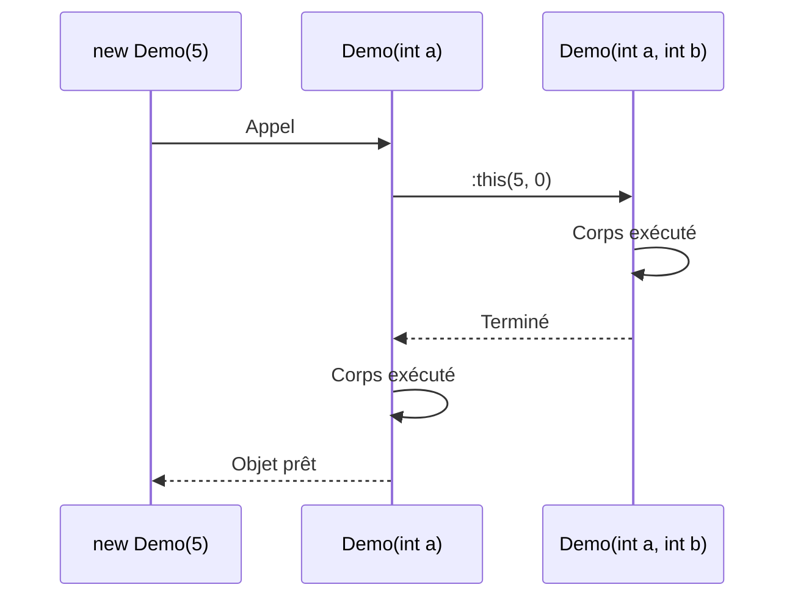

# Les Constructeurs

## Introduction : Pourquoi les constructeurs ?

Imaginons que vous achetez un nouveau smartphone. Dès que vous l'allumez pour la première fois, il vous demande de configurer certaines choses : votre langue, votre compte, votre code PIN... C'est la **configuration initiale** sans laquelle le téléphone ne peut pas fonctionner correctement.

En programmation orientée objet, le **constructeur** joue exactement ce rôle : c'est le code qui s'exécute automatiquement quand un objet "naît" pour le configurer correctement.

::: info Analogie
Pensez à la **naissance d'un bébé** :
- Le bébé reçoit immédiatement un **nom** (obligatoire pour l'état civil)
- On note sa **date de naissance** (automatique)
- On enregistre le nom des **parents** (informations initiales)

Le constructeur fait la même chose : il définit les informations initiales indispensables pour que l'objet existe.
:::

## Rôle du constructeur

Un **constructeur** est une méthode spéciale qui est automatiquement appelée lors de la création d'un objet avec `new`. Son rôle principal est d'**initialiser l'état de l'objet** de manière cohérente.

### Caractéristiques d'un constructeur

Voici ce qui distingue un constructeur d'une méthode normale :

| Caractéristique | Explication |
|-----------------|-------------|
| **Même nom que la classe** | Si la classe s'appelle `Voiture`, le constructeur s'appelle `Voiture` |
| **Pas de type de retour** | Même pas `void` ! C'est ce qui le différencie d'une méthode |
| **Appelé automatiquement** | Dès qu'on écrit `new`, le constructeur s'exécute |
| **Peut avoir des paramètres** | Pour recevoir les informations initiales |
| **Plusieurs constructeurs possibles** | Différentes façons de créer l'objet |

### Anatomie d'un constructeur

```csharp
public Personne(string nom, int age)
   │      │           └──────────────── Paramètres (données d'entrée)
   │      └──────────────────────────── Nom = celui de la classe
   └─────────────────────────────────── Modificateur d'accès (pas de type de retour !)
```

### Exemple simple

```csharp
class Personne
{
    private string _nom;
    private int _age;
    
    // Le constructeur : même nom que la classe, pas de type de retour
    public Personne(string nom, int age)
    {
        _nom = nom;   // On initialise les champs
        _age = age;   // avec les valeurs reçues
    }
}

// Utilisation : le constructeur est appelé automatiquement
Personne p = new Personne("Alice", 25);
//             └── new déclenche l'appel du constructeur
```

::: tip Ce qui se passe lors du `new Personne("Alice", 25)`
1. L'espace mémoire pour l'objet est alloué
2. Le constructeur `Personne(string nom, int age)` est appelé avec `"Alice"` et `25`
3. Les champs `_nom` et `_age` sont initialisés
4. L'objet est prêt à être utilisé
:::

## Constructeur par défaut

### Le constructeur "invisible"

Si vous ne définissez **aucun constructeur**, C# vous fait une faveur : il génère automatiquement un **constructeur par défaut** (sans paramètres) :

```csharp
class Animal
{
    public string Nom;
    public int Age;
    
    // Vous n'avez rien écrit...
    // Mais C# a créé secrètement ceci :
    // public Animal() { }
}

// Du coup, ceci fonctionne :
Animal chat = new Animal();  // ✅ OK : le constructeur par défaut existe
```

::: info Pourquoi ce comportement ?
C'est pour vous simplifier la vie quand vous créez des classes simples. Sans ce mécanisme, vous seriez obligé d'écrire un constructeur vide dans chaque classe, même quand vous n'en avez pas besoin.
:::

### Le piège : le constructeur par défaut disparaît !

::: danger Attention - Piège fréquent chez les débutants
Dès que vous définissez **un seul** constructeur (même avec paramètres), le constructeur par défaut **n'est plus généré automatiquement** :

```csharp
class Animal
{
    public string Nom;
    
    // Vous avez ajouté CE constructeur
    public Animal(string nom)
    {
        Nom = nom;
    }
}

// Maintenant...
Animal chat = new Animal();        // ❌ ERREUR ! Plus de constructeur sans paramètre !
Animal chien = new Animal("Rex");  // ✅ OK
```

**Le message d'erreur sera :** `'Animal' does not contain a constructor that takes 0 arguments`
:::

### Solution : redéfinir le constructeur par défaut

Si vous voulez les deux possibilités (avec et sans paramètres), vous devez définir les deux constructeurs :

```csharp
class Animal
{
    public string Nom;
    
    // Constructeur sans paramètre (vous le redéfinissez explicitement)
    public Animal()
    {
        Nom = "Sans nom";
    }
    
    // Constructeur avec paramètre
    public Animal(string nom)
    {
        Nom = nom;
    }
}

// Maintenant les deux fonctionnent :
Animal chat = new Animal();        // ✅ OK : utilise le constructeur sans paramètre
Animal chien = new Animal("Rex");  // ✅ OK : utilise le constructeur avec paramètre
```

## Surcharge de constructeurs

### Le concept de surcharge

La **surcharge** (overloading) permet d'avoir **plusieurs constructeurs** dans la même classe, à condition qu'ils aient des **signatures différentes** (nombre ou types de paramètres différents).

::: info Analogie du restaurant
Imaginons un restaurant qui propose un menu :
- **Menu simple** : juste le plat principal (10€)
- **Menu complet** : entrée + plat + dessert (18€)
- **Menu gastronomique** : entrée + plat + fromage + dessert + café (25€)

C'est le même concept en programmation : différentes façons de "commander" (créer) un objet selon les informations disponibles.
:::

### Exemple : plusieurs façons de créer un livre

```csharp
class Livre
{
    private string _titre;
    private string _auteur;
    private int _annee;
    private int _nbPages;
    
    // Constructeur minimal : juste le titre
    public Livre(string titre)
    {
        _titre = titre;
        _auteur = "Inconnu";
        _annee = 0;
        _nbPages = 0;
    }
    
    // Constructeur intermédiaire : titre + auteur
    public Livre(string titre, string auteur)
    {
        _titre = titre;
        _auteur = auteur;
        _annee = 0;
        _nbPages = 0;
    }
    
    // Constructeur complet : toutes les informations
    public Livre(string titre, string auteur, int annee, int nbPages)
    {
        _titre = titre;
        _auteur = auteur;
        _annee = annee;
        _nbPages = nbPages;
    }
}
```

### Utilisation : le compilateur choisit le bon constructeur

```csharp
// Je connais juste le titre
Livre l1 = new Livre("1984");
// → Appelle Livre(string titre)

// Je connais le titre et l'auteur
Livre l2 = new Livre("1984", "George Orwell");
// → Appelle Livre(string titre, string auteur)

// Je connais tout
Livre l3 = new Livre("1984", "George Orwell", 1949, 328);
// → Appelle Livre(string titre, string auteur, int annee, int nbPages)
```

::: tip Comment le compilateur choisit-il ?
Le compilateur regarde le **nombre** et le **type** des arguments que vous passez, puis trouve le constructeur correspondant. S'il n'en trouve pas, vous aurez une erreur de compilation.
:::

### Le problème : la duplication de code

Avez-vous remarqué ? Dans chaque constructeur, on répète les mêmes lignes :
```csharp
_titre = titre;
_auteur = ...
```

Si demain on ajoute un nouveau champ ou on change la logique d'initialisation, il faudra modifier **tous** les constructeurs. C'est source d'erreurs ! La solution : le **chaînage de constructeurs**.

## Chaînage de constructeurs (`: this()`)

### Le problème résolu

Le chaînage permet à un constructeur d'**appeler un autre constructeur** de la même classe. Ainsi, la logique d'initialisation n'est écrite qu'une seule fois !

::: info Analogie
Pensez à une chaîne de montage dans une usine :
- Le poste final assemble tout
- Les autres postes préparent les pièces puis passent le relais au poste final

De même, le constructeur "complet" fait tout le travail, les autres lui passent juste les informations.
:::

### La syntaxe `: this(...)`

```csharp
public Livre(string titre) : this(titre, "Inconnu", 0, 0)
                           └────────────────────────────────
                           "Appelle d'abord l'autre constructeur avec ces valeurs"
```

### Exemple complet

```csharp
class Livre
{
    private string _titre;
    private string _auteur;
    private int _annee;
    private int _nbPages;
    
    // ═══════════════════════════════════════════════════════════
    // CONSTRUCTEUR PRINCIPAL : le seul qui fait vraiment le travail
    // ═══════════════════════════════════════════════════════════
    public Livre(string titre, string auteur, int annee, int nbPages)
    {
        _titre = titre;
        _auteur = auteur;
        _annee = annee;
        _nbPages = nbPages;
        Console.WriteLine($"Livre créé : {_titre}");
    }
    
    // ═══════════════════════════════════════════════════════════
    // CONSTRUCTEURS SECONDAIRES : ils délèguent au principal
    // ═══════════════════════════════════════════════════════════
    
    // Constructeur avec titre + auteur → délègue au principal
    public Livre(string titre, string auteur)
        : this(titre, auteur, 0, 0)  // Appelle le constructeur principal
    {
        // Le corps peut être vide ou contenir du code additionnel
    }
    
    // Constructeur minimal → délègue aussi au principal
    public Livre(string titre)
        : this(titre, "Inconnu", 0, 0)
    {
        // Vide : tout le travail est fait par le constructeur principal
    }
}
```

```mermaid
flowchart TD
    A["new Livre(\"1984\")"] --> B["Livre(string titre)"]
    B -->|":this(...)"| C["Livre(string, string, int, int)"]
    C --> D["Objet créé et initialisé"]
    
    E["new Livre(\"1984\", \"Orwell\")"] --> F["Livre(string, string)"]
    F -->|":this(...)"| C
```

::: tip Bonne pratique
- Identifiez le constructeur **le plus complet** comme constructeur principal
- Les autres constructeurs **délèguent** au principal avec `: this(...)`
- Le code d'initialisation n'est écrit qu'**une seule fois**
:::

## Ordre d'exécution

Quand on utilise le chaînage, l'ordre d'exécution peut être surprenant. Regardons de près :

### Expérience : qui s'exécute en premier ?

```csharp
class Demo
{
    public Demo(int a, int b)
    {
        Console.WriteLine($"1. Constructeur principal: a={a}, b={b}");
    }
    
    public Demo(int a) : this(a, 0)
    {
        Console.WriteLine("2. Constructeur secondaire");
    }
}

Demo d = new Demo(5);
```

**Question :** Quel est l'ordre d'affichage ?

::: details Cliquez pour voir la réponse
```
1. Constructeur principal: a=5, b=0
2. Constructeur secondaire
```

**Explication :** Le constructeur chaîné (principal) s'exécute **AVANT** le corps du constructeur appelant !
:::

::: warning Règle à retenir
L'ordre d'exécution est :
1. **D'abord** le constructeur appelé via `: this(...)`
2. **Ensuite** le corps `{ }` du constructeur secondaire

C'est logique : on construit les fondations avant d'ajouter les finitions.
:::

### Visualisation



## Validation dans le constructeur

### Pourquoi valider ?

Le constructeur est le **gardien** de votre objet. C'est le moment idéal pour vérifier que les données sont valides et que l'objet est créé dans un état cohérent.

::: info Analogie
Imaginons un videur à l'entrée d'une boîte de nuit :
- Il vérifie que vous avez l'âge légal
- Il vérifie que vous êtes correctement habillé
- Si tout est OK, vous entrez. Sinon, vous êtes refusé.

Le constructeur fait pareil : il vérifie les données et refuse de créer l'objet si elles sont invalides.
:::

### Exemple : compte bancaire avec validation

```csharp
class CompteBancaire
{
    private string _titulaire;
    private double _soldeInitial;
    
    public CompteBancaire(string titulaire, double soldeInitial)
    {
        // ═══ VALIDATION DU TITULAIRE ═══
        if (string.IsNullOrWhiteSpace(titulaire))
        {
            throw new ArgumentException("Le titulaire ne peut pas être vide");
        }
        
        // ═══ VALIDATION DU SOLDE ═══
        if (soldeInitial < 0)
        {
            throw new ArgumentException("Le solde initial ne peut pas être négatif");
        }
        
        // ═══ SI TOUT EST OK, ON INITIALISE ═══
        _titulaire = titulaire;
        _soldeInitial = soldeInitial;
    }
}
```

### Gérer les erreurs de validation

Quand la validation échoue, on lance une **exception**. Le code appelant doit la gérer :

```csharp
try
{
    // Tentative de créer un compte avec un titulaire vide
    CompteBancaire compte = new CompteBancaire("", 100);
}
catch (ArgumentException ex)
{
    Console.WriteLine($"❌ Erreur : {ex.Message}");
    // Affiche : ❌ Erreur : Le titulaire ne peut pas être vide
}

try
{
    // Tentative de créer un compte avec un solde négatif
    CompteBancaire compte = new CompteBancaire("Alice", -500);
}
catch (ArgumentException ex)
{
    Console.WriteLine($"❌ Erreur : {ex.Message}");
    // Affiche : ❌ Erreur : Le solde initial ne peut pas être négatif
}

// Création correcte
CompteBancaire monCompte = new CompteBancaire("Alice", 1000);  // ✅ OK
```

::: tip Bonne pratique
Validez toujours dans le constructeur :
- Les valeurs **obligatoires** (non nulles, non vides)
- Les **plages de valeurs** (positif, entre X et Y...)
- La **cohérence** entre les champs (date de fin > date de début...)

Ainsi, un objet qui existe est **toujours valide** !
:::

## Constructeur avec `required` (C# 11+)

### Une alternative moderne à la validation

C# 11 introduit le mot-clé `required` pour forcer l'initialisation de certaines propriétés **à la compilation**, sans écrire de validation manuelle.

```csharp
class Produit
{
    public required string Nom { get; set; }      // Obligatoire
    public required double Prix { get; set; }     // Obligatoire
    public string? Description { get; set; }      // Optionnel (le ? l'indique)
}
```

### Utilisation

```csharp
// ✅ Correct : Nom et Prix sont fournis
Produit p = new Produit
{
    Nom = "Clavier",
    Prix = 49.99
    // Description est optionnel, on peut l'omettre
};

// ❌ Erreur de COMPILATION (pas d'exécution !)
Produit p2 = new Produit
{
    Description = "Un produit"
    // Le compilateur refuse : Nom et Prix manquent !
};
```

::: tip Avantage de `required`
L'erreur est détectée **à la compilation**, pas à l'exécution. C'est plus sûr car vous ne pouvez pas oublier d'initialiser ces propriétés.
:::

## Initialisation des champs

Il existe plusieurs façons d'initialiser les champs d'une classe. Voyons-les une par une :

### Les 3 méthodes d'initialisation

```csharp
class Exemple
{
    // ═══ MÉTHODE 1 : Valeur par défaut (automatique) ═══
    private int _compteur;  // Vaut 0 automatiquement
    private string _nom;    // Vaut null automatiquement
    
    // ═══ MÉTHODE 2 : Initialisation à la déclaration ═══
    private string _statut = "Actif";
    private List<string> _liste = new List<string>();
    
    // ═══ MÉTHODE 3 : Initialisation dans le constructeur ═══
    private DateTime _dateCreation;
    
    public Exemple()
    {
        _dateCreation = DateTime.Now;  // Valeur dynamique
    }
}
```

### Quand utiliser quelle méthode ?

| Méthode | Utilisez quand... | Exemple |
|---------|-------------------|---------|
| Valeur par défaut | La valeur 0, null, false vous convient | `private int _compteur;` |
| À la déclaration | La valeur est fixe et connue d'avance | `private string _statut = "Nouveau";` |
| Dans le constructeur | La valeur dépend des paramètres ou est dynamique | `_dateCreation = DateTime.Now;` |

### Ordre d'initialisation (important !)

Quand un objet est créé, voici l'ordre exact des opérations :

```
1. Champs → valeur par défaut (0, null, false...)
   ↓
2. Champs → initialisation déclarée (= ...)
   ↓
3. Constructeur chaîné (: this(...))
   ↓
4. Corps du constructeur { ... }
```

::: info Exemple concret
```csharp
class Demo
{
    private int _a;           // 1. Devient 0
    private int _b = 5;       // 2. Devient 5
    
    public Demo() : this(10)  // 3. Appelle l'autre constructeur
    {
        // 4. S'exécute en dernier
    }
    
    public Demo(int x)
    {
        _a = x;  // _a passe de 0 à 10
    }
}
```
:::

## Exemple complet : Classe Étudiant

Mettons en pratique tous les concepts avec un exemple réaliste et commenté :

### Objectif

Créer une classe `Etudiant` qui :
- Génère automatiquement un ID unique
- Valide les données obligatoires
- Propose plusieurs façons de créer un étudiant
- Génère automatiquement l'email si non fourni

### Le code complet

```csharp
class Etudiant
{
    // ════════════════════════════════════════════════════════════════
    // CHAMPS STATIQUES - Partagés par tous les étudiants
    // ════════════════════════════════════════════════════════════════
    private static int _prochainId = 1;  // Compteur pour générer les IDs
    
    // ════════════════════════════════════════════════════════════════
    // CHAMPS D'INSTANCE - Propres à chaque étudiant
    // ════════════════════════════════════════════════════════════════
    private int _id;
    private string _nom;
    private string _prenom;
    private DateTime _dateNaissance;
    private string _email;
    
    // ════════════════════════════════════════════════════════════════
    // CONSTRUCTEUR PRINCIPAL - Fait tout le travail
    // ════════════════════════════════════════════════════════════════
    public Etudiant(string nom, string prenom, DateTime dateNaissance, string email)
    {
        // --- Validation ---
        if (string.IsNullOrWhiteSpace(nom))
            throw new ArgumentException("Le nom est obligatoire");
        if (string.IsNullOrWhiteSpace(prenom))
            throw new ArgumentException("Le prénom est obligatoire");
        if (dateNaissance > DateTime.Now)
            throw new ArgumentException("La date de naissance ne peut pas être dans le futur");
        
        // --- Initialisation ---
        _id = _prochainId++;  // Génère un ID et incrémente le compteur
        _nom = nom;
        _prenom = prenom;
        _dateNaissance = dateNaissance;
        // Si email est null, on le génère automatiquement
        _email = email ?? $"{prenom.ToLower()}.{nom.ToLower()}@helha.be";
    }
    
    // ════════════════════════════════════════════════════════════════
    // CONSTRUCTEURS SECONDAIRES - Délèguent au principal
    // ════════════════════════════════════════════════════════════════
    
    // Sans email → génération automatique
    public Etudiant(string nom, string prenom, DateTime dateNaissance)
        : this(nom, prenom, dateNaissance, null)
    {
    }
    
    // Minimal → juste nom et prénom
    public Etudiant(string nom, string prenom)
        : this(nom, prenom, DateTime.MinValue, null)
    {
    }
    
    // ════════════════════════════════════════════════════════════════
    // MÉTHODES
    // ════════════════════════════════════════════════════════════════
    public void Afficher()
    {
        Console.WriteLine($"[{_id}] {_prenom} {_nom}");
        if (_dateNaissance != DateTime.MinValue)
        {
            int age = DateTime.Now.Year - _dateNaissance.Year;
            Console.WriteLine($"    Né(e) le {_dateNaissance:dd/MM/yyyy} ({age} ans)");
        }
        Console.WriteLine($"    Email: {_email}");
    }
}
```

### Utilisation

```csharp
// Différentes façons de créer des étudiants
Etudiant e1 = new Etudiant("Dupont", "Marie", new DateTime(2003, 5, 15));
Etudiant e2 = new Etudiant("Martin", "Jean", new DateTime(2002, 8, 20), "jean.martin@gmail.com");
Etudiant e3 = new Etudiant("Durand", "Sophie");

e1.Afficher();
Console.WriteLine();
e2.Afficher();
Console.WriteLine();
e3.Afficher();
```

### Résultat

```
[1] Marie Dupont
    Né(e) le 15/05/2003 (22 ans)
    Email: marie.dupont@helha.be

[2] Jean Martin
    Né(e) le 20/08/2002 (23 ans)
    Email: jean.martin@gmail.com

[3] Sophie Durand
    Email: sophie.durand@helha.be
```

::: tip Ce qu'il faut retenir de cet exemple
1. **Un seul constructeur principal** contient toute la logique
2. **Les autres constructeurs délèguent** avec `: this(...)`
3. **La validation** empêche la création d'objets invalides
4. **L'opérateur `??`** permet de fournir une valeur par défaut
5. **Le compteur statique** génère des IDs uniques pour chaque étudiant
:::

## Erreurs courantes à éviter

### 1. Oublier que le constructeur par défaut disparaît

```csharp
class Animal
{
    public Animal(string nom) { }
}

Animal a = new Animal();  // ❌ ERREUR !
```

**Solution :** Ajoutez explicitement un constructeur sans paramètre si vous en avez besoin.

### 2. Duplication de code entre constructeurs

```csharp
// ❌ MAUVAIS : code dupliqué
public Livre(string titre)
{
    _titre = titre;
    _auteur = "Inconnu";
    _dateCreation = DateTime.Now;  // Dupliqué !
}

public Livre(string titre, string auteur)
{
    _titre = titre;
    _auteur = auteur;
    _dateCreation = DateTime.Now;  // Dupliqué !
}
```

**Solution :** Utilisez le chaînage `: this(...)`.

### 3. Ne pas valider les données

```csharp
// ❌ MAUVAIS : pas de validation
public Personne(int age)
{
    _age = age;  // Et si age = -5 ?
}
```

**Solution :** Validez et lancez une exception si les données sont invalides.

## Exercices

### Exercice 1 : Classe Voiture

**Objectif :** Pratiquer la surcharge et le chaînage de constructeurs.

Créez une classe `Voiture` avec :
- Champs : `_marque`, `_modele`, `_annee`, `_kilometrage`
- Constructeur complet (4 paramètres)
- Constructeur sans kilométrage (défaut = 0 km)
- Constructeur avec marque et modèle seulement (année = année actuelle, km = 0)
- **Utilisez le chaînage de constructeurs !**

**Résultat attendu :**
```csharp
Voiture v1 = new Voiture("Peugeot", "208", 2020, 45000);
Voiture v2 = new Voiture("Renault", "Clio", 2022);  // km = 0
Voiture v3 = new Voiture("Toyota", "Yaris");        // 2025, km = 0
```

::: details Solution
```csharp
class Voiture
{
    private string _marque;
    private string _modele;
    private int _annee;
    private int _kilometrage;
    
    // Constructeur principal
    public Voiture(string marque, string modele, int annee, int kilometrage)
    {
        _marque = marque;
        _modele = modele;
        _annee = annee;
        _kilometrage = kilometrage;
    }
    
    // Sans kilométrage
    public Voiture(string marque, string modele, int annee)
        : this(marque, modele, annee, 0)
    {
    }
    
    // Juste marque et modèle
    public Voiture(string marque, string modele)
        : this(marque, modele, DateTime.Now.Year, 0)
    {
    }
}
```
:::

### Exercice 2 : Classe Article

**Objectif :** Pratiquer la validation et l'auto-génération de valeurs.

Créez une classe `Article` pour un blog avec :
- Champs : `_id` (auto-incrémenté), `_titre`, `_contenu`, `_auteur`, `_datePublication`
- Validation : titre et contenu obligatoires (non vides)
- La date de publication est automatiquement définie à `DateTime.Now`
- L'ID est automatiquement généré (1, 2, 3...)

::: details Solution
```csharp
class Article
{
    private static int _prochainId = 1;
    
    private int _id;
    private string _titre;
    private string _contenu;
    private string _auteur;
    private DateTime _datePublication;
    
    public Article(string titre, string contenu, string auteur)
    {
        if (string.IsNullOrWhiteSpace(titre))
            throw new ArgumentException("Le titre est obligatoire");
        if (string.IsNullOrWhiteSpace(contenu))
            throw new ArgumentException("Le contenu est obligatoire");
        
        _id = _prochainId++;
        _titre = titre;
        _contenu = contenu;
        _auteur = auteur ?? "Anonyme";
        _datePublication = DateTime.Now;
    }
    
    public Article(string titre, string contenu)
        : this(titre, contenu, null)
    {
    }
}
```
:::

## Résumé

| Concept | Description | Exemple |
|---------|-------------|---------|
| **Constructeur** | Méthode spéciale pour initialiser l'objet | `public Personne(string nom)` |
| **Constructeur par défaut** | Généré automatiquement si aucun constructeur n'est défini | `public Personne() { }` |
| **Surcharge** | Plusieurs constructeurs avec signatures différentes | `Livre(string)`, `Livre(string, string)` |
| **Chaînage (`: this`)** | Un constructeur appelle un autre constructeur | `: this(titre, "Inconnu")` |
| **Validation** | Vérifier les données et lancer une exception si invalide | `throw new ArgumentException(...)` |
| **`required`** | Force l'initialisation à la compilation (C# 11+) | `public required string Nom { get; set; }` |

::: tip Points essentiels à retenir
1. Le constructeur a le **même nom que la classe** et **pas de type de retour**
2. Le constructeur par défaut **disparaît** dès que vous définissez un constructeur
3. Utilisez le **chaînage** pour éviter la duplication de code
4. **Validez** les données dans le constructeur pour garantir la cohérence
5. Le constructeur chaîné s'exécute **avant** le corps du constructeur appelant
:::
