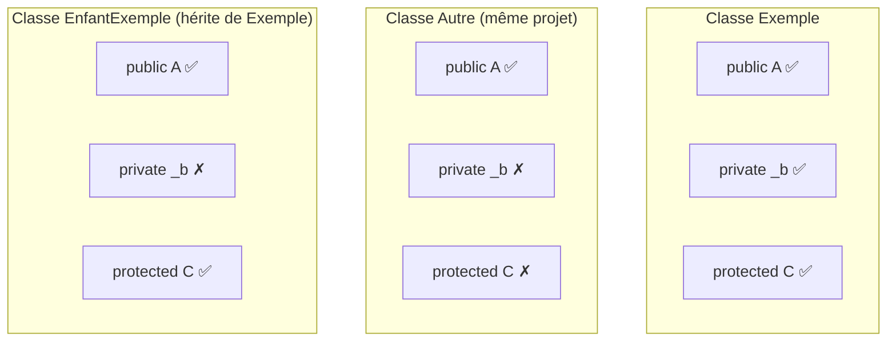

# Encapsulation et Propriétés

## Introduction : Protéger ses données

Imaginons que vous ayez un compte en banque. Est-ce que n'importe qui peut y accéder et modifier votre solde ? Non ! Vous passez par un **guichet** (ou une application) qui vérifie votre identité et contrôle les opérations.

C'est exactement le principe de l'**encapsulation** en programmation : protéger les données internes d'un objet et forcer les utilisateurs à passer par des "portes d'entrée" contrôlées.

::: info Pourquoi c'est important ?
Sans encapsulation, votre code ressemblerait à une maison sans portes ni murs : n'importe qui pourrait entrer et modifier n'importe quoi, causant des bugs difficiles à trouver.
:::

## Le principe d'encapsulation

L'**encapsulation** est l'un des piliers fondamentaux de la programmation orientée objet. Elle consiste à :

| Principe | Explication | Analogie |
|----------|-------------|----------|
| **Cacher les détails** | L'extérieur ne voit pas comment ça fonctionne | Vous ne voyez pas le moteur de votre voiture |
| **Contrôler l'accès** | On passe par une interface définie | On utilise le volant et les pédales, pas les câbles |
| **Protéger l'intégrité** | On valide avant de modifier | La voiture refuse de démarrer sans clé |

::: tip Analogie du distributeur automatique
Pensez à un distributeur automatique de billets (DAB) :
- Vous ne voyez pas les mécanismes internes (les billets, le coffre) → **détails cachés**
- Vous interagissez uniquement via l'écran et le clavier → **interface publique**
- Le DAB vérifie votre code et votre solde avant de vous donner de l'argent → **validation**
:::

## Modificateurs d'accès

Les **modificateurs d'accès** sont des mots-clés qui contrôlent **qui peut voir et utiliser** un membre de classe.

### Les modificateurs les plus courants

Pour débuter, concentrez-vous sur ces deux-là :

| Modificateur | Qui peut accéder ? | Quand l'utiliser ? |
|--------------|---------------------|--------------------|
| `public` | Tout le monde | Méthodes et propriétés de l'interface |
| `private` | Seulement la classe elle-même | Champs et méthodes internes |

::: info Analogie de la maison
- **`public`** = la porte d'entrée, les invités peuvent y accéder
- **`private`** = votre chambre, seulement vous y avez accès
:::

### Tous les modificateurs

C# propose plusieurs modificateurs d'accès pour des besoins plus avancés :

| Modificateur | Accessibilité |
|--------------|--------------|
| `public` | Partout (aucune restriction) |
| `private` | Uniquement dans la classe elle-même |
| `protected` | Dans la classe et ses classes dérivées (héritage) |
| `internal` | Partout dans le même assembly (projet) |
| `protected internal` | Classe dérivée OU même assembly |
| `private protected` | Classe dérivée ET même assembly |

### Exemple concret

Voyons ce qui se passe quand on essaie d'accéder aux différents membres :

```csharp
class Exemple
{
    public int A;         // Accessible partout
    private int _b;       // Accessible SEULEMENT dans Exemple
    protected int C;      // Accessible dans Exemple et ses enfants
    internal int D;       // Accessible dans le même projet
}

class Autre
{
    void Test()
    {
        Exemple e = new Exemple();
        e.A = 1;    // ✅ OK - public
        e._b = 2;   // ❌ ERREUR - private : inaccessible !
        e.C = 3;    // ❌ ERREUR - protected : Autre n'hérite pas d'Exemple
        e.D = 4;    // ✅ OK - internal (si même projet)
    }
}

// Si une classe hérite de Exemple...
class EnfantExemple : Exemple
{
    void Test()
    {
        this.A = 1;   // ✅ OK - public
        this._b = 2;  // ❌ ERREUR - private reste privé !
        this.C = 3;   // ✅ OK - protected accessible aux enfants
    }
}
```

::: warning Règle d'or
Par défaut, mettez tout en **`private`** et ne rendez **`public`** que ce qui est vraiment nécessaire. C'est le principe du "moindre privilège".
:::

### Visualisation



## Pourquoi rendre les champs privés ?

### Le problème des champs publics

Rendre les champs `public` semble plus simple... mais c'est une **très mauvaise idée** !

```csharp
// ❌ MAUVAISE PRATIQUE : champs publics
class CompteBancaire
{
    public double Solde;  // N'importe qui peut modifier directement !
}

CompteBancaire compte = new CompteBancaire();
compte.Solde = -1000000;      // Solde négatif sans aucun contrôle !
compte.Solde = double.MaxValue;  // Valeur absurde acceptée !
```

::: danger Quels sont les risques ?
1. **Données invalides** : rien n'empêche de mettre des valeurs absurdes
2. **Bugs difficiles à trouver** : n'importe quel code peut modifier le solde
3. **Impossible de changer l'implémentation** : si demain vous voulez logger les modifications, c'est impossible
:::

### La solution : champs privés + méthodes publiques

```csharp
// ✅ BONNE PRATIQUE : champs privés + méthodes contrôlées
class CompteBancaire
{
    private double _solde;  // Personne ne peut y accéder directement
    
    public void Deposer(double montant)
    {
        // Validation AVANT modification
        if (montant <= 0)
            throw new ArgumentException("Le montant doit être positif");
        _solde += montant;
    }
    
    public void Retirer(double montant)
    {
        // Validation AVANT modification
        if (montant <= 0)
            throw new ArgumentException("Le montant doit être positif");
        if (montant > _solde)
            throw new InvalidOperationException("Solde insuffisant");
        _solde -= montant;
    }
    
    public double ObtenirSolde()
    {
        return _solde;  // Lecture autorisée, mais pas modification directe
    }
}
```

**Maintenant, le code suivant est impossible :**
```csharp
CompteBancaire compte = new CompteBancaire();
compte._solde = -1000;  // ❌ ERREUR de compilation : _solde est privé !
compte.Retirer(1000);   // ❌ Exception : Solde insuffisant
compte.Deposer(-50);    // ❌ Exception : Le montant doit être positif
```

::: tip Avantages de l'encapsulation
- **Sécurité** : les données sont toujours valides
- **Débogage facile** : une seule méthode modifie le solde, facile à tracer
- **Évolutivité** : on peut ajouter des logs, des vérifications... sans changer l'interface
:::
```

## Les propriétés

### Le problème des getters/setters

Dans l'exemple précédent, on a utilisé `ObtenirSolde()`. C'est fonctionnel, mais pas très élégant :

```csharp
// Avec des méthodes : un peu lourd
double s = compte.ObtenirSolde();

// Ce qu'on aimerait écrire :
double s = compte.Solde;  // Plus naturel !
```

C# offre une solution élégante : les **propriétés**. Elles combinent :
- La **sécurité** de l'encapsulation (validation possible)
- La **simplicité** d'accès des champs publics (syntaxe naturelle)

### Syntaxe complète (avec backing field)

```csharp
class Personne
{
    private string _nom;  // Backing field (champ de support) - le vrai stockage
    
    public string Nom     // Propriété - l'interface publique
    {
        get { return _nom; }     // Getter : appelé quand on LIT la propriété
        set { _nom = value; }    // Setter : appelé quand on ÉCRIT la propriété
    }
}
```

**Décortiquons :**
- `get` : le code exécuté quand on **lit** la propriété
- `set` : le code exécuté quand on **écrit** dans la propriété
- `value` : mot-clé spécial représentant la valeur qu'on essaie d'assigner

**Utilisation (comme un champ public !) :**
```csharp
Personne p = new Personne();
p.Nom = "Alice";            // Appelle le SETTER avec value = "Alice"
Console.WriteLine(p.Nom);   // Appelle le GETTER, affiche "Alice"
```

::: info Ce qui se passe en coulisses
```csharp
p.Nom = "Alice";
// ↓ C# transforme en :
p.set_Nom("Alice");  // Méthode cachée générée par le compilateur

Console.WriteLine(p.Nom);
// ↓ C# transforme en :
Console.WriteLine(p.get_Nom());
```
:::

### Syntaxe avec expressions

```csharp
class Personne
{
    private string _nom;
    
    public string Nom
    {
        get => _nom;          // Expression body
        set => _nom = value;
    }
}
```

### Le mot-clé `value`

Dans un setter, `value` est un mot-clé spécial qui représente la valeur que l'utilisateur essaie d'assigner. C'est ici qu'on peut **valider** les données !

```csharp
class Produit
{
    private double _prix;
    
    public double Prix
    {
        get => _prix;
        set
        {
            // "value" contient ce que l'utilisateur veut assigner
            Console.WriteLine($"Tentative de définir le prix à : {value}");
            
            if (value < 0)
                throw new ArgumentException("Le prix ne peut pas être négatif");
            
            _prix = value;  // On accepte la valeur
        }
    }
}
```

**Utilisation :**
```csharp
Produit p = new Produit();
p.Prix = 49.99;  // value = 49.99, validation OK, _prix = 49.99
p.Prix = -10;    // value = -10, validation échoue, exception lancée !
```

::: tip La puissance des propriétés
Le code appelant écrit `p.Prix = -10` sans savoir qu'une validation a lieu. C'est **transparent** mais **sécurisé**.
:::

## Propriétés automatiques

Quand vous n'avez **pas besoin de validation** ni de logique particulière, écrire le backing field + getter + setter devient répétitif. C# propose une syntaxe ultra-concise : les **propriétés automatiques**.

### Syntaxe

```csharp
class Client
{
    // Propriété automatique : C# crée le backing field automatiquement !
    public string Nom { get; set; }
    public string Email { get; set; }
    public DateTime DateInscription { get; set; }
}
```

::: info C'est équivalent à...
```csharp
class Client
{
    private string _nom;  // Champ caché généré par le compilateur
    public string Nom
    {
        get { return _nom; }
        set { _nom = value; }
    }
    // etc.
}
```
Mais vous n'écrivez qu'une seule ligne !
:::

### Propriétés automatiques avec valeur par défaut

Vous pouvez initialiser une propriété automatique directement :

```csharp
class Configuration
{
    public string Theme { get; set; } = "clair";        // Défaut : "clair"
    public int TaillePage { get; set; } = 20;           // Défaut : 20
    public bool NotificationsActives { get; set; } = true;  // Défaut : true
}

// Utilisation
Configuration config = new Configuration();
Console.WriteLine(config.Theme);  // "clair" (valeur par défaut)
config.Theme = "sombre";          // On peut toujours modifier
```

::: tip Quand utiliser quoi ?
| Besoin | Solution |
|--------|----------|
| Simple stockage, pas de validation | Propriété automatique `{ get; set; }` |
| Validation ou logique nécessaire | Propriété complète avec backing field |
| Valeur par défaut | `{ get; set; } = valeur;` |
:::

## Contrôle d'accès des propriétés

C# permet de définir des **niveaux d'accès différents** pour le getter et le setter. C'est très puissant !

### Propriété en lecture seule (de l'extérieur)

Le cas le plus courant : on peut **lire** la propriété de partout, mais seule la classe peut la **modifier**.

```csharp
class Commande
{
    // Lecture publique, écriture PRIVÉE
    public int Numero { get; private set; }
    public DateTime DateCreation { get; private set; }
    
    public Commande()
    {
        Numero = GenererNumero();      // OK : on est dans la classe
        DateCreation = DateTime.Now;   // OK : on est dans la classe
    }
    
    private int GenererNumero() => new Random().Next(1000, 9999);
}
```

**Utilisation :**
```csharp
Commande c = new Commande();
Console.WriteLine(c.Numero);  // ✅ OK : lecture publique
Console.WriteLine(c.DateCreation);  // ✅ OK

c.Numero = 1234;  // ❌ ERREUR : le setter est privé !
```

::: info Cas d'usage
Utilisez `private set` pour les propriétés qui :
- Sont définies à la création (numéro de commande)
- Sont modifiées par des méthodes spécifiques (pas directement)
- Représentent un état calculé par la classe
:::

### Propriété calculée (sans setter)

Parfois, une propriété ne stocke rien : elle **calcule** sa valeur à partir d'autres propriétés.

```csharp
class Rectangle
{
    public double Largeur { get; set; }
    public double Hauteur { get; set; }
    
    // Propriété calculée : pas de setter, pas de backing field
    public double Aire
    {
        get => Largeur * Hauteur;
    }
    
    // Syntaxe encore plus courte (expression-bodied property)
    public double Perimetre => 2 * (Largeur + Hauteur);
}
```

**Utilisation :**
```csharp
Rectangle r = new Rectangle { Largeur = 5, Hauteur = 3 };
Console.WriteLine(r.Aire);       // 15 (calculé à la volée)
Console.WriteLine(r.Perimetre);  // 16

r.Largeur = 10;
Console.WriteLine(r.Aire);       // 30 (recalculé automatiquement !)

r.Aire = 50;  // ❌ ERREUR : pas de setter !
```

::: tip Propriété calculée vs stockée
- **Stockée** : la valeur est en mémoire, rapide à lire
- **Calculée** : la valeur est recalculée à chaque lecture, toujours à jour

Utilisez les propriétés calculées pour les valeurs dérivées (aire, âge, nom complet...).
:::

## Validation dans les propriétés

Les propriétés sont l'endroit idéal pour valider les données :

```csharp
class Etudiant
{
    private string _email;
    private int _age;
    
    public string Email
    {
        get => _email;
        set
        {
            if (string.IsNullOrWhiteSpace(value))
                throw new ArgumentException("L'email ne peut pas être vide");
            if (!value.Contains("@"))
                throw new ArgumentException("L'email doit contenir @");
            _email = value;
        }
    }
    
    public int Age
    {
        get => _age;
        set
        {
            if (value < 0 || value > 150)
                throw new ArgumentOutOfRangeException("L'âge doit être entre 0 et 150");
            _age = value;
        }
    }
    
    public string Nom { get; set; }  // Pas de validation particulière
}
```

## Propriétés `init` (C# 9+)

Le modificateur `init` permet de créer des propriétés qui peuvent être initialisées lors de la création, mais deviennent ensuite en lecture seule :

```csharp
class Livre
{
    public string Isbn { get; init; }      // Défini à la création, puis immuable
    public string Titre { get; init; }
    public string Auteur { get; init; }
    public int Pages { get; set; }         // Peut être modifié après
}

Livre livre = new Livre
{
    Isbn = "978-2-1234-5678-9",
    Titre = "Le Guide du C#",
    Auteur = "Marie Dupont",
    Pages = 350
};

livre.Pages = 400;              // ✓ OK
livre.Titre = "Autre titre";    // ❌ ERREUR : init-only
```

::: tip Quand utiliser `init` ?
Utilisez `init` pour les propriétés qui définissent l'**identité** de l'objet et qui ne devraient pas changer après la création (ISBN, numéro de commande, identifiant unique...).
:::

## Comparaison des différentes approches

| Syntaxe | Usage |
|---------|-------|
| `{ get; set; }` | Propriété standard, lecture/écriture libre |
| `{ get; private set; }` | Lecture publique, écriture interne seulement |
| `{ get; }` avec initialisation | Lecture seule, valeur fixée à la construction |
| `{ get; init; }` | Initialisable une fois, puis lecture seule |
| `=> expression` | Propriété calculée (pas de stockage) |

```csharp
class Demonstration
{
    // Lecture/écriture standard
    public string Nom { get; set; }
    
    // Lecture publique, écriture privée
    public int Id { get; private set; }
    
    // Lecture seule (initialisée dans le constructeur)
    public DateTime DateCreation { get; }
    
    // Init-only
    public string Code { get; init; }
    
    // Propriété calculée
    public string Resume => $"[{Id}] {Nom}";
    
    public Demonstration()
    {
        Id = new Random().Next(1000);
        DateCreation = DateTime.Now;
    }
}
```

## Exemple complet : Gestion d'un produit

```csharp
class Produit
{
    // Champs privés
    private double _prix;
    private int _stock;
    
    // Propriétés avec validation
    public string Reference { get; init; }  // Immuable après création
    
    public string Nom { get; set; }
    
    public double Prix
    {
        get => _prix;
        set
        {
            if (value < 0)
                throw new ArgumentException("Le prix ne peut pas être négatif");
            _prix = Math.Round(value, 2);  // Arrondi à 2 décimales
        }
    }
    
    public int Stock
    {
        get => _stock;
        private set  // Modification interne uniquement
        {
            if (value < 0)
                throw new ArgumentException("Le stock ne peut pas être négatif");
            _stock = value;
        }
    }
    
    // Propriétés calculées
    public bool EstDisponible => Stock > 0;
    public double ValeurStock => Prix * Stock;
    
    // Constructeur
    public Produit(string reference, string nom, double prix, int stockInitial)
    {
        Reference = reference;
        Nom = nom;
        Prix = prix;
        Stock = stockInitial;
    }
    
    // Méthodes pour modifier le stock
    public void AjouterStock(int quantite)
    {
        if (quantite <= 0)
            throw new ArgumentException("La quantité doit être positive");
        Stock += quantite;
    }
    
    public void RetirerStock(int quantite)
    {
        if (quantite <= 0)
            throw new ArgumentException("La quantité doit être positive");
        if (quantite > Stock)
            throw new InvalidOperationException("Stock insuffisant");
        Stock -= quantite;
    }
    
    public void Afficher()
    {
        string dispo = EstDisponible ? "En stock" : "Rupture";
        Console.WriteLine($"[{Reference}] {Nom}");
        Console.WriteLine($"  Prix: {Prix:C}");
        Console.WriteLine($"  Stock: {Stock} ({dispo})");
        Console.WriteLine($"  Valeur totale: {ValeurStock:C}");
    }
}
```

```csharp
// Utilisation
Produit p = new Produit("CLV-001", "Clavier mécanique", 89.99, 50);
p.Afficher();

Console.WriteLine("\n--- Après une vente ---");
p.RetirerStock(5);
p.Afficher();

// Tentatives invalides
// p.Reference = "CLV-002";  // ❌ ERREUR : init-only
// p.Stock = 100;            // ❌ ERREUR : private set
// p.Prix = -10;             // ❌ Exception : prix négatif
```

## Exercices

### Exercice 1 : Classe Temperature

**Objectif :** Pratiquer les propriétés avec validation et les propriétés calculées.

Créez une classe `Temperature` avec :
- Une propriété `Celsius` avec validation (pas en dessous de -273.15°C, le zéro absolu)
- Une propriété calculée `Fahrenheit` (formule : C × 9/5 + 32)
- Une propriété calculée `Kelvin` (formule : C + 273.15)

**Résultat attendu :**
```csharp
Temperature t = new Temperature();
t.Celsius = 25;
Console.WriteLine(t.Fahrenheit);  // 77
Console.WriteLine(t.Kelvin);      // 298.15

t.Celsius = -300;  // Exception : en dessous du zéro absolu !
```

::: details Solution
```csharp
class Temperature
{
    private double _celsius;
    
    public double Celsius
    {
        get => _celsius;
        set
        {
            if (value < -273.15)
                throw new ArgumentException("La température ne peut pas être inférieure au zéro absolu (-273.15°C)");
            _celsius = value;
        }
    }
    
    public double Fahrenheit => Celsius * 9.0 / 5.0 + 32;
    
    public double Kelvin => Celsius + 273.15;
}
```
:::

### Exercice 2 : Classe MotDePasse

**Objectif :** Pratiquer l'encapsulation avec une donnée sensible.

Créez une classe `MotDePasse` avec :
- Un champ privé pour stocker le mot de passe (jamais accessible en lecture !)
- Une méthode `Definir(string motDePasse)` avec validation (min 8 caractères)
- Une méthode `Verifier(string tentative)` qui retourne `true` si correct
- Une propriété calculée `Force` ("Faible", "Moyen", "Fort") selon la longueur

**Résultat attendu :**
```csharp
MotDePasse mdp = new MotDePasse();
mdp.Definir("abc");           // Exception : trop court !
mdp.Definir("MonSecret123");
Console.WriteLine(mdp.Force);  // "Fort"
Console.WriteLine(mdp.Verifier("mauvais"));      // False
Console.WriteLine(mdp.Verifier("MonSecret123")); // True
```

::: details Solution
```csharp
class MotDePasse
{
    private string _valeur;  // Jamais exposé !
    
    public void Definir(string motDePasse)
    {
        if (string.IsNullOrEmpty(motDePasse))
            throw new ArgumentException("Le mot de passe ne peut pas être vide");
        if (motDePasse.Length < 8)
            throw new ArgumentException("Le mot de passe doit faire au moins 8 caractères");
        _valeur = motDePasse;
    }
    
    public bool Verifier(string tentative)
    {
        return _valeur == tentative;
    }
    
    public string Force
    {
        get
        {
            if (_valeur == null) return "Non défini";
            if (_valeur.Length >= 12) return "Fort";
            if (_valeur.Length >= 10) return "Moyen";
            return "Faible";
        }
    }
}
```
:::

## Résumé

| Concept | Description | Exemple |
|---------|-------------|----------|
| **Encapsulation** | Cacher les détails, exposer une interface contrôlée | Champs privés + méthodes publiques |
| **`private`** | Accessible uniquement dans la classe | `private int _solde;` |
| **`public`** | Accessible de partout | `public void Deposer(...)` |
| **Propriété** | Accès contrôlé aux données avec `get`/`set` | `public string Nom { get; set; }` |
| **Auto-propriété** | Syntaxe courte sans backing field explicite | `public int Age { get; set; }` |
| **`private set`** | Lecture publique, écriture privée | `public int Id { get; private set; }` |
| **`init`** | Initialisable une fois puis immuable | `public string Code { get; init; }` |
| **Calculée** | Propriété sans stockage, valeur dérivée | `public double Aire => L * H;` |

::: tip Points essentiels à retenir
1. **Champs toujours privés** : utilisez des propriétés pour l'accès
2. **Validez dans le setter** : rejetez les valeurs invalides
3. **Propriétés calculées** : utilisez `=>` pour les valeurs dérivées
4. **`private set`** : pour les valeurs modifiables seulement en interne
5. **L'encapsulation protège** : un objet bien encapsulé est toujours dans un état valide
:::
