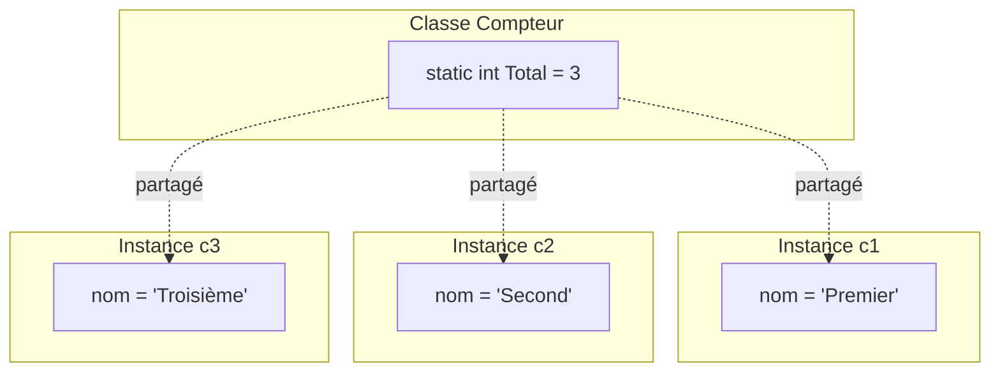

# Membres Statiques

## Introduction : Partager des données entre objets

Jusqu'à présent, chaque objet que nous avons créé était **indépendant** : si vous créez 100 étudiants, chacun a son propre nom, son propre âge, etc. C'est le comportement normal.

Mais parfois, on a besoin de données **partagées** par tous les objets :
- Combien d'étudiants ont été créés au total ?
- Quel est le taux d'intérêt actuel de la banque (identique pour tous les comptes) ?
- Quel est le prochain numéro de commande à attribuer ?

C'est là qu'interviennent les **membres statiques**.

::: info Analogie de la salle de classe
Imaginons une classe d'étudiants :
- Chaque étudiant a **son propre** cahier, stylo, sac → **membres d'instance**
- Le **tableau noir** est partagé par toute la classe → **membre statique**

Quand un étudiant écrit au tableau, tout le monde voit le changement. C'est le même tableau pour tous !
:::

## Le concept de `static`

Les membres **statiques** appartiennent à la **classe elle-même**, et non à une instance particulière. Ils sont partagés par tous les objets de cette classe.

### Comparaison visuelle



## Champs statiques

Un **champ statique** est partagé entre toutes les instances de la classe. Il n'existe qu'en **un seul exemplaire** pour toute la classe.

### Exemple : compter les étudiants

```csharp
class Etudiant
{
    // ═══ CHAMP STATIQUE : un seul pour toute la classe ═══
    private static int _nombreTotal = 0;
    
    // ═══ CHAMPS D'INSTANCE : un par étudiant ═══
    private string _nom;
    private int _id;
    
    public Etudiant(string nom)
    {
        _nom = nom;
        _nombreTotal++;          // Incrémente le compteur PARTAGÉ
        _id = _nombreTotal;      // Chaque étudiant a un ID unique
    }
    
    // Méthode statique pour accéder au champ statique
    public static int ObtenirNombreTotal()
    {
        return _nombreTotal;
    }
    
    public void Afficher()
    {
        Console.WriteLine($"[{_id}] {_nom}");
    }
}
```

### Utilisation

```csharp
Console.WriteLine($"Total: {Etudiant.ObtenirNombreTotal()}");  // 0

Etudiant e1 = new Etudiant("Alice");
Etudiant e2 = new Etudiant("Bob");
Etudiant e3 = new Etudiant("Charlie");

e1.Afficher();  // [1] Alice
e2.Afficher();  // [2] Bob
e3.Afficher();  // [3] Charlie

Console.WriteLine($"Total: {Etudiant.ObtenirNombreTotal()}");  // 3
```

### Ce qui se passe en mémoire

```
    ┌───────────────────────────────────────────┐
    │         CLASSE Etudiant                   │
    │  ┌─────────────────────────────────────┐  │
    │  │ static _nombreTotal = 3             │  │ ← UN SEUL
    │  └─────────────────────────────────────┘  │
    └───────────────────────────────────────────┘
            ▲            ▲              ▲
            │            │              │
     ┌──────┴─────┐ ┌────┴───────┐ ┌────┴─────────┐
     │     e1     │ │     e2     │ │     e3       │
     ├────────────┤ ├────────────┤ ├──────────────┤
     │_nom="Alice"│ │_nom="Bob"  │ │_nom="Charlie"│
     │_id=1       │ │_id=2       │ │_id=3         │
     └────────────┘ └────────────┘ └──────────────┘
     ↑ UN CHACUN      ↑ UN CHACUN    ↑ UN CHACUN
```

::: warning Comment accéder aux membres statiques ?
Les membres statiques s'accèdent via le **nom de la classe**, PAS via une instance :

```csharp
// ✅ CORRECT : via le nom de la classe
int total = Etudiant.ObtenirNombreTotal();

// ⚠️ MAUVAIS STYLE : via une instance (fonctionne mais à éviter)
int total = e1.ObtenirNombreTotal();  // Le compilateur peut avertir
```
:::

## Méthodes statiques

Une **méthode statique** peut être appelée **sans créer d'instance**. Elle est parfaite pour les fonctions utilitaires.

::: info Déjà vues sans le savoir !
Vous utilisez déjà des méthodes statiques tous les jours :
```csharp
Console.WriteLine("Hello");     // Console est une classe, WriteLine est statique
Math.Sqrt(25);                  // Math est une classe, Sqrt est statique
DateTime.Now;                   // DateTime est une classe, Now est statique
```
Vous n'avez jamais écrit `Console c = new Console();` ! C'est parce que ces méthodes sont statiques.
:::

### Créer sa propre classe utilitaire

```csharp
class Mathematiques
{
    // Constante statique
    public static readonly double Pi = 3.14159265359;
    
    // Méthodes statiques (utilitaires)
    public static double Carre(double x)
    {
        return x * x;
    }
    
    public static double Cube(double x)
    {
        return x * x * x;
    }
    
    public static double AireCercle(double rayon)
    {
        return Pi * Carre(rayon);
    }
    
    public static double Max(double a, double b)
    {
        return a > b ? a : b;
    }
}
```

### Utilisation (pas besoin de `new` !)

```csharp
// Pas de : Mathematiques m = new Mathematiques();
// On appelle directement via le nom de la classe :

double surface = Mathematiques.AireCercle(5);
double maximum = Mathematiques.Max(10, 25);
Console.WriteLine(Mathematiques.Pi);
```

::: tip Exemples de classes statiques du framework .NET
| Classe | Méthodes statiques courantes |
|--------|------------------------------|
| `Math` | `Sqrt()`, `Abs()`, `Round()`, `Pow()` |
| `Console` | `WriteLine()`, `ReadLine()`, `Clear()` |
| `DateTime` | `Now`, `Today`, `Parse()` |
| `File` | `ReadAllText()`, `WriteAllText()`, `Exists()` |
| `Path` | `Combine()`, `GetFileName()` |
:::

## Restrictions des membres statiques

### La règle d'or

Une méthode statique **ne peut pas** accéder aux membres d'instance. Pourquoi ? Parce qu'elle n'a pas d'objet sur lequel travailler !

::: danger Ce qui est INTERDIT dans une méthode statique
- Accéder aux champs d'instance
- Appeler des méthodes d'instance
- Utiliser `this`
:::

### Exemple

```csharp
class Exemple
{
    private int _valeur;                // Champ d'INSTANCE
    private static int _compteur = 0;   // Champ STATIQUE
    
    public static void MethodeStatique()
    {
        // ✅ OK : accès aux membres statiques
        _compteur++;
        Console.WriteLine(_compteur);
        
        // ❌ ERREUR : pas d'accès aux membres d'instance !
        // _valeur = 5;              // INTERDIT
        // this._valeur = 5;         // INTERDIT (pas de "this")
        // AfficherValeur();         // INTERDIT (méthode d'instance)
    }
    
    public void MethodeInstance()  // Méthode d'instance
    {
        // ✅ Peut accéder à TOUT
        Console.WriteLine($"Valeur: {_valeur}, Compteur: {_compteur}");
    }
}
```

::: info Pourquoi cette restriction ?
Une méthode statique appartient à la **classe**, pas à un objet spécifique. Quand vous appelez `Mathematiques.Carre(5)`, il n'y a **aucun objet** `Mathematiques`. Donc il n'y a pas de `_valeur` individuelle à laquelle accéder !
:::

### Résumé des accès

| Depuis... | Accès aux membres d'instance | Accès aux membres statiques |
|-----------|------------------------------|-----------------------------|
| Méthode **d'instance** | ✅ Oui | ✅ Oui |
| Méthode **statique** | ❌ Non | ✅ Oui |

## Constructeur statique

Un **constructeur statique** est exécuté **une seule fois**, automatiquement, avant la première utilisation de la classe.

::: info Quand s'exécute-t-il ?
- Au premier accès à un membre statique
- OU à la première instanciation d'un objet de cette classe
- Dans tous les cas, **une seule fois par programme**
:::

### Exemple : configuration d'application

```csharp
class Configuration
{
    public static string CheminBase { get; private set; }
    public static string Version { get; private set; }
    
    // Constructeur STATIQUE : pas de "public", pas de paramètres
    static Configuration()
    {
        Console.WriteLine("🔧 Initialisation de la configuration...");
        CheminBase = Environment.GetFolderPath(Environment.SpecialFolder.UserProfile);
        Version = "1.0.0";
        // Pourrait charger depuis un fichier, une base de données, etc.
    }
}
```

### Utilisation

```csharp
// Premier accès : le constructeur statique s'exécute
Console.WriteLine(Configuration.Version);
// Affiche : 🔧 Initialisation de la configuration...
// Puis    : 1.0.0

// Deuxième accès : PAS de ré-exécution
Console.WriteLine(Configuration.CheminBase);
// Affiche juste le chemin, pas le message d'initialisation
```

### Caractéristiques du constructeur statique

| Règle | Explication |
|-------|-------------|
| **Pas de modificateur d'accès** | Pas de `public` ni `private` |
| **Pas de paramètres** | On ne l'appelle pas manuellement |
| **Exécuté une seule fois** | Avant tout accès à la classe |
| **Automatique** | Vous n'écrivez jamais `new Configuration()` statiquement |

::: tip Cas d'usage typiques
- Charger une configuration depuis un fichier
- Initialiser une connexion à une base de données
- Générer des valeurs uniques au démarrage
:::

## Classes statiques

Une **classe statique** ne peut contenir que des membres statiques et ne peut pas être instanciée :

```csharp
static class Utilitaires
{
    public static string Majuscules(string texte)
    {
        return texte.ToUpper();
    }
    
    public static bool EstPalindrome(string texte)
    {
        string nettoye = texte.ToLower().Replace(" ", "");
        char[] tableau = nettoye.ToCharArray();
        Array.Reverse(tableau);
        return nettoye == new string(tableau);
    }
    
    public static void AfficherSeparateur()
    {
        Console.WriteLine(new string('-', 50));
    }
}

// Utilisation
Utilitaires.AfficherSeparateur();
Console.WriteLine(Utilitaires.EstPalindrome("kayak"));  // True

// ❌ ERREUR : impossible d'instancier une classe statique
// Utilitaires u = new Utilitaires();
```

## Cas d'utilisation typiques

### 1. Compteur d'instances

```csharp
class Connexion
{
    private static int _nombreConnexions = 0;
    private static readonly int _maxConnexions = 100;
    
    private string _utilisateur;
    
    public Connexion(string utilisateur)
    {
        if (_nombreConnexions >= _maxConnexions)
            throw new InvalidOperationException("Nombre maximum de connexions atteint");
        
        _utilisateur = utilisateur;
        _nombreConnexions++;
        Console.WriteLine($"Connexion établie pour {_utilisateur} ({_nombreConnexions}/{_maxConnexions})");
    }
    
    public void Fermer()
    {
        _nombreConnexions--;
        Console.WriteLine($"Connexion fermée pour {_utilisateur} ({_nombreConnexions}/{_maxConnexions})");
    }
    
    public static int ObtenirNombreConnexions() => _nombreConnexions;
}
```

### 2. Factory Method (méthode de fabrication)

```csharp
class Couleur
{
    public int R { get; }
    public int G { get; }
    public int B { get; }
    
    private Couleur(int r, int g, int b)
    {
        R = r;
        G = g;
        B = b;
    }
    
    // Méthodes statiques de fabrication
    public static Couleur Rouge() => new Couleur(255, 0, 0);
    public static Couleur Vert() => new Couleur(0, 255, 0);
    public static Couleur Bleu() => new Couleur(0, 0, 255);
    public static Couleur Blanc() => new Couleur(255, 255, 255);
    public static Couleur Noir() => new Couleur(0, 0, 0);
    
    public static Couleur DepuisHexa(string hexa)
    {
        // Logique de conversion...
        return new Couleur(0, 0, 0);
    }
}

// Utilisation
Couleur c1 = Couleur.Rouge();
Couleur c2 = Couleur.DepuisHexa("#FF5733");
```

### 3. Cache partagé

```csharp
class CacheImages
{
    private static Dictionary<string, byte[]> _cache = new Dictionary<string, byte[]>();
    
    public static byte[] Charger(string chemin)
    {
        if (!_cache.ContainsKey(chemin))
        {
            Console.WriteLine($"Chargement de {chemin} depuis le disque...");
            _cache[chemin] = File.ReadAllBytes(chemin);
        }
        else
        {
            Console.WriteLine($"Récupération de {chemin} depuis le cache.");
        }
        return _cache[chemin];
    }
    
    public static void Vider()
    {
        _cache.Clear();
    }
}
```

## Constantes et `readonly`

### Constantes (`const`)

Les constantes sont implicitement statiques :

```csharp
class Physique
{
    public const double VitesseLumiere = 299792458;  // m/s
    public const double GraviteTerre = 9.81;          // m/s²
    public const int AbsoluZeroCelsius = -273;
}

// Utilisation
Console.WriteLine(Physique.VitesseLumiere);
```

### `readonly` statique

Différence avec `const` : la valeur peut être calculée au runtime :

```csharp
class Application
{
    // const : valeur connue à la compilation
    public const string Version = "2.0.0";
    
    // readonly static : valeur calculée à l'exécution
    public static readonly DateTime DateLancement = DateTime.Now;
    public static readonly string CheminConfig = 
        Path.Combine(Environment.GetFolderPath(Environment.SpecialFolder.ApplicationData), "app.config");
}
```

## Exemple complet : Générateur d'identifiants

```csharp
class GenerateurId
{
    private static int _dernierIdNumerique = 0;
    private static readonly string _prefixe;
    private static readonly Random _random = new Random();
    
    static GenerateurId()
    {
        // Génère un préfixe unique au démarrage
        _prefixe = DateTime.Now.ToString("yyyyMMdd");
    }
    
    public static string GenererIdCommande()
    {
        _dernierIdNumerique++;
        return $"CMD-{_prefixe}-{_dernierIdNumerique:D5}";
    }
    
    public static string GenererIdProduit()
    {
        _dernierIdNumerique++;
        return $"PRD-{_dernierIdNumerique:D6}";
    }
    
    public static string GenererCode(int longueur = 8)
    {
        const string caracteres = "ABCDEFGHIJKLMNOPQRSTUVWXYZ0123456789";
        char[] code = new char[longueur];
        for (int i = 0; i < longueur; i++)
        {
            code[i] = caracteres[_random.Next(caracteres.Length)];
        }
        return new string(code);
    }
    
    public static int ObtenirDernierId() => _dernierIdNumerique;
}
```

```csharp
// Utilisation
Console.WriteLine(GenerateurId.GenererIdCommande());  // CMD-20251217-00001
Console.WriteLine(GenerateurId.GenererIdCommande());  // CMD-20251217-00002
Console.WriteLine(GenerateurId.GenererIdProduit());   // PRD-000003
Console.WriteLine(GenerateurId.GenererCode());        // Ex: K7F2M9XP
Console.WriteLine(GenerateurId.GenererCode(12));      // Ex: A3B7C9D2E5F1
```

## Exercices

### Exercice 1 : Classe Banque

**Objectif :** Combiner membres statiques et d'instance.

Créez une classe `Banque` avec :
- Un champ statique `TauxInteret` (modifiable par tous)
- Un compteur statique du nombre de comptes créés
- Une méthode statique `AfficherStatistiques()`
- Des comptes individuels avec leur propre solde

**Résultat attendu :**
```csharp
Banque.TauxInteret = 2.5;
CompteBanque c1 = new CompteBanque("Alice", 1000);
CompteBanque c2 = new CompteBanque("Bob", 2500);
Banque.AfficherStatistiques();
// Nombre de comptes : 2
// Taux d'intérêt actuel : 2.5%
```

::: details Solution
```csharp
class Banque
{
    public static double TauxInteret = 1.0;
    private static int _nombreComptes = 0;
    
    public static void IncrémenterComptes()
    {
        _nombreComptes++;
    }
    
    public static void AfficherStatistiques()
    {
        Console.WriteLine($"Nombre de comptes : {_nombreComptes}");
        Console.WriteLine($"Taux d'intérêt actuel : {TauxInteret}%");
    }
}

class CompteBanque
{
    private string _titulaire;
    private double _solde;
    
    public CompteBanque(string titulaire, double soldeInitial)
    {
        _titulaire = titulaire;
        _solde = soldeInitial;
        Banque.IncrémenterComptes();
    }
    
    public double CalculerInterets()
    {
        return _solde * Banque.TauxInteret / 100;
    }
}
```
:::

### Exercice 2 : Classe Logger

**Objectif :** Créer une classe entièrement statique.

Créez une classe statique `Logger` avec :
- Des méthodes `Info(string message)`, `Erreur(string message)`, `Avertissement(string message)`
- Un compteur par catégorie de messages
- Une méthode `AfficherResume()` qui affiche les compteurs

**Résultat attendu :**
```csharp
Logger.Info("Application démarrée");
Logger.Info("Chargement des données");
Logger.Erreur("Fichier non trouvé");
Logger.Avertissement("Mémoire basse");
Logger.AfficherResume();
// [INFO] 2 messages
// [ERREUR] 1 message
// [AVERTISSEMENT] 1 message
```

::: details Solution
```csharp
static class Logger
{
    private static int _infos = 0;
    private static int _erreurs = 0;
    private static int _avertissements = 0;
    
    public static void Info(string message)
    {
        Console.WriteLine($"[ℹ️ INFO] {DateTime.Now:HH:mm:ss} - {message}");
        _infos++;
    }
    
    public static void Erreur(string message)
    {
        Console.WriteLine($"[❌ ERREUR] {DateTime.Now:HH:mm:ss} - {message}");
        _erreurs++;
    }
    
    public static void Avertissement(string message)
    {
        Console.WriteLine($"[⚠️ ATTENTION] {DateTime.Now:HH:mm:ss} - {message}");
        _avertissements++;
    }
    
    public static void AfficherResume()
    {
        Console.WriteLine($"[INFO] {_infos} message(s)");
        Console.WriteLine($"[ERREUR] {_erreurs} message(s)");
        Console.WriteLine($"[AVERTISSEMENT] {_avertissements} message(s)");
    }
}
```
:::

## Résumé

| Concept | Description | Exemple |
|---------|-------------|----------|
| **Champ statique** | Partagé par toutes les instances | `static int _compteur;` |
| **Méthode statique** | Appelable sans instance | `Math.Sqrt(25)` |
| **Constructeur statique** | Exécuté une fois au démarrage | `static MaClasse() { }` |
| **Classe statique** | Ne peut contenir que des membres statiques | `static class Utilitaires` |
| **`const`** | Constante, valeur fixée à la compilation | `const double Pi = 3.14;` |
| **`readonly static`** | Valeur fixée à l'exécution | `static readonly DateTime Demarrage = DateTime.Now;` |

::: tip Points essentiels à retenir
1. **Statique = appartient à la classe**, pas aux objets
2. **Accédez via le nom de la classe** : `MaClasse.MaMethodeStatique()`
3. **Une méthode statique ne peut PAS accéder aux membres d'instance**
4. **Le constructeur statique s'exécute une seule fois**, automatiquement
5. Utilisez `static` pour les **utilitaires**, **compteurs globaux**, **configuration**
:::
