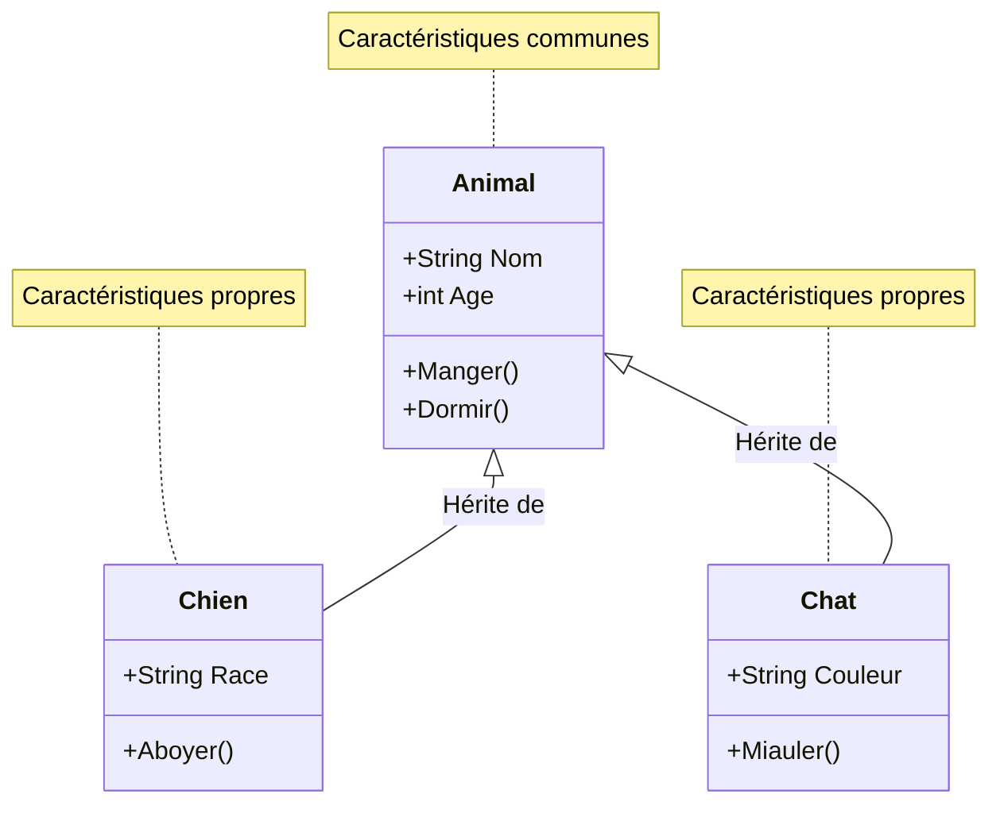
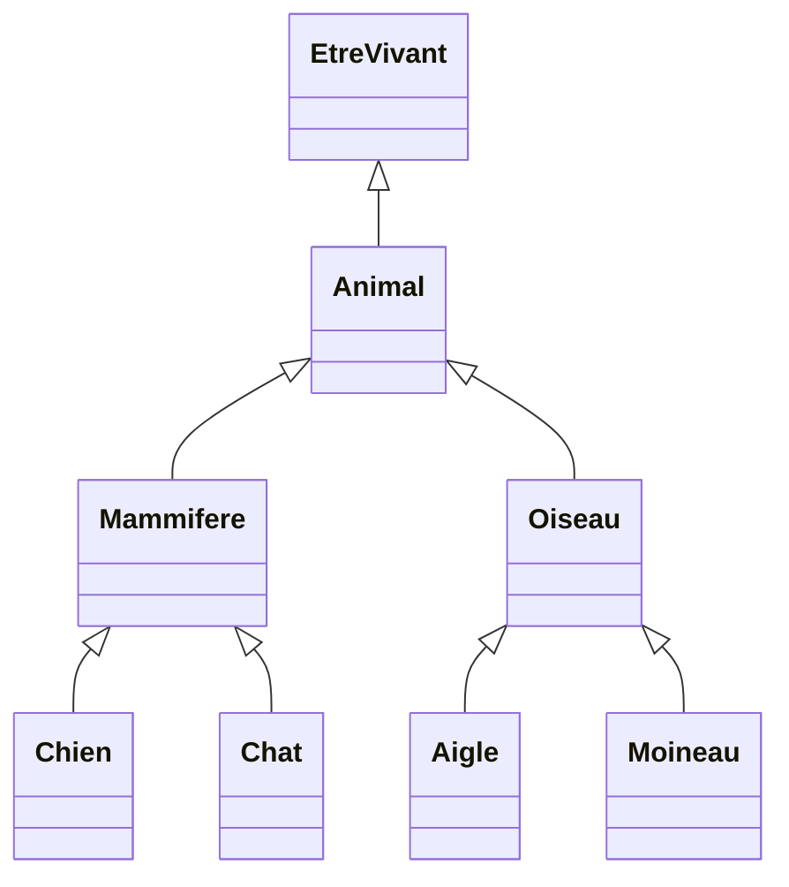
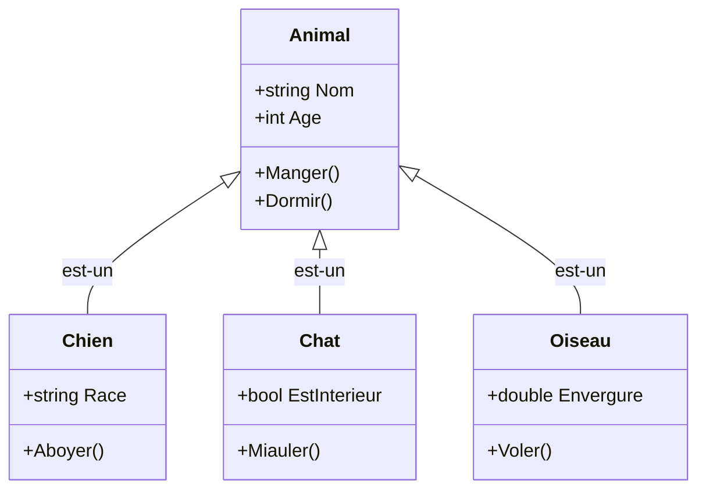
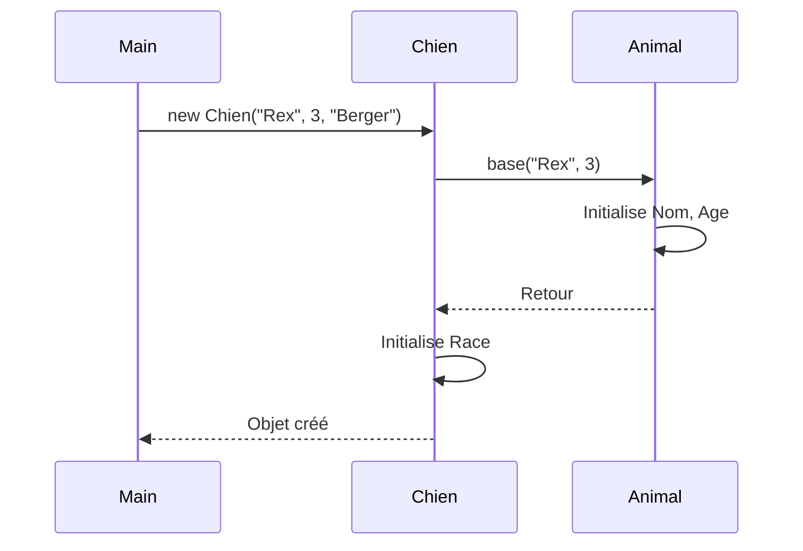
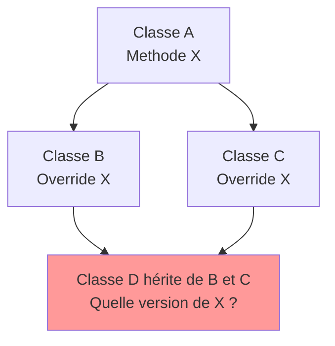
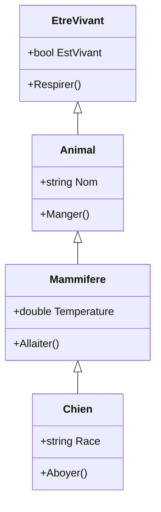

# Héritage

L'héritage est l'un des piliers fondamentaux de la programmation orientée objet. Il permet de créer de nouvelles classes basées sur des classes existantes, favorisant ainsi la **réutilisation du code** et l'organisation logique des concepts.

::: tip 🎯 Ce que vous allez apprendre
- Comprendre le concept d'héritage et la relation "est-un"
- Créer des classes dérivées qui héritent de classes de base
- Utiliser le mot-clé `base` pour appeler le constructeur parent
- Maîtriser le modificateur `protected` pour l'encapsulation
- Savoir quand utiliser l'héritage et quand l'éviter
:::

## Qu'est-ce que l'héritage ?

L'héritage est un mécanisme qui permet à une classe (appelée **classe dérivée** ou **sous-classe**) d'hériter des caractéristiques d'une autre classe (appelée **classe de base** ou **superclasse**).

### 🌳 Analogie : l'arbre généalogique

Pensez à un arbre généalogique familial :
- Un enfant **hérite** des caractéristiques de ses parents (couleur des yeux, taille...)
- Mais l'enfant a aussi ses **propres caractéristiques** uniques
- Et l'enfant peut **faire les choses différemment** de ses parents



Chien et Chat héritent AUTOMATIQUEMENT de Nom, Age, Manger() et Dormir() ! Ils n'ont pas besoin de les redéfinir.

::: tip 🔬 Analogie du monde réel
Pensez à la classification biologique : un **Chien** est un **Mammifère**, qui est un **Animal**, qui est un **Être vivant**. Chaque niveau hérite des caractéristiques du niveau supérieur tout en ajoutant ses propres spécificités.
:::



## Vocabulaire de l'héritage

| Terme | Définition | Exemple |
|-------|------------|---------|
| **Classe de base** | Classe dont on hérite (parent) | `Animal` |
| **Classe dérivée** | Classe qui hérite (enfant) | `Chien` |
| **Superclasse** | Synonyme de classe de base | `Animal` |
| **Sous-classe** | Synonyme de classe dérivée | `Chien` |
| **Hériter** | Recevoir les membres d'une autre classe | `Chien` hérite de `Animal` |
| **Spécialiser** | Créer une version plus spécifique | `Chien` spécialise `Animal` |
| **Généraliser** | Extraire les points communs | `Animal` généralise `Chien` et `Chat` |

## Syntaxe de base

En C#, l'héritage est déclaré avec le symbole `:` après le nom de la classe :

```csharp
class ClasseEnfant : ClasseParent
{
    // La ClasseEnfant hérite de ClasseParent
}
```

### Exemple concret : Animal et ses dérivées

```csharp
// Classe de base (parent)
class Animal
{
    public string Nom;
    public int Age;
    
    public void Manger()
    {
        Console.WriteLine($"{Nom} mange.");
    }
    
    public void Dormir()
    {
        Console.WriteLine($"{Nom} dort.");
    }
}

// Classe dérivée (enfant) - hérite de Animal
class Chien : Animal  // ← Le ":" indique l'héritage
{
    public string Race;  // Propriété spécifique au Chien
    
    public void Aboyer()  // Méthode spécifique au Chien
    {
        Console.WriteLine($"{Nom} aboie : Wouf !");
    }
}

// Autre classe dérivée
class Chat : Animal
{
    public bool EstInterieur;  // Propriété spécifique au Chat
    
    public void Miauler()  // Méthode spécifique au Chat
    {
        Console.WriteLine($"{Nom} miaule : Miaou !");
    }
}
```

### Ce que la classe dérivée reçoit automatiquement

Quand `Chien` hérite de `Animal`, il reçoit **gratuitement** :

| Hérité | Catégorie | Exemple |
|--------|-----------|---------|
| ✅ Oui | Attributs publics | `Nom`, `Age` |
| ✅ Oui | Attributs protégés | `protected int _energie;` |
| ✅ Oui | Méthodes publiques | `Manger()`, `Dormir()` |
| ✅ Oui | Méthodes protégées | Accessibles dans la classe dérivée |
| ❌ Non | Membres privés | Non accessibles directement |
| ❌ Non | Constructeurs | Doivent être redéfinis |

```csharp
Chien monChien = new Chien();

// 🎁 Membres hérités de Animal (gratuits !)
monChien.Nom = "Rex";
monChien.Age = 3;
monChien.Manger();      // "Rex mange."
monChien.Dormir();      // "Rex dort."

// ⭐ Membres propres à Chien
monChien.Race = "Berger Allemand";
monChien.Aboyer();      // "Rex aboie : Wouf !"
```

::: info 💡 L'avantage clé
On n'a pas eu à réécrire `Nom`, `Age`, `Manger()` et `Dormir()` dans `Chien`. Tout est hérité automatiquement de `Animal` !
:::

## La relation "est-un" (is-a)

L'héritage modélise une relation **"est-un"** (is-a relationship). C'est la règle d'or pour décider si l'héritage est approprié.

### 🧪 Le test "est-un"

Posez-vous la question : *"Un [classe enfant] EST-IL un [classe parent] ?"*

| Test | Réponse | Héritage approprié ? |
|------|---------|---------------------|
| Un `Chien` **est-un** `Animal` ? | ✅ Oui | ✅ Correct |
| Un `Chat` **est-un** `Animal` ? | ✅ Oui | ✅ Correct |
| Une `Voiture` **est-un** `Animal` ? | ❌ Non | ❌ Absurde |
| Un `Carré` **est-un** `Rectangle` ? | 🤔 Mathématiquement oui, mais attention... | ⚠️ Discutable |



::: warning Attention
N'utilisez pas l'héritage pour des relations "a-un" (has-a). Par exemple, une `Voiture` **a un** `Moteur`, mais une `Voiture` n'**est pas un** `Moteur`. Pour les relations "a-un", utilisez la **composition** (un attribut de type `Moteur` dans la classe `Voiture`).
:::

```csharp
// ❌ MAUVAIS - Une voiture n'est pas un moteur
class Voiture : Moteur { }

// ✅ BON - Une voiture a un moteur (composition)
class Voiture
{
    private Moteur _moteur;  // Relation "a-un"
}
```

## Constructeurs et héritage

### Le problème des constructeurs

::: danger ⛔ Règle importante
Les constructeurs ne sont **pas hérités** ! Chaque classe doit définir ses propres constructeurs.
:::

Quand une classe de base a un constructeur avec paramètres, la classe dérivée **doit** appeler ce constructeur.

```csharp
class Animal
{
    public string Nom;
    public int Age;
    
    // Constructeur de la classe de base
    public Animal(string nom, int age)
    {
        Nom = nom;
        Age = age;
    }
}

class Chien : Animal
{
    public string Race;
    
    // ❌ ERREUR : pas d'appel au constructeur de base
    // public Chien(string nom, int age, string race)
    // {
    //     // Erreur de compilation : Animal n'a pas de constructeur sans paramètre
    // }
    // {
    //     Nom = nom;  // Erreur de compilation !
    //     Age = age;
    //     Race = race;
    // }
}
```

### Le mot-clé `base`

Le mot-clé `base` permet d'appeler le constructeur de la classe parent. C'est **obligatoire** quand la classe parent n'a pas de constructeur sans paramètre.

### 🏗️ Analogie : construction d'une maison

Pour construire une maison sur mesure (classe dérivée), vous devez d'abord construire les fondations (classe de base). Vous ne pouvez pas sauter les fondations !

```
┌─────────────────────────────────────────────────────────────────────┐
│                    APPEL AU CONSTRUCTEUR PARENT                     │
├─────────────────────────────────────────────────────────────────────┤
│                                                                     │
│    new Chien("Rex", 3, "Berger Allemand")                           │
│                                                                     │
│    1️⃣ Chien reçoit les paramètres                                   │
│    2️⃣ base(nom, age) appelle Animal(nom, age)                       │
│    3️⃣ Animal initialise Nom et Age                                  │
│    4️⃣ Retour dans Chien                                             │
│    5️⃣ Chien initialise Race                                         │
│                                                                     │
│    Les fondations (Animal) sont construites AVANT le reste !        │
│                                                                     │
└─────────────────────────────────────────────────────────────────────┘
```

```csharp
class Animal
{
    public string Nom;
    public int Age;
    
    public Animal(string nom, int age)
    {
        Nom = nom;
        Age = age;
        Console.WriteLine($"1. Création d'un animal : {Nom}");
    }
}

class Chien : Animal
{
    public string Race;
    
    // ✅ Appel du constructeur parent avec base(...)
    public Chien(string nom, int age, string race) : base(nom, age)  // ← base() appelle Animal()
    {
        Race = race;
        Console.WriteLine($"2. C'est un chien de race {Race}");
    }
}
```

```csharp
Chien rex = new Chien("Rex", 3, "Berger Allemand");
// Affiche :
// 1. Création d'un animal : Rex
// 2. C'est un chien de race Berger Allemand
```

::: info 💡 Remarquez l'ordre !
Le message de `Animal` s'affiche **avant** celui de `Chien`. Le constructeur parent est exécuté en premier !
:::

### Ordre d'exécution des constructeurs

Les constructeurs s'exécutent du **plus général au plus spécifique** :



```csharp
class EtreVivant
{
    public EtreVivant()
    {
        Console.WriteLine("1. Constructeur EtreVivant");
    }
}

class Animal : EtreVivant
{
    public Animal() : base()
    {
        Console.WriteLine("2. Constructeur Animal");
    }
}

class Chien : Animal
{
    public Chien() : base()
    {
        Console.WriteLine("3. Constructeur Chien");
    }
}

// new Chien() affiche :
// 1. Constructeur EtreVivant
// 2. Constructeur Animal
// 3. Constructeur Chien
```

### Constructeur par défaut implicite

Si la classe de base a un constructeur **sans paramètre**, l'appel à `base()` est implicite (vous n'êtes pas obligé de l'écrire) :

```csharp
class Animal
{
    public string Nom = "Inconnu";
    
    // Constructeur sans paramètre
    public Animal()
    {
        Console.WriteLine("Animal créé");
    }
}

class Chien : Animal
{
    // Pas besoin de : base() explicite
    // Le compilateur ajoute automatiquement l'appel à base()
    public Chien()
    {
        Console.WriteLine("Chien créé");
    }
}
```

::: warning ⚠️ Attention au piège classique
Si vous ajoutez un constructeur avec paramètres à la classe de base et que vous supprimez le constructeur sans paramètre, toutes les classes dérivées casseront !

```csharp
class Animal
{
    public Animal(string nom)  // Plus de constructeur sans paramètre !
    {
        // ...
    }
}

class Chien : Animal
{
    public Chien()  // ❌ ERREUR : Animal n'a pas de constructeur sans paramètre
    {
    }
}
```
:::

## Niveaux d'accès et héritage

### Le modificateur `protected`

Le modificateur `protected` crée une "zone intermédiaire" entre `public` et `private`. Les membres `protected` sont accessibles **dans la classe et dans toutes ses classes dérivées**, mais pas à l'extérieur.

### 🏠 Analogie : les pièces de la maison

| Modificateur | Analogie | Qui peut accéder ? |
|--------------|----------|-------------------|
| `public` | Jardin | Tout le monde |
| `protected` | Salon familial | Famille uniquement (classe + enfants) |
| `private` | Chambre | Moi seul (classe uniquement) |

```
┌─────────────────────────────────────────────────────────────────────┐
│                    VISIBILITÉ DES MEMBRES                           │
├─────────────────────────────────────────────────────────────────────┤
│                                                                     │
│    public    ──────►  ✅ Même classe                                │
│                       ✅ Classes dérivées                           │
│                       ✅ Autres classes                             │
│                                                                     │
│    protected ──────►  ✅ Même classe                                │
│                       ✅ Classes dérivées                           │
│                       ❌ Autres classes                             │
│                                                                     │
│    private   ──────►  ✅ Même classe                                │
│                       ❌ Classes dérivées                           │
│                       ❌ Autres classes                             │
│                                                                     │
└─────────────────────────────────────────────────────────────────────┘
```

```csharp
class Animal
{
    public string Nom;           // Accessible partout
    protected int _energie;      // Accessible dans Animal et ses dérivées
    private string _id;          // Accessible uniquement dans Animal
    
    public Animal(string nom)
    {
        Nom = nom;
        _energie = 100;
        _id = Guid.NewGuid().ToString();
    }
    
    protected void ConsommerEnergie(int quantite)
    {
        _energie -= quantite;
    }
}

class Chien : Animal
{
    public Chien(string nom) : base(nom) { }
    
    public void Courir()
    {
        // ✅ Accès au membre protected
        if (_energie >= 20)
        {
            ConsommerEnergie(20);
            Console.WriteLine($"{Nom} court ! Énergie restante : {_energie}");
        }
        else
        {
            Console.WriteLine($"{Nom} est trop fatigué pour courir.");
        }
        
        // ❌ Erreur : _id est private
        // Console.WriteLine(_id);
    }
}
```

```csharp
Chien rex = new Chien("Rex");
rex.Courir();  // "Rex court ! Énergie restante : 80"
rex.Courir();  // "Rex court ! Énergie restante : 60"

// ❌ Erreur : _energie est protected
// Console.WriteLine(rex._energie);
```

### Bonnes pratiques d'encapsulation avec l'héritage

```csharp
class CompteBancaire
{
    public string Titulaire { get; }
    
    // Protected : accessible aux sous-classes pour lecture/écriture
    protected decimal Solde { get; set; }
    
    // Private : vraiment interne
    private readonly List<string> _historique = new();
    
    public CompteBancaire(string titulaire, decimal soldeInitial)
    {
        Titulaire = titulaire;
        Solde = soldeInitial;
        AjouterHistorique($"Compte créé avec {soldeInitial}€");
    }
    
    public virtual void Deposer(decimal montant)
    {
        if (montant > 0)
        {
            Solde += montant;
            AjouterHistorique($"Dépôt de {montant}€");
        }
    }
    
    public decimal ConsulterSolde() => Solde;
    
    // Méthode privée helper
    private void AjouterHistorique(string message)
    {
        _historique.Add($"{DateTime.Now}: {message}");
    }
    
    // Méthode protected pour permettre aux sous-classes d'ajouter à l'historique
    protected void EnregistrerOperation(string message)
    {
        AjouterHistorique(message);
    }
}

class CompteEpargne : CompteBancaire
{
    public decimal TauxInteret { get; }
    
    public CompteEpargne(string titulaire, decimal soldeInitial, decimal taux) 
        : base(titulaire, soldeInitial)
    {
        TauxInteret = taux;
    }
    
    public void AppliquerInterets()
    {
        decimal interets = Solde * TauxInteret;
        Solde += interets;  // ✅ Accès au Solde protected
        EnregistrerOperation($"Intérêts de {interets}€ appliqués");
    }
}
```

## Héritage et substitution (Principe de Liskov)

Le **principe de substitution de Liskov** stipule qu'un objet d'une classe dérivée doit pouvoir être utilisé partout où un objet de la classe de base est attendu.

```csharp
class Animal
{
    public string Nom { get; set; }
    
    public virtual void SeDeplacer()
    {
        Console.WriteLine($"{Nom} se déplace.");
    }
}

class Chien : Animal
{
    public override void SeDeplacer()
    {
        Console.WriteLine($"{Nom} court sur ses quatre pattes.");
    }
}

class Oiseau : Animal
{
    public override void SeDeplacer()
    {
        Console.WriteLine($"{Nom} vole dans les airs.");
    }
}
```

```csharp
// Une méthode qui accepte n'importe quel Animal
void FaireDeplacer(Animal animal)
{
    animal.SeDeplacer();
}

// On peut passer n'importe quelle sous-classe
FaireDeplacer(new Chien { Nom = "Rex" });    // "Rex court sur ses quatre pattes."
FaireDeplacer(new Oiseau { Nom = "Piou" });  // "Piou vole dans les airs."

// Stockage polymorphique
Animal[] animaux = new Animal[]
{
    new Chien { Nom = "Rex" },
    new Oiseau { Nom = "Piou" },
    new Chien { Nom = "Max" }
};

foreach (Animal a in animaux)
{
    FaireDeplacer(a);  // Le bon comportement est appelé
}
```

## Empêcher l'héritage : `sealed`

Le mot-clé `sealed` empêche une classe d'être héritée :

```csharp
sealed class ClasseFinale
{
    public void Methode()
    {
        Console.WriteLine("Cette classe ne peut pas être héritée");
    }
}

// ❌ Erreur de compilation
// class TentativeHeritage : ClasseFinale { }
```

### Quand utiliser `sealed` ?

- Pour des raisons de **sécurité** (empêcher la modification du comportement)
- Pour des raisons de **performance** (le compilateur peut optimiser)
- Quand une classe est **complète** et ne devrait pas être étendue

```csharp
// Exemple : une classe utilitaire qui ne devrait pas être modifiée
public sealed class MathUtils
{
    public static double CalculerTVA(double montant, double taux)
    {
        return montant * taux;
    }
}
```

## Héritage multiple : pourquoi C# l'interdit

En C#, une classe ne peut hériter que d'**une seule** classe. C'est l'**héritage simple**.

```csharp
class A { }
class B { }

// ❌ INTERDIT en C#
// class C : A, B { }
```

### Le problème du diamant

L'héritage multiple peut créer des ambiguïtés :



### Solution : les interfaces

Pour obtenir un comportement similaire à l'héritage multiple, utilisez les **interfaces** :

```csharp
// Interfaces multiples
interface IVolant
{
    void Voler();
}

interface INageant
{
    void Nager();
}

// Une classe peut implémenter plusieurs interfaces
class Canard : Animal, IVolant, INageant
{
    public void Voler()
    {
        Console.WriteLine($"{Nom} vole.");
    }
    
    public void Nager()
    {
        Console.WriteLine($"{Nom} nage.");
    }
}
```

## Chaîne d'héritage

L'héritage peut s'étendre sur plusieurs niveaux :

```csharp
class EtreVivant
{
    public bool EstVivant { get; set; } = true;
    
    public void Respirer()
    {
        Console.WriteLine("Respiration...");
    }
}

class Animal : EtreVivant
{
    public string Nom { get; set; }
    
    public void Manger()
    {
        Console.WriteLine($"{Nom} mange.");
    }
}

class Mammifere : Animal
{
    public double Temperature { get; set; } = 37.0;
    
    public void Allaiter()
    {
        Console.WriteLine($"{Nom} allaite ses petits.");
    }
}

class Chien : Mammifere
{
    public string Race { get; set; }
    
    public void Aboyer()
    {
        Console.WriteLine($"{Nom} aboie !");
    }
}
```

```csharp
Chien rex = new Chien { Nom = "Rex", Race = "Berger" };

// Membres de Chien
rex.Aboyer();         // "Rex aboie !"

// Membres de Mammifere
rex.Allaiter();       // "Rex allaite ses petits."
Console.WriteLine(rex.Temperature);  // 37.0

// Membres de Animal
rex.Manger();         // "Rex mange."

// Membres de EtreVivant
rex.Respirer();       // "Respiration..."
```



## La classe `object`

En C#, **toutes les classes héritent implicitement de `object`** (ou `System.Object`). C'est la racine de toute la hiérarchie :

```csharp
class MaClasse  // Équivalent à : class MaClasse : object
{
    // ...
}
```

### Méthodes héritées de `object`

| Méthode | Description |
|---------|-------------|
| `ToString()` | Retourne une représentation textuelle de l'objet |
| `Equals(object)` | Compare deux objets pour l'égalité |
| `GetHashCode()` | Retourne un code de hachage |
| `GetType()` | Retourne le type de l'objet |

```csharp
class Personne
{
    public string Nom { get; set; }
    public int Age { get; set; }
    
    // Redéfinition de ToString()
    public override string ToString()
    {
        return $"{Nom}, {Age} ans";
    }
    
    // Redéfinition de Equals()
    public override bool Equals(object obj)
    {
        if (obj is Personne autre)
        {
            return Nom == autre.Nom && Age == autre.Age;
        }
        return false;
    }
    
    // Redéfinition de GetHashCode()
    public override int GetHashCode()
    {
        return HashCode.Combine(Nom, Age);
    }
}
```

```csharp
Personne p1 = new Personne { Nom = "Alice", Age = 25 };
Personne p2 = new Personne { Nom = "Alice", Age = 25 };

Console.WriteLine(p1.ToString());     // "Alice, 25 ans"
Console.WriteLine(p1.Equals(p2));     // true
Console.WriteLine(p1.GetType());      // Personne
```

## Exemple complet : Système de gestion d'employés

```csharp
class Employe
{
    public string Nom { get; set; }
    public string Prenom { get; set; }
    public decimal SalaireBase { get; protected set; }
    
    public Employe(string nom, string prenom, decimal salaireBase)
    {
        Nom = nom;
        Prenom = prenom;
        SalaireBase = salaireBase;
    }
    
    public virtual decimal CalculerSalaire()
    {
        return SalaireBase;
    }
    
    public virtual void Travailler()
    {
        Console.WriteLine($"{Prenom} {Nom} travaille.");
    }
    
    public override string ToString()
    {
        return $"{Prenom} {Nom} - Salaire: {CalculerSalaire()}€";
    }
}

class Developpeur : Employe
{
    public string LangagePrincipal { get; set; }
    public int NombreProjets { get; set; }
    
    private const decimal BonusParProjet = 200m;
    
    public Developpeur(string nom, string prenom, decimal salaireBase, string langage) 
        : base(nom, prenom, salaireBase)
    {
        LangagePrincipal = langage;
        NombreProjets = 0;
    }
    
    public override decimal CalculerSalaire()
    {
        return SalaireBase + (NombreProjets * BonusParProjet);
    }
    
    public override void Travailler()
    {
        Console.WriteLine($"{Prenom} code en {LangagePrincipal}.");
    }
    
    public void TerminerProjet()
    {
        NombreProjets++;
        Console.WriteLine($"{Prenom} a terminé un projet. Total: {NombreProjets}");
    }
}

class Manager : Employe
{
    public List<Employe> Equipe { get; } = new();
    
    private const decimal BonusParMembre = 150m;
    
    public Manager(string nom, string prenom, decimal salaireBase) 
        : base(nom, prenom, salaireBase)
    {
    }
    
    public override decimal CalculerSalaire()
    {
        return SalaireBase + (Equipe.Count * BonusParMembre);
    }
    
    public override void Travailler()
    {
        Console.WriteLine($"{Prenom} gère une équipe de {Equipe.Count} personnes.");
    }
    
    public void AjouterMembre(Employe employe)
    {
        Equipe.Add(employe);
        Console.WriteLine($"{employe.Prenom} rejoint l'équipe de {Prenom}.");
    }
}

class Stagiaire : Employe
{
    public string Ecole { get; set; }
    public Employe Tuteur { get; set; }
    
    public Stagiaire(string nom, string prenom, string ecole) 
        : base(nom, prenom, 600m)  // Salaire fixe pour les stagiaires
    {
        Ecole = ecole;
    }
    
    public override void Travailler()
    {
        Console.WriteLine($"{Prenom} apprend auprès de {Tuteur?.Prenom ?? "personne"}.");
    }
}
```

### Utilisation du système

```csharp
// Création des employés
var dev1 = new Developpeur("Dupont", "Alice", 3000m, "C#");
var dev2 = new Developpeur("Martin", "Bob", 3200m, "Python");
var manager = new Manager("Durand", "Claire", 4000m);
var stagiaire = new Stagiaire("Petit", "David", "HELHa");

// Configuration
manager.AjouterMembre(dev1);
manager.AjouterMembre(dev2);
stagiaire.Tuteur = dev1;

dev1.TerminerProjet();
dev1.TerminerProjet();
dev2.TerminerProjet();

// Liste polymorphique de tous les employés
List<Employe> employes = new() { dev1, dev2, manager, stagiaire };

Console.WriteLine("\n=== État des employés ===");
foreach (Employe e in employes)
{
    Console.WriteLine(e);  // Appelle ToString()
    e.Travailler();        // Comportement spécifique
    Console.WriteLine();
}

// Calcul de la masse salariale
decimal masseSalariale = employes.Sum(e => e.CalculerSalaire());
Console.WriteLine($"Masse salariale totale: {masseSalariale}€");
```

## Quand utiliser l'héritage ?

### ✅ Utilisez l'héritage quand :

1. **Relation "est-un" claire** : Un `Chien` est un `Animal`
2. **Code commun à factoriser** : Éviter la duplication
3. **Hiérarchie logique** : Les concepts s'organisent naturellement
4. **Polymorphisme nécessaire** : Traiter uniformément des objets différents

### ❌ Évitez l'héritage quand :

1. **Relation "a-un"** : Utilisez la composition
2. **Juste pour réutiliser du code** : Préférez la composition
3. **Hiérarchie trop profonde** : Plus de 3-4 niveaux devient complexe
4. **Changement fréquent** : L'héritage crée un couplage fort

```csharp
// ❌ Mauvais usage : héritage pour réutiliser du code
class Utilitaires
{
    public void Log(string message) { }
}

class MaClasse : Utilitaires  // MaClasse n'est pas un Utilitaire !
{
}

// ✅ Bon usage : composition
class MaClasse
{
    private readonly Utilitaires _utils = new();
    
    public void FaireQuelqueChose()
    {
        _utils.Log("Quelque chose fait");
    }
}
```

## Exercices

### Exercice 1 : Hiérarchie de véhicules

Créez une hiérarchie de classes pour représenter des véhicules :

1. Classe de base `Vehicule` avec :
   - Propriétés : `Marque`, `Modele`, `Annee`
   - Méthode : `Demarrer()` qui affiche "Le véhicule démarre"

2. Classe `Voiture` qui hérite de `Vehicule` avec :
   - Propriété : `NombrePortes`
   - Méthode : `Klaxonner()` qui affiche "Tuuut!"

3. Classe `Moto` qui hérite de `Vehicule` avec :
   - Propriété : `Cylindree`
   - Méthode : `FaireCabriolage()` qui affiche "Wheeelie!"

::: details 💡 Solution Exercice 1

```csharp
class Vehicule
{
    public string Marque { get; set; }
    public string Modele { get; set; }
    public int Annee { get; set; }
    
    public Vehicule(string marque, string modele, int annee)
    {
        Marque = marque;
        Modele = modele;
        Annee = annee;
    }
    
    public void Demarrer()
    {
        Console.WriteLine($"Le {Marque} {Modele} démarre.");
    }
    
    public override string ToString()
    {
        return $"{Marque} {Modele} ({Annee})";
    }
}

class Voiture : Vehicule
{
    public int NombrePortes { get; set; }
    
    public Voiture(string marque, string modele, int annee, int portes) 
        : base(marque, modele, annee)
    {
        NombrePortes = portes;
    }
    
    public void Klaxonner()
    {
        Console.WriteLine("Tuuut!");
    }
}

class Moto : Vehicule
{
    public int Cylindree { get; set; }
    
    public Moto(string marque, string modele, int annee, int cylindree) 
        : base(marque, modele, annee)
    {
        Cylindree = cylindree;
    }
    
    public void FaireCabriolage()
    {
        Console.WriteLine("Wheeelie!");
    }
}

// Test
var voiture = new Voiture("Peugeot", "308", 2022, 5);
var moto = new Moto("Yamaha", "MT-07", 2021, 700);

voiture.Demarrer();    // Le Peugeot 308 démarre.
voiture.Klaxonner();   // Tuuut!

moto.Demarrer();       // Le Yamaha MT-07 démarre.
moto.FaireCabriolage(); // Wheeelie!
```
:::

### Exercice 2 : Compte bancaire avec héritage

Créez une hiérarchie de comptes bancaires :

1. Classe de base `CompteBancaire` avec :
   - Propriété protégée `_solde`
   - Méthodes : `Deposer(decimal)`, `Retirer(decimal)`, `AfficherSolde()`

2. Classe `CompteCourant` qui permet un découvert jusqu'à -500€

3. Classe `CompteEpargne` avec un taux d'intérêt et une méthode `AppliquerInterets()`

::: details 💡 Solution Exercice 2

```csharp
class CompteBancaire
{
    public string Titulaire { get; }
    protected decimal _solde;
    
    public CompteBancaire(string titulaire, decimal soldeInitial = 0)
    {
        Titulaire = titulaire;
        _solde = soldeInitial;
    }
    
    public virtual void Deposer(decimal montant)
    {
        if (montant > 0)
        {
            _solde += montant;
            Console.WriteLine($"Dépôt de {montant}€. Nouveau solde: {_solde}€");
        }
    }
    
    public virtual bool Retirer(decimal montant)
    {
        if (montant > 0 && montant <= _solde)
        {
            _solde -= montant;
            Console.WriteLine($"Retrait de {montant}€. Nouveau solde: {_solde}€");
            return true;
        }
        Console.WriteLine("Retrait impossible : solde insuffisant.");
        return false;
    }
    
    public void AfficherSolde()
    {
        Console.WriteLine($"Solde de {Titulaire}: {_solde}€");
    }
}

class CompteCourant : CompteBancaire
{
    private const decimal DecouvertMax = 500m;
    
    public CompteCourant(string titulaire, decimal soldeInitial = 0) 
        : base(titulaire, soldeInitial)
    {
    }
    
    public override bool Retirer(decimal montant)
    {
        // On peut aller jusqu'à -500€
        if (montant > 0 && (_solde - montant) >= -DecouvertMax)
        {
            _solde -= montant;
            Console.WriteLine($"Retrait de {montant}€. Nouveau solde: {_solde}€");
            return true;
        }
        Console.WriteLine($"Retrait impossible : découvert maximum de {DecouvertMax}€ dépassé.");
        return false;
    }
}

class CompteEpargne : CompteBancaire
{
    public decimal TauxInteret { get; }
    
    public CompteEpargne(string titulaire, decimal soldeInitial, decimal tauxInteret) 
        : base(titulaire, soldeInitial)
    {
        TauxInteret = tauxInteret;
    }
    
    public void AppliquerInterets()
    {
        decimal interets = _solde * TauxInteret;
        _solde += interets;
        Console.WriteLine($"Intérêts appliqués: +{interets}€. Nouveau solde: {_solde}€");
    }
    
    public override bool Retirer(decimal montant)
    {
        // Un compte épargne ne peut pas être négatif
        if (montant > 0 && montant <= _solde)
        {
            _solde -= montant;
            Console.WriteLine($"Retrait de {montant}€. Nouveau solde: {_solde}€");
            return true;
        }
        Console.WriteLine("Retrait impossible : solde insuffisant sur compte épargne.");
        return false;
    }
}

// Test
var courant = new CompteCourant("Alice", 100);
courant.Retirer(200);  // OK, solde = -100€
courant.Retirer(500);  // Impossible, dépasserait -500€

var epargne = new CompteEpargne("Bob", 1000, 0.02m);
epargne.AppliquerInterets();  // +20€, solde = 1020€
epargne.Retirer(2000);  // Impossible, pas assez de fonds
```
:::

### Exercice 3 : Formes géométriques

Créez une hiérarchie pour des formes géométriques avec une méthode `CalculerAire()` :

1. Classe de base `Forme` avec la propriété `Nom`
2. Classe `Rectangle` avec `Largeur` et `Hauteur`
3. Classe `Cercle` avec `Rayon`
4. Classe `Triangle` avec `Base` et `Hauteur`

::: details 💡 Solution Exercice 3

```csharp
abstract class Forme
{
    public string Nom { get; protected set; }
    
    public abstract double CalculerAire();
    
    public override string ToString()
    {
        return $"{Nom} - Aire: {CalculerAire():F2}";
    }
}

class Rectangle : Forme
{
    public double Largeur { get; }
    public double Hauteur { get; }
    
    public Rectangle(double largeur, double hauteur)
    {
        Nom = "Rectangle";
        Largeur = largeur;
        Hauteur = hauteur;
    }
    
    public override double CalculerAire()
    {
        return Largeur * Hauteur;
    }
}

class Cercle : Forme
{
    public double Rayon { get; }
    
    public Cercle(double rayon)
    {
        Nom = "Cercle";
        Rayon = rayon;
    }
    
    public override double CalculerAire()
    {
        return Math.PI * Rayon * Rayon;
    }
}

class Triangle : Forme
{
    public double Base { get; }
    public double Hauteur { get; }
    
    public Triangle(double baseTriangle, double hauteur)
    {
        Nom = "Triangle";
        Base = baseTriangle;
        Hauteur = hauteur;
    }
    
    public override double CalculerAire()
    {
        return Base * Hauteur / 2;
    }
}

// Test
Forme[] formes = {
    new Rectangle(5, 3),
    new Cercle(4),
    new Triangle(6, 4)
};

foreach (Forme f in formes)
{
    Console.WriteLine(f);
}
// Rectangle - Aire: 15.00
// Cercle - Aire: 50.27
// Triangle - Aire: 12.00
```

**Remarque** : Cet exercice utilise une classe `abstract`, concept qui sera approfondi dans le chapitre sur le polymorphisme.
:::

## Résumé

| Concept | Description |
|---------|-------------|
| **Héritage** | Mécanisme permettant à une classe d'hériter des membres d'une autre |
| **Classe de base** | La classe parente dont on hérite |
| **Classe dérivée** | La classe enfant qui hérite |
| **`base`** | Mot-clé pour accéder aux membres de la classe parent |
| **`protected`** | Modificateur d'accès pour les classes dérivées |
| **`sealed`** | Empêche l'héritage d'une classe |
| **Relation "est-un"** | Critère pour décider d'utiliser l'héritage |

::: tip Points clés à retenir
1. L'héritage modélise une relation **"est-un"**
2. Utilisez `base(...)` pour appeler le constructeur parent
3. Les membres `protected` sont accessibles aux classes dérivées
4. Préférez la **composition** à l'héritage quand c'est possible
5. Toutes les classes héritent implicitement de `object`
:::
