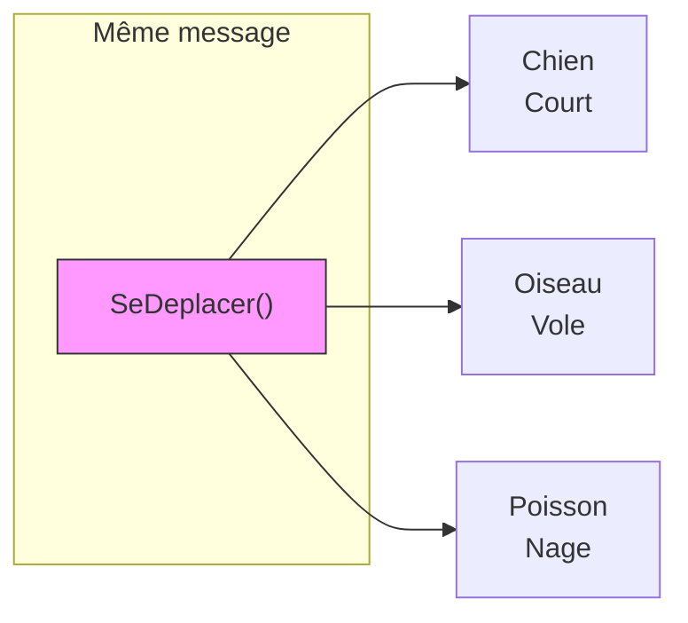
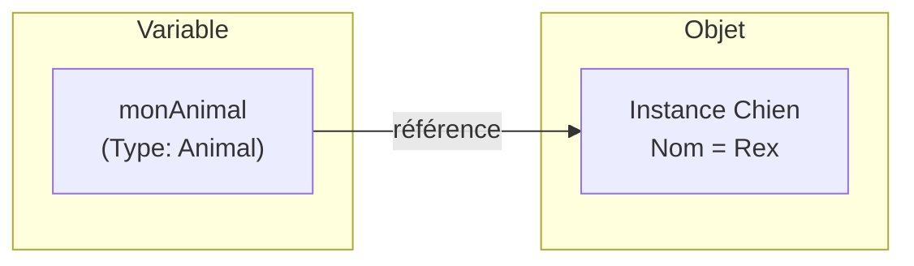
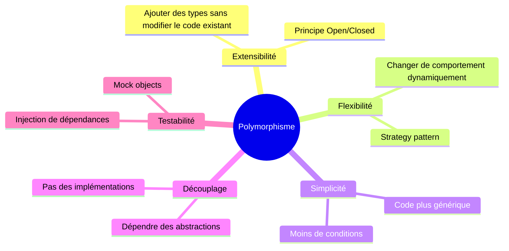

# Polymorphisme

Le polymorphisme est l'un des concepts les plus puissants de la programmation orientée objet. Il permet à un même code de se comporter différemment selon le type réel des objets manipulés, offrant une grande flexibilité et extensibilité.

::: tip 🎯 Ce que vous allez apprendre
- Comprendre le concept de polymorphisme et son intérêt
- Utiliser `virtual` et `override` pour redéfinir des comportements
- Comprendre la différence entre type déclaré et type réel
- Créer des classes et méthodes abstraites
- Appliquer le polymorphisme dans des cas pratiques
:::

## Qu'est-ce que le polymorphisme ?

Le mot **polymorphisme** vient du grec : *poly* (plusieurs) et *morphê* (forme). En programmation, cela signifie qu'une même opération peut prendre **plusieurs formes** selon le contexte.

### 🚗 Analogie : le bouton "Démarrer"

Imaginez une télécommande universelle avec un seul bouton "Démarrer" :
- Sur une **voiture** → le moteur démarre
- Sur un **avion** → les réacteurs s'allument
- Sur un **vélo électrique** → l'assistance s'active

Le **même bouton** produit des **comportements différents** selon l'objet ! C'est exactement le polymorphisme.

```
┌─────────────────────────────────────────────────────────────────────┐
│                    LE POLYMORPHISME EN IMAGE                        │
├─────────────────────────────────────────────────────────────────────┤
│                                                                     │
│                       animal.EmettreSon()                           │
│                              │                                      │
│           ┌──────────────────┼──────────────────┐                   │
│           ▼                  ▼                  ▼                   │
│       ┌───────┐          ┌───────┐          ┌───────┐               │
│       │ Chien │          │ Chat  │          │ Vache │               │
│       │       │          │       │          │       │               │
│       │"Wouf!"│          │"Miaou"│          │"Meuh!"│               │
│       └───────┘          └───────┘          └───────┘               │
│                                                                     │
│    Même appel de méthode → Comportements différents                 │
│                                                                     │
└─────────────────────────────────────────────────────────────────────┘
```

::: tip 🎭 Analogie du monde réel
Pensez au verbe "ouvrir" : on peut ouvrir une porte (en la poussant), ouvrir un livre (en écartant les pages), ouvrir une bouteille (en dévissant le bouchon). Le même concept d'"ouvrir" s'adapte à l'objet sur lequel il s'applique. C'est le polymorphisme !
:::



## Les types de polymorphisme

En C#, il existe plusieurs formes de polymorphisme :

| Type | Description | Mécanisme |
|------|-------------|-----------|
| **Polymorphisme d'héritage** | Redéfinition de méthodes dans les classes dérivées | `virtual` / `override` |
| **Polymorphisme d'interface** | Implémentation différente d'une même interface | Interfaces |
| **Surcharge de méthodes** | Plusieurs méthodes avec le même nom mais des paramètres différents | Method overloading |
| **Polymorphisme paramétrique** | Types génériques | Generics `<T>` |

Ce chapitre se concentre principalement sur le **polymorphisme d'héritage** et le **polymorphisme d'interface**.

## Polymorphisme d'héritage

### Le problème sans polymorphisme

Sans polymorphisme, on doit traiter chaque type séparément :

```csharp
// ❌ Sans polymorphisme : code verbeux et non extensible
void FaireParler(object animal)
{
    if (animal is Chien chien)
    {
        Console.WriteLine($"{chien.Nom} fait : Wouf !");
    }
    else if (animal is Chat chat)
    {
        Console.WriteLine($"{chat.Nom} fait : Miaou !");
    }
    else if (animal is Vache vache)
    {
        Console.WriteLine($"{vache.Nom} fait : Meuh !");
    }
    // ... et si on ajoute un nouveau type ?
}
```

**Problèmes de cette approche :**
- Code répétitif et difficile à maintenir
- Ajouter un nouveau type nécessite de modifier le code existant
- Violation du principe Open/Closed (ouvert à l'extension, fermé à la modification)

### La solution polymorphique

```csharp
// ✅ Avec polymorphisme : code élégant et extensible
void FaireParler(Animal animal)
{
    animal.EmettreSon();  // Le bon comportement est appelé automatiquement
}
```

### `virtual` et `override`

Pour activer le polymorphisme, on utilise :
- **`virtual`** : dans la classe de base, indique qu'une méthode peut être redéfinie
- **`override`** : dans la classe dérivée, redéfinit le comportement

```csharp
class Animal
{
    public string Nom { get; set; }
    
    public Animal(string nom)
    {
        Nom = nom;
    }
    
    // Méthode virtuelle : CAN être redéfinie
    public virtual void EmettreSon()
    {
        Console.WriteLine($"{Nom} émet un son.");
    }
    
    // Méthode non virtuelle : NE PEUT PAS être redéfinie
    public void Respirer()
    {
        Console.WriteLine($"{Nom} respire.");
    }
}

class Chien : Animal
{
    public Chien(string nom) : base(nom) { }
    
    // Redéfinition du comportement
    public override void EmettreSon()
    {
        Console.WriteLine($"{Nom} aboie : Wouf ! Wouf !");
    }
}

class Chat : Animal
{
    public Chat(string nom) : base(nom) { }
    
    public override void EmettreSon()
    {
        Console.WriteLine($"{Nom} miaule : Miaou !");
    }
}

class Vache : Animal
{
    public Vache(string nom) : base(nom) { }
    
    public override void EmettreSon()
    {
        Console.WriteLine($"{Nom} meugle : Meuh !");
    }
}
```

### Démonstration du polymorphisme

```csharp
// Création d'objets de différents types
Animal[] ferme = new Animal[]
{
    new Chien("Rex"),
    new Chat("Whiskers"),
    new Vache("Marguerite"),
    new Chien("Max")
};

// Un seul code pour tous les types !
foreach (Animal animal in ferme)
{
    animal.EmettreSon();
}
```

**Sortie :**
```
Rex aboie : Wouf ! Wouf !
Whiskers miaule : Miaou !
Marguerite meugle : Meuh !
Max aboie : Wouf ! Wouf !
```

::: warning Liaison dynamique
Le choix de la méthode à appeler se fait **à l'exécution** (runtime), pas à la compilation. C'est ce qu'on appelle la **liaison dynamique** ou **late binding**.
:::

## Comprendre la liaison dynamique

### Type déclaré vs Type réel

Une variable a deux types :
- **Type déclaré (statique)** : le type utilisé dans la déclaration
- **Type réel (dynamique)** : le type de l'objet effectivement créé

```csharp
Animal monAnimal = new Chien("Rex");
//     ↑                    ↑
//  Type déclaré      Type réel
```



### Quelle méthode est appelée ?

| Type de méthode | Méthode appelée selon |
|-----------------|----------------------|
| Non virtuelle | Type **déclaré** (compilation) |
| Virtuelle/override | Type **réel** (exécution) |

```csharp
class Animal
{
    public virtual void Virtuelle() 
    { 
        Console.WriteLine("Animal.Virtuelle"); 
    }
    
    public void NonVirtuelle() 
    { 
        Console.WriteLine("Animal.NonVirtuelle"); 
    }
}

class Chien : Animal
{
    public override void Virtuelle() 
    { 
        Console.WriteLine("Chien.Virtuelle"); 
    }
    
    public new void NonVirtuelle()  // Masquage, pas override
    { 
        Console.WriteLine("Chien.NonVirtuelle"); 
    }
}
```

```csharp
Animal animal = new Chien();

animal.Virtuelle();      // "Chien.Virtuelle" (type réel)
animal.NonVirtuelle();   // "Animal.NonVirtuelle" (type déclaré)

Chien chien = new Chien();
chien.Virtuelle();       // "Chien.Virtuelle"
chien.NonVirtuelle();    // "Chien.NonVirtuelle"
```

## Appeler la méthode de base avec `base`

Dans une méthode redéfinie, on peut appeler la version de la classe parent :

```csharp
class Animal
{
    public string Nom { get; set; }
    
    public virtual void SePresenter()
    {
        Console.WriteLine($"Je suis {Nom}.");
    }
}

class Chien : Animal
{
    public string Race { get; set; }
    
    public override void SePresenter()
    {
        base.SePresenter();  // Appelle Animal.SePresenter()
        Console.WriteLine($"Je suis un {Race}.");
    }
}
```

```csharp
Chien rex = new Chien { Nom = "Rex", Race = "Berger Allemand" };
rex.SePresenter();
// Affiche :
// Je suis Rex.
// Je suis un Berger Allemand.
```

### Pattern d'extension

Le pattern d'extension permet d'ajouter un comportement sans remplacer complètement celui de la classe parent :

```csharp
class Vehicule
{
    public virtual void Demarrer()
    {
        Console.WriteLine("Vérification du système...");
        Console.WriteLine("Démarrage en cours...");
    }
}

class VoitureElectrique : Vehicule
{
    public override void Demarrer()
    {
        Console.WriteLine("Vérification de la batterie...");
        base.Demarrer();  // Appelle le démarrage standard
        Console.WriteLine("Mode électrique activé.");
    }
}
```

## Classes et méthodes abstraites

### Le mot-clé `abstract`

Une **classe abstraite** ne peut pas être instanciée directement. Elle sert de modèle pour ses classes dérivées.

Une **méthode abstraite** n'a pas de corps et DOIT être implémentée dans les classes dérivées.

```csharp
// Classe abstraite : ne peut pas être instanciée
abstract class Forme
{
    public string Nom { get; set; }
    
    protected Forme(string nom)
    {
        Nom = nom;
    }
    
    // Méthode abstraite : PAS de corps, DOIT être implémentée
    public abstract double CalculerAire();
    
    // Méthode abstraite
    public abstract double CalculerPerimetre();
    
    // Méthode virtuelle : a un corps, CAN être redéfinie
    public virtual void Afficher()
    {
        Console.WriteLine($"{Nom} - Aire: {CalculerAire():F2}");
    }
}

class Rectangle : Forme
{
    public double Largeur { get; set; }
    public double Hauteur { get; set; }
    
    public Rectangle(double largeur, double hauteur) : base("Rectangle")
    {
        Largeur = largeur;
        Hauteur = hauteur;
    }
    
    // OBLIGATION d'implémenter les méthodes abstraites
    public override double CalculerAire()
    {
        return Largeur * Hauteur;
    }
    
    public override double CalculerPerimetre()
    {
        return 2 * (Largeur + Hauteur);
    }
}

class Cercle : Forme
{
    public double Rayon { get; set; }
    
    public Cercle(double rayon) : base("Cercle")
    {
        Rayon = rayon;
    }
    
    public override double CalculerAire()
    {
        return Math.PI * Rayon * Rayon;
    }
    
    public override double CalculerPerimetre()
    {
        return 2 * Math.PI * Rayon;
    }
    
    // Redéfinition optionnelle de la méthode virtuelle
    public override void Afficher()
    {
        base.Afficher();
        Console.WriteLine($"  Rayon: {Rayon}");
    }
}
```

```csharp
// ❌ Erreur : impossible d'instancier une classe abstraite
// Forme forme = new Forme("Test");

// ✅ On peut utiliser le type abstrait comme référence
Forme[] formes = new Forme[]
{
    new Rectangle(5, 3),
    new Cercle(2.5),
    new Rectangle(10, 4)
};

foreach (Forme forme in formes)
{
    forme.Afficher();
    Console.WriteLine($"  Périmètre: {forme.CalculerPerimetre():F2}");
    Console.WriteLine();
}
```

### Différence entre `abstract` et `virtual`

| Aspect | `abstract` | `virtual` |
|--------|-----------|-----------|
| Corps de méthode | Pas de corps | A un corps (implémentation par défaut) |
| Obligation d'override | **Obligatoire** dans les classes dérivées | **Optionnel** |
| Classe | La classe DOIT être abstraite | La classe peut être concrète |
| Utilisation | Quand pas de comportement par défaut sensé | Quand un comportement par défaut existe |

```csharp
abstract class Animal
{
    // Pas de son par défaut sensé pour "un animal"
    public abstract void EmettreSon();
    
    // Tous les animaux respirent de la même façon (par défaut)
    public virtual void Respirer()
    {
        Console.WriteLine("Inspiration... Expiration...");
    }
}
```

## Empêcher la redéfinition : `sealed override`

On peut empêcher une classe dérivée de redéfinir une méthode avec `sealed` :

```csharp
class Animal
{
    public virtual void EmettreSon()
    {
        Console.WriteLine("Son générique");
    }
}

class Chien : Animal
{
    // Cette redéfinition est finale
    public sealed override void EmettreSon()
    {
        Console.WriteLine("Wouf !");
    }
}

class ChienDeChasse : Chien
{
    // ❌ Erreur : ne peut pas redéfinir une méthode sealed
    // public override void EmettreSon() { }
}
```

## Polymorphisme d'interface

Les interfaces permettent un autre type de polymorphisme : des classes sans lien d'héritage peuvent implémenter la même interface.

```csharp
interface IDessinable
{
    void Dessiner();
}

interface IDeplacable
{
    void Deplacer(int x, int y);
}

// Différentes classes implémentent la même interface
class Rectangle : IDessinable, IDeplacable
{
    public int X { get; set; }
    public int Y { get; set; }
    
    public void Dessiner()
    {
        Console.WriteLine($"Dessin d'un rectangle en ({X}, {Y})");
    }
    
    public void Deplacer(int x, int y)
    {
        X = x;
        Y = y;
    }
}

class Image : IDessinable, IDeplacable
{
    public string Chemin { get; set; }
    public int X { get; set; }
    public int Y { get; set; }
    
    public void Dessiner()
    {
        Console.WriteLine($"Affichage de l'image {Chemin}");
    }
    
    public void Deplacer(int x, int y)
    {
        X = x;
        Y = y;
    }
}

class Texte : IDessinable
{
    public string Contenu { get; set; }
    
    public void Dessiner()
    {
        Console.WriteLine($"Affichage du texte: {Contenu}");
    }
}
```

```csharp
// Polymorphisme par interface
List<IDessinable> elements = new()
{
    new Rectangle { X = 0, Y = 0 },
    new Image { Chemin = "photo.jpg" },
    new Texte { Contenu = "Bonjour !" }
};

foreach (IDessinable element in elements)
{
    element.Dessiner();
}

// Filtrer par interface
var deplacables = elements.OfType<IDeplacable>();
foreach (IDeplacable d in deplacables)
{
    d.Deplacer(100, 100);
}
```

## Vérification et conversion de types

### L'opérateur `is`

L'opérateur `is` vérifie si un objet est d'un type donné :

```csharp
Animal animal = new Chien("Rex");

if (animal is Chien)
{
    Console.WriteLine("C'est un chien !");
}

// Avec pattern matching (C# 7+)
if (animal is Chien chien)
{
    Console.WriteLine($"C'est un chien nommé {chien.Nom}");
}

// Vérification négative
if (animal is not Chat)
{
    Console.WriteLine("Ce n'est pas un chat");
}
```

### L'opérateur `as`

L'opérateur `as` tente une conversion et retourne `null` si elle échoue :

```csharp
Animal animal = new Chien("Rex");

Chien? chien = animal as Chien;
if (chien != null)
{
    chien.Aboyer();
}

Chat? chat = animal as Chat;
if (chat == null)
{
    Console.WriteLine("La conversion en Chat a échoué");
}
```

### Cast explicite

Le cast explicite lève une exception si la conversion échoue :

```csharp
Animal animal = new Chien("Rex");

// ✅ Fonctionne
Chien chien = (Chien)animal;

// ❌ Lève InvalidCastException
// Chat chat = (Chat)animal;
```

### Comparaison des approches

| Approche | Comportement si échec | Utilisation |
|----------|----------------------|-------------|
| `is` | Retourne `false` | Vérification simple |
| `as` | Retourne `null` | Conversion optionnelle |
| Cast `()` | Lève exception | Quand on est sûr du type |

```csharp
void TraiterAnimal(Animal animal)
{
    // Recommandé : pattern matching
    switch (animal)
    {
        case Chien chien:
            chien.Aboyer();
            break;
        case Chat chat:
            chat.Miauler();
            break;
        case Oiseau oiseau:
            oiseau.Chanter();
            break;
        default:
            animal.EmettreSon();
            break;
    }
}
```

## Exemple complet : Système de paiement

```csharp
// Interface commune pour tous les moyens de paiement
interface IMoyenPaiement
{
    string Nom { get; }
    bool Valider(decimal montant);
    bool Payer(decimal montant);
    void AfficherRecu(decimal montant);
}

// Classe abstraite pour le code commun
abstract class MoyenPaiementBase : IMoyenPaiement
{
    public abstract string Nom { get; }
    
    public virtual bool Valider(decimal montant)
    {
        if (montant <= 0)
        {
            Console.WriteLine("Montant invalide");
            return false;
        }
        return true;
    }
    
    public abstract bool Payer(decimal montant);
    
    public virtual void AfficherRecu(decimal montant)
    {
        Console.WriteLine($"=== REÇU ===");
        Console.WriteLine($"Moyen: {Nom}");
        Console.WriteLine($"Montant: {montant:C}");
        Console.WriteLine($"Date: {DateTime.Now}");
        Console.WriteLine($"=============");
    }
}

class CarteBancaire : MoyenPaiementBase
{
    public override string Nom => "Carte Bancaire";
    public string NumeroCarte { get; set; }
    private decimal _plafond = 5000m;
    
    public CarteBancaire(string numero)
    {
        NumeroCarte = numero;
    }
    
    public override bool Valider(decimal montant)
    {
        if (!base.Valider(montant))
            return false;
            
        if (montant > _plafond)
        {
            Console.WriteLine("Plafond dépassé");
            return false;
        }
        return true;
    }
    
    public override bool Payer(decimal montant)
    {
        if (!Valider(montant))
            return false;
            
        Console.WriteLine($"Connexion à la banque...");
        Console.WriteLine($"Paiement par carte ****{NumeroCarte[^4..]}");
        Console.WriteLine($"Transaction autorisée");
        return true;
    }
}

class Especes : MoyenPaiementBase
{
    public override string Nom => "Espèces";
    public decimal MontantRecu { get; set; }
    
    public override bool Payer(decimal montant)
    {
        if (!Valider(montant))
            return false;
            
        if (MontantRecu < montant)
        {
            Console.WriteLine($"Montant insuffisant. Manque: {montant - MontantRecu:C}");
            return false;
        }
        
        decimal rendu = MontantRecu - montant;
        Console.WriteLine($"Paiement en espèces: {montant:C}");
        if (rendu > 0)
            Console.WriteLine($"Rendu monnaie: {rendu:C}");
        return true;
    }
}

class PayPal : MoyenPaiementBase
{
    public override string Nom => "PayPal";
    public string Email { get; set; }
    private bool _estConnecte;
    
    public PayPal(string email)
    {
        Email = email;
    }
    
    public void SeConnecter()
    {
        Console.WriteLine($"Connexion à PayPal ({Email})...");
        _estConnecte = true;
    }
    
    public override bool Payer(decimal montant)
    {
        if (!_estConnecte)
        {
            Console.WriteLine("Veuillez vous connecter à PayPal");
            return false;
        }
        
        if (!Valider(montant))
            return false;
            
        Console.WriteLine($"Paiement PayPal de {montant:C}");
        Console.WriteLine($"Confirmation envoyée à {Email}");
        return true;
    }
    
    public override void AfficherRecu(decimal montant)
    {
        base.AfficherRecu(montant);
        Console.WriteLine($"Reçu envoyé à: {Email}");
    }
}

// Système de caisse polymorphique
class Caisse
{
    public void TraiterPaiement(IMoyenPaiement moyen, decimal montant)
    {
        Console.WriteLine($"\n--- Traitement du paiement ---");
        Console.WriteLine($"Montant: {montant:C}");
        Console.WriteLine($"Moyen: {moyen.Nom}");
        
        if (moyen.Payer(montant))
        {
            Console.WriteLine("✅ Paiement réussi !");
            moyen.AfficherRecu(montant);
        }
        else
        {
            Console.WriteLine("❌ Paiement échoué");
        }
    }
}
```

### Utilisation du système

```csharp
Caisse caisse = new Caisse();

// Différents moyens de paiement
var carte = new CarteBancaire("1234567890123456");
var especes = new Especes { MontantRecu = 50m };
var paypal = new PayPal("client@email.com");
paypal.SeConnecter();

// Le même code traite tous les types de paiement !
caisse.TraiterPaiement(carte, 75.50m);
caisse.TraiterPaiement(especes, 42.00m);
caisse.TraiterPaiement(paypal, 199.99m);

// Paiement échoué
var espacesInsuffisantes = new Especes { MontantRecu = 10m };
caisse.TraiterPaiement(espacesInsuffisantes, 50m);
```

## Design Pattern : Strategy

Le polymorphisme est à la base de nombreux design patterns. Le pattern **Strategy** permet de changer dynamiquement le comportement d'un objet :

```csharp
// Stratégies de tri
interface IStrategieTri
{
    void Trier<T>(List<T> liste) where T : IComparable<T>;
    string Nom { get; }
}

class TriBulle : IStrategieTri
{
    public string Nom => "Tri à bulle";
    
    public void Trier<T>(List<T> liste) where T : IComparable<T>
    {
        Console.WriteLine($"Tri avec {Nom}...");
        for (int i = 0; i < liste.Count - 1; i++)
        {
            for (int j = 0; j < liste.Count - 1 - i; j++)
            {
                if (liste[j].CompareTo(liste[j + 1]) > 0)
                {
                    (liste[j], liste[j + 1]) = (liste[j + 1], liste[j]);
                }
            }
        }
    }
}

class TriRapide : IStrategieTri
{
    public string Nom => "Tri rapide";
    
    public void Trier<T>(List<T> liste) where T : IComparable<T>
    {
        Console.WriteLine($"Tri avec {Nom}...");
        liste.Sort();  // Utilise l'implémentation optimisée de .NET
    }
}

// Contexte qui utilise une stratégie
class Trieur
{
    private IStrategieTri _strategie;
    
    public Trieur(IStrategieTri strategie)
    {
        _strategie = strategie;
    }
    
    // On peut changer de stratégie dynamiquement
    public void ChangerStrategie(IStrategieTri nouvelleStrategie)
    {
        _strategie = nouvelleStrategie;
        Console.WriteLine($"Nouvelle stratégie: {_strategie.Nom}");
    }
    
    public void Trier<T>(List<T> liste) where T : IComparable<T>
    {
        _strategie.Trier(liste);
    }
}
```

```csharp
List<int> nombres = new() { 64, 34, 25, 12, 22, 11, 90 };

Trieur trieur = new Trieur(new TriBulle());
trieur.Trier(nombres);  // Utilise le tri à bulle

trieur.ChangerStrategie(new TriRapide());
trieur.Trier(nombres);  // Utilise le tri rapide
```

## Avantages du polymorphisme



| Avantage | Description |
|----------|-------------|
| **Extensibilité** | Ajouter un nouveau type ne modifie pas le code existant |
| **Lisibilité** | Code plus simple, moins de `if/switch` sur les types |
| **Maintenabilité** | Chaque comportement est isolé dans sa classe |
| **Testabilité** | Facile de créer des mocks pour les tests |
| **Découplage** | Le code dépend des abstractions, pas des détails |

## Erreurs courantes à éviter

### 1. Oublier `virtual`

```csharp
class Animal
{
    // ❌ Sans virtual, pas de polymorphisme
    public void EmettreSon()
    {
        Console.WriteLine("Son générique");
    }
}

class Chien : Animal
{
    // Ceci masque la méthode parent, pas de polymorphisme !
    public new void EmettreSon()
    {
        Console.WriteLine("Wouf !");
    }
}

Animal animal = new Chien();
animal.EmettreSon();  // "Son générique" ← pas le résultat attendu !
```

### 2. Confondre `new` et `override`

```csharp
class Parent
{
    public virtual void Methode() { Console.WriteLine("Parent"); }
}

class Enfant : Parent
{
    // override : polymorphisme
    public override void Methode() { Console.WriteLine("Enfant override"); }
}

class AutreEnfant : Parent
{
    // new : masquage, PAS de polymorphisme
    public new void Methode() { Console.WriteLine("Autre enfant new"); }
}

Parent p1 = new Enfant();
Parent p2 = new AutreEnfant();

p1.Methode();  // "Enfant override" ← polymorphisme
p2.Methode();  // "Parent" ← masquage, pas polymorphisme !
```

### 3. Ne pas appeler base quand nécessaire

```csharp
class Compte
{
    public virtual void Deposer(decimal montant)
    {
        // Validation importante
        if (montant <= 0)
            throw new ArgumentException("Montant invalide");
        
        // ... logique de dépôt
    }
}

class CompteEpargne : Compte
{
    // ❌ Oublie la validation du parent
    public override void Deposer(decimal montant)
    {
        // ... logique spécifique seulement
    }
    
    // ✅ Correct : appelle le parent
    public override void Deposer(decimal montant)
    {
        base.Deposer(montant);  // Inclut la validation
        // ... logique spécifique
    }
}
```

## Exercices

### Exercice 1 : Instruments de musique

Créez une hiérarchie de classes pour des instruments de musique avec polymorphisme :

1. Classe abstraite `Instrument` avec :
   - Propriété `Nom`
   - Méthode abstraite `Jouer()`

2. Classes `Guitare`, `Piano`, `Batterie` qui implémentent `Jouer()` différemment

3. Méthode `Concert(Instrument[] instruments)` qui fait jouer tous les instruments

::: details 💡 Solution Exercice 1

```csharp
abstract class Instrument
{
    public string Nom { get; set; }
    
    protected Instrument(string nom)
    {
        Nom = nom;
    }
    
    public abstract void Jouer();
}

class Guitare : Instrument
{
    public Guitare(string nom) : base(nom) { }
    
    public override void Jouer()
    {
        Console.WriteLine($"🎸 {Nom} : Pling pling pling !");
    }
}

class Piano : Instrument
{
    public Piano(string nom) : base(nom) { }
    
    public override void Jouer()
    {
        Console.WriteLine($"🎹 {Nom} : Do Ré Mi Fa Sol !");
    }
}

class Batterie : Instrument
{
    public Batterie(string nom) : base(nom) { }
    
    public override void Jouer()
    {
        Console.WriteLine($"🥁 {Nom} : Boum Boum Tac !");
    }
}

// Méthode polymorphique
void Concert(Instrument[] instruments)
{
    Console.WriteLine("🎵 Le concert commence !");
    foreach (Instrument instrument in instruments)
    {
        instrument.Jouer();  // Appel polymorphique
    }
    Console.WriteLine("🎵 Fin du concert !");
}

// Test
Instrument[] orchestre = {
    new Guitare("Fender Stratocaster"),
    new Piano("Steinway"),
    new Batterie("Pearl"),
    new Guitare("Gibson Les Paul")
};

Concert(orchestre);
```

**Sortie** :
```
🎵 Le concert commence !
🎸 Fender Stratocaster : Pling pling pling !
🎹 Steinway : Do Ré Mi Fa Sol !
🥁 Pearl : Boum Boum Tac !
🎸 Gibson Les Paul : Pling pling pling !
🎵 Fin du concert !
```
:::

### Exercice 2 : Système de notifications

Créez un système de notification polymorphique :

1. Classe abstraite `Notification` avec :
   - Propriété `Message`
   - Méthode abstraite `Envoyer()`

2. Classes `NotificationEmail`, `NotificationSMS`, `NotificationPush`

3. Classe `NotificationManager` qui peut envoyer une liste de notifications

::: details 💡 Solution Exercice 2

```csharp
abstract class Notification
{
    public string Destinataire { get; set; }
    public string Message { get; set; }
    
    protected Notification(string destinataire, string message)
    {
        Destinataire = destinataire;
        Message = message;
    }
    
    public abstract void Envoyer();
}

class NotificationEmail : Notification
{
    public string Sujet { get; set; }
    
    public NotificationEmail(string email, string sujet, string message) 
        : base(email, message)
    {
        Sujet = sujet;
    }
    
    public override void Envoyer()
    {
        Console.WriteLine($"📧 Email envoyé à {Destinataire}");
        Console.WriteLine($"   Sujet: {Sujet}");
        Console.WriteLine($"   Message: {Message}");
    }
}

class NotificationSMS : Notification
{
    public NotificationSMS(string numero, string message) 
        : base(numero, message) { }
    
    public override void Envoyer()
    {
        Console.WriteLine($"📱 SMS envoyé à {Destinataire}: {Message}");
    }
}

class NotificationPush : Notification
{
    public string AppName { get; set; }
    
    public NotificationPush(string userId, string appName, string message) 
        : base(userId, message)
    {
        AppName = appName;
    }
    
    public override void Envoyer()
    {
        Console.WriteLine($"🔔 Push [{AppName}] à {Destinataire}: {Message}");
    }
}

class NotificationManager
{
    private List<Notification> _notifications = new();
    
    public void Ajouter(Notification notification)
    {
        _notifications.Add(notification);
    }
    
    public void EnvoyerToutes()
    {
        Console.WriteLine($"Envoi de {_notifications.Count} notification(s)...\n");
        
        foreach (Notification n in _notifications)
        {
            n.Envoyer();  // Polymorphisme !
            Console.WriteLine();
        }
        
        _notifications.Clear();
        Console.WriteLine("Toutes les notifications ont été envoyées.");
    }
}

// Test
var manager = new NotificationManager();

manager.Ajouter(new NotificationEmail("alice@email.com", "Bienvenue", "Votre compte a été créé !"));
manager.Ajouter(new NotificationSMS("+32 123 456 789", "Code: 1234"));
manager.Ajouter(new NotificationPush("user_42", "MyApp", "Vous avez 3 nouveaux messages"));

manager.EnvoyerToutes();
```
:::

### Exercice 3 : Calculatrice polymorphique

Créez un système de calcul polymorphique :

1. Classe abstraite `Operation` avec méthode `Calculer(double a, double b)`
2. Classes `Addition`, `Soustraction`, `Multiplication`, `Division`
3. Classe `Calculatrice` qui exécute des opérations

::: details 💡 Solution Exercice 3

```csharp
abstract class Operation
{
    public string Symbole { get; protected set; }
    
    public abstract double Calculer(double a, double b);
    
    public override string ToString()
    {
        return Symbole;
    }
}

class Addition : Operation
{
    public Addition() { Symbole = "+"; }
    
    public override double Calculer(double a, double b)
    {
        return a + b;
    }
}

class Soustraction : Operation
{
    public Soustraction() { Symbole = "-"; }
    
    public override double Calculer(double a, double b)
    {
        return a - b;
    }
}

class Multiplication : Operation
{
    public Multiplication() { Symbole = "×"; }
    
    public override double Calculer(double a, double b)
    {
        return a * b;
    }
}

class Division : Operation
{
    public Division() { Symbole = "÷"; }
    
    public override double Calculer(double a, double b)
    {
        if (b == 0)
            throw new DivideByZeroException("Division par zéro impossible");
        return a / b;
    }
}

class Calculatrice
{
    public void Executer(double a, double b, Operation operation)
    {
        double resultat = operation.Calculer(a, b);
        Console.WriteLine($"{a} {operation.Symbole} {b} = {resultat}");
    }
    
    public void ExecuterSerie(double a, double b, params Operation[] operations)
    {
        foreach (Operation op in operations)
        {
            Executer(a, b, op);
        }
    }
}

// Test
var calc = new Calculatrice();

calc.ExecuterSerie(10, 3,
    new Addition(),
    new Soustraction(),
    new Multiplication(),
    new Division()
);
```

**Sortie** :
```
10 + 3 = 13
10 - 3 = 7
10 × 3 = 30
10 ÷ 3 = 3.333...
```
:::

## Résumé

| Concept | Description |
|---------|-------------|
| **Polymorphisme** | Capacité d'un même code à se comporter différemment selon le type |
| **`virtual`** | Permet à une méthode d'être redéfinie |
| **`override`** | Redéfinit une méthode virtuelle |
| **`abstract`** | Méthode sans corps, doit être implémentée |
| **Classe abstraite** | Ne peut pas être instanciée, sert de modèle |
| **`sealed override`** | Empêche les redéfinitions ultérieures |
| **Liaison dynamique** | Le choix de la méthode se fait à l'exécution |

::: tip Points clés à retenir
1. Utilisez `virtual` + `override` pour activer le polymorphisme
2. Les classes abstraites définissent des contrats incomplets
3. Le polymorphisme permet d'écrire du code générique et extensible
4. Préférez le polymorphisme aux cascades de `if/switch` sur les types
5. Le pattern matching (`is`, `switch`) permet d'interagir avec le type réel quand nécessaire
:::
