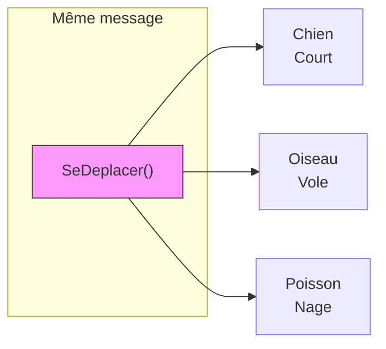
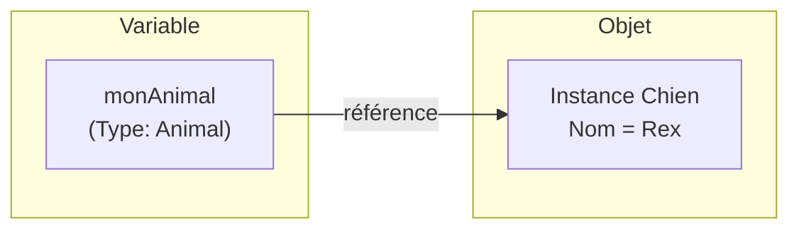
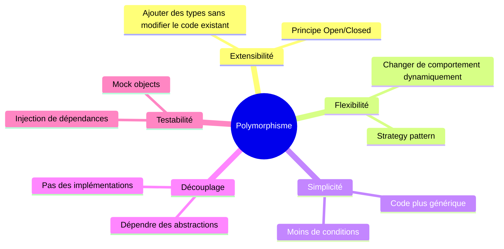

# Polymorphisme

Le polymorphisme est l'un des concepts les plus puissants de la programmation orientée objet. Il permet à un même code de se comporter différemment selon le type réel des objets manipulés, offrant une grande flexibilité et extensibilité.

::: tip 🎯 Ce que vous allez apprendre
- Comprendre le concept de polymorphisme et son intérêt
- Utiliser `virtual` et `override` pour redéfinir des comportements
- Comprendre le masquage de méthode avec `new` et ses pièges
- Comprendre la différence entre type déclaré et type réel
- Créer des classes et méthodes abstraites
- Appliquer le polymorphisme dans des cas pratiques
:::

## Qu'est-ce que le polymorphisme ?

Le mot **polymorphisme** vient du grec : *poly* (plusieurs) et *morphê* (forme). En programmation, cela signifie qu'une même opération peut prendre **plusieurs formes** selon le contexte.

### 🚗 Analogie : le bouton "Démarrer"

Imaginez une télécommande universelle avec un seul bouton "Démarrer" :
- Sur une **voiture** → le moteur démarre
- Sur un **avion** → les réacteurs s'allument
- Sur un **vélo électrique** → l'assistance s'active

Le **même bouton** produit des **comportements différents** selon l'objet ! C'est exactement le polymorphisme.

```
┌─────────────────────────────────────────────────────────────────────┐
│                    LE POLYMORPHISME EN IMAGE                        │
├─────────────────────────────────────────────────────────────────────┤
│                                                                     │
│                       animal.EmettreSon()                           │
│                              │                                      │
│           ┌──────────────────┼──────────────────┐                   │
│           ▼                  ▼                  ▼                   │
│       ┌───────┐          ┌───────┐          ┌───────┐               │
│       │ Chien │          │ Chat  │          │ Vache │               │
│       │       │          │       │          │       │               │
│       │"Wouf!"│          │"Miaou"│          │"Meuh!"│               │
│       └───────┘          └───────┘          └───────┘               │
│                                                                     │
│    Même appel de méthode → Comportements différents                 │
│                                                                     │
└─────────────────────────────────────────────────────────────────────┘
```

::: tip 🎭 Analogie du monde réel
Pensez au verbe "ouvrir" : on peut ouvrir une porte (en la poussant), ouvrir un livre (en écartant les pages), ouvrir une bouteille (en dévissant le bouchon). Le même concept d'"ouvrir" s'adapte à l'objet sur lequel il s'applique. C'est le polymorphisme !
:::


```mermaid
flowchart LR
    subgraph "Même message"
        M["SeDeplacer()"]
    end
    
    M --> C[Chien<br/>Court]
    M --> O[Oiseau<br/>Vole]
    M --> P[Poisson<br/>Nage]
    
    style M fill:#f9f,stroke:#333
```

## Les types de polymorphisme

En C#, il existe plusieurs formes de polymorphisme :

| Type | Description | Mécanisme |
|------|-------------|-----------|
| **Polymorphisme d'héritage** | Redéfinition de méthodes dans les classes dérivées | `virtual` / `override` |
| **Polymorphisme d'interface** | Implémentation différente d'une même interface | Interfaces |
| **Surcharge de méthodes** | Plusieurs méthodes avec le même nom mais des paramètres différents | Method overloading |
| **Polymorphisme paramétrique** | Types génériques | Generics `<T>` |

Ce chapitre se concentre principalement sur le **polymorphisme d'héritage**. Le **polymorphisme d'interface** est abordé ici brièvement et détaillé dans le chapitre [Interfaces](./09-interfaces.md). Le **polymorphisme paramétrique** est couvert dans le chapitre [Classes et Interfaces Génériques](./10-generiques.md).

## Polymorphisme d'héritage

### Le problème sans polymorphisme

Sans polymorphisme, on doit traiter chaque type séparément :

```csharp
// ❌ Sans polymorphisme : code verbeux et non extensible
void FaireParler(object animal)
{
    if (animal is Chien chien)
    {
        Console.WriteLine($"{chien.Nom} fait : Wouf !");
    }
    else if (animal is Chat chat)
    {
        Console.WriteLine($"{chat.Nom} fait : Miaou !");
    }
    else if (animal is Vache vache)
    {
        Console.WriteLine($"{vache.Nom} fait : Meuh !");
    }
    // ... et si on ajoute un nouveau type ?
}
```

**Problèmes de cette approche :**
- Code répétitif et difficile à maintenir
- Ajouter un nouveau type nécessite de modifier le code existant
- Violation du principe Open/Closed (ouvert à l'extension, fermé à la modification)

### La solution polymorphique

```csharp
// ✅ Avec polymorphisme : code élégant et extensible
void FaireParler(Animal animal)
{
    animal.EmettreSon();  // Le bon comportement est appelé automatiquement
}
```

### `virtual` et `override`

#### Le comportement par défaut : pas de polymorphisme

Par défaut en C#, toutes les méthodes utilisent la **liaison statique** : c'est le **type déclaré** de la variable (celui écrit à gauche du `=`) qui détermine quelle méthode est appelée, **indépendamment** du type réel de l'objet. Autrement dit, le compilateur décide *à l'avance* quelle méthode appeler.

Voyons ce que cela donne sans polymorphisme :

```csharp
class Animal
{
    public void EmettreSon()  // Pas de virtual !
    {
        Console.WriteLine("Son générique");
    }
}

class Chien : Animal
{
    public void EmettreSon()  // Même nom, mais pas d'override
    {
        Console.WriteLine("Wouf !");
    }
}
```

```csharp
Chien rex = new Chien();
rex.EmettreSon();  // "Wouf !" ← OK, le type déclaré est Chien

Animal animal = new Chien();  // Le type déclaré est Animal
animal.EmettreSon();  // "Son générique" ← ⚠️ Pas le résultat attendu !
```

Même si l'objet est *réellement* un `Chien`, c'est la méthode d'`Animal` qui est appelée, car la variable est de type `Animal`. Le polymorphisme **n'est pas actif** : le programme ne "regarde" pas quel est le vrai type de l'objet.

::: tip 🚗 Analogie
Imaginez un parking de véhicules. Sur chaque place est écrit "Véhicule" (le type déclaré). Quand on appuie sur le bouton "Démarrer" du parking, il exécute toujours le démarrage générique d'un véhicule, même si la place contient une Ferrari. Sans polymorphisme, le parking ne sait pas qu'il y a une Ferrari — il voit seulement "Véhicule".
:::

#### Activer le polymorphisme : `virtual`

Le mot-clé `virtual` dans la classe de base dit au compilateur : *"cette méthode peut être redéfinie par mes classes dérivées, et quand elle sera appelée, il faudra chercher la bonne version à l'exécution"*.

C'est le **premier verrou** à lever pour activer le polymorphisme.

```csharp
class Animal
{
    // Le mot-clé virtual active la liaison dynamique
    public virtual void EmettreSon()
    {
        Console.WriteLine("Son générique");
    }
}
```

En ajoutant `virtual`, on informe C# que cette méthode participe au mécanisme de polymorphisme. À l'exécution, le programme ira chercher la "bonne" version de la méthode en fonction du type réel de l'objet.

::: info Ce que `virtual` ne fait PAS
`virtual` ne rend pas la redéfinition **obligatoire**. Les classes dérivées *peuvent* redéfinir la méthode, mais elles n'y sont pas forcées. Si elles ne la redéfinissent pas, le comportement par défaut (celui de la classe de base) est utilisé.
:::

#### Redéfinir le comportement : `override`

Le mot-clé `override` dans la classe dérivée dit : *"je fournis une nouvelle implémentation pour cette méthode virtuelle héritée"*. C'est le **second verrou**.

```csharp
class Chien : Animal
{
    // override = "je remplace le comportement hérité"
    public override void EmettreSon()
    {
        Console.WriteLine("Wouf !");
    }
}
```

Quand C# rencontre un appel à `EmettreSon()` sur un objet qui est *réellement* un `Chien`, il utilise cette version redéfinie au lieu de la version de base.

::: warning Contraintes de `override`
Pour pouvoir écrire `override`, la méthode dans la classe de base **doit** être `virtual`, `abstract` ou elle-même `override`. On ne peut pas faire `override` sur une méthode "normale" — le compilateur refusera.
:::

#### Les deux verrous ensemble

`virtual` et `override` fonctionnent **en tandem**. L'un ne va pas sans l'autre :

| Situation | Résultat |
|-----------|----------|
| `virtual` dans la base + `override` dans la dérivée | ✅ Polymorphisme actif |
| Pas de `virtual` + `override` dans la dérivée | ❌ Erreur de compilation |
| `virtual` dans la base + pas de `override` dans la dérivée | ⚠️ Comportement par défaut (pas de redéfinition) |
| Pas de `virtual` + même nom dans la dérivée | ⚠️ Masquage (`new` implicite), pas de polymorphisme |

```
┌─────────────────────────────────────────────────────────────────────┐
│                  virtual + override = polymorphisme                 │
│                                                                     │
│   Classe de base                   Classe dérivée                   │
│   ┌──────────────────┐             ┌──────────────────┐             │
│   │ Animal           │             │ Chien : Animal   │             │
│   │                  │             │                  │             │
│   │  virtual         │───────────> │  override        │             │
│   │  EmettreSon()    │  "je peux   │  EmettreSon()    │             │
│   │  {Son générique} │  être       │  {Wouf !}        │             │
│   │                  │  redéfinie" │                  │             │
│   └──────────────────┘             └──────────────────┘             │
│                                                                     │
│   🔑 virtual = "verrou 1"         🔑 override = "verrou 2"         │
│   Autorise la redéfinition         Fournit la nouvelle version      │
│                                                                     │
│   Les DEUX sont nécessaires pour que le polymorphisme fonctionne.   │
└─────────────────────────────────────────────────────────────────────┘
```

#### Exemple complet avec `virtual` et `override`

```csharp
class Animal
{
    public string Nom { get; set; }
    
    public Animal(string nom)
    {
        Nom = nom;
    }
    
    // Méthode virtuelle : PEUT être redéfinie par les classes dérivées
    public virtual void EmettreSon()
    {
        Console.WriteLine($"{Nom} émet un son.");
    }
    
    // Méthode non virtuelle : NE PEUT PAS être redéfinie (polymorphisme impossible)
    public void Respirer()
    {
        Console.WriteLine($"{Nom} respire.");
    }
}

class Chien : Animal
{
    public Chien(string nom) : base(nom) { }
    
    // override : redéfinit le comportement de EmettreSon()
    public override void EmettreSon()
    {
        Console.WriteLine($"{Nom} aboie : Wouf ! Wouf !");
    }
}

class Chat : Animal
{
    public Chat(string nom) : base(nom) { }
    
    public override void EmettreSon()
    {
        Console.WriteLine($"{Nom} miaule : Miaou !");
    }
}

class Vache : Animal
{
    public Vache(string nom) : base(nom) { }
    
    public override void EmettreSon()
    {
        Console.WriteLine($"{Nom} meugle : Meuh !");
    }
}
```

Remarquez que `Respirer()` n'est **pas** `virtual`. Même si une classe dérivée voulait changer cette méthode, le polymorphisme ne fonctionnerait pas pour elle.

### Démonstration du polymorphisme

```csharp
// Création d'objets de différents types
Animal[] ferme = new Animal[]
{
    new Chien("Rex"),
    new Chat("Whiskers"),
    new Vache("Marguerite"),
    new Chien("Max")
};

// Un seul code pour tous les types !
foreach (Animal animal in ferme)
{
    animal.EmettreSon();
}
```

**Sortie :**
```
Rex aboie : Wouf ! Wouf !
Whiskers miaule : Miaou !
Marguerite meugle : Meuh !
Max aboie : Wouf ! Wouf !
```

Ici, la variable `animal` est de type `Animal` (type déclaré), mais grâce à `virtual` + `override`, C# regarde le **type réel** de chaque objet pour choisir la bonne méthode. C'est le polymorphisme en action !

::: info 💡 Pourquoi ça marche ?
À chaque itération de la boucle, `animal` pointe vers un objet différent (un `Chien`, un `Chat`, une `Vache`...). Grâce au mécanisme `virtual`/`override`, l'appel `animal.EmettreSon()` ne se résout pas à la compilation (sinon ce serait toujours `Animal.EmettreSon()`), mais **à l'exécution**, en fonction du type réel de l'objet pointé.
:::

::: warning Liaison dynamique
Le choix de la méthode à appeler se fait **à l'exécution** (runtime), pas à la compilation. C'est ce qu'on appelle la **liaison dynamique** ou **late binding**.
:::

## Comprendre la liaison dynamique

### Type déclaré vs Type réel

Chaque variable objet en C# possède **deux types** qu'il est essentiel de distinguer :

- **Type déclaré (statique)** : le type écrit à **gauche** du `=` lors de la déclaration. C'est le type que le **compilateur** connaît.
- **Type réel (dynamique)** : le type de l'objet effectivement créé avec `new`, à **droite** du `=`. C'est le type que le **runtime** (l'exécution) connaît.

```csharp
Animal monAnimal = new Chien("Rex");
//     ↑                    ↑
//  Type déclaré      Type réel
//  (compilateur)     (exécution)
```

Le type déclaré peut être un **parent** du type réel (grâce à l'héritage), mais **jamais l'inverse**. On peut mettre un `Chien` dans une variable `Animal`, mais pas un `Animal` dans une variable `Chien`.


```mermaid
flowchart LR
    subgraph Variable
        V["monAnimal<br/>(Type: Animal)"]
    end
    
    subgraph Objet
        O["Instance Chien<br/>Nom = Rex"]
    end
    
    V -->|référence| O
```

::: tip 🎭 Analogie
Un acteur (type réel) peut porter un costume (type déclaré). L'acteur est un `Chien`, mais il porte le costume `Animal`. Quand on lui demande de jouer (appel de méthode), c'est l'acteur qui joue — pas le costume !
:::

### Quelle méthode est appelée ?

La distinction est simple mais **cruciale** :

| Type de méthode | Méthode appelée selon | Mécanisme |
|-----------------|----------------------|-----------|
| Non virtuelle | Type **déclaré** (compilation) | Liaison statique |
| `virtual` + `override` | Type **réel** (exécution) | Liaison dynamique |

```csharp
class Animal
{
    public virtual void Virtuelle() 
    { 
        Console.WriteLine("Animal.Virtuelle"); 
    }
    
    public void NonVirtuelle() 
    { 
        Console.WriteLine("Animal.NonVirtuelle"); 
    }
}

class Chien : Animal
{
    public override void Virtuelle() 
    { 
        Console.WriteLine("Chien.Virtuelle"); 
    }
    
    public new void NonVirtuelle()  // Masquage, pas override
    { 
        Console.WriteLine("Chien.NonVirtuelle"); 
    }
}
```

```csharp
Animal animal = new Chien();
//     ↑ déclaré       ↑ réel

animal.Virtuelle();      // "Chien.Virtuelle"      → regarde le type RÉEL (Chien)
animal.NonVirtuelle();   // "Animal.NonVirtuelle"   → regarde le type DÉCLARÉ (Animal)

Chien chien = new Chien();
//    ↑ déclaré = réel

chien.Virtuelle();       // "Chien.Virtuelle"       → type réel = Chien
chien.NonVirtuelle();    // "Chien.NonVirtuelle"     → type déclaré = Chien
```

::: details 🔍 Analyse ligne par ligne
1. `animal.Virtuelle()` → `Virtuelle` est `virtual` dans `Animal` et `override` dans `Chien`. Le type réel est `Chien` → **"Chien.Virtuelle"**
2. `animal.NonVirtuelle()` → `NonVirtuelle` n'est pas `virtual` dans `Animal`. Le type déclaré est `Animal` → **"Animal.NonVirtuelle"** (le `new` dans `Chien` est ignoré)
3. `chien.Virtuelle()` → Même résultat car le type déclaré ET réel sont `Chien` → **"Chien.Virtuelle"**
4. `chien.NonVirtuelle()` → Le type déclaré est `Chien`, donc on utilise `Chien.NonVirtuelle` → **"Chien.NonVirtuelle"**
:::

## Appeler la méthode de base avec `base`

Dans une méthode redéfinie, on peut appeler la version de la classe parent :

```csharp
class Animal
{
    public string Nom { get; set; }
    
    public virtual void SePresenter()
    {
        Console.WriteLine($"Je suis {Nom}.");
    }
}

class Chien : Animal
{
    public string Race { get; set; }
    
    public override void SePresenter()
    {
        base.SePresenter();  // Appelle Animal.SePresenter()
        Console.WriteLine($"Je suis un {Race}.");
    }
}
```

```csharp
Chien rex = new Chien { Nom = "Rex", Race = "Berger Allemand" };
rex.SePresenter();
// Affiche :
// Je suis Rex.
// Je suis un Berger Allemand.
```

### Pattern d'extension

Le pattern d'extension permet d'ajouter un comportement sans remplacer complètement celui de la classe parent :

```csharp
class Vehicule
{
    public virtual void Demarrer()
    {
        Console.WriteLine("Vérification du système...");
        Console.WriteLine("Démarrage en cours...");
    }
}

class VoitureElectrique : Vehicule
{
    public override void Demarrer()
    {
        Console.WriteLine("Vérification de la batterie...");
        base.Demarrer();  // Appelle le démarrage standard
        Console.WriteLine("Mode électrique activé.");
    }
}
```

## Le mot-clé `new` : masquage de méthode

### Le problème : que se passe-t-il sans `override` ?

Que se passe-t-il si une classe dérivée définit une méthode qui porte le même nom qu'une méthode de sa classe de base, **sans** utiliser `override` ?

```csharp
class Animal
{
    public virtual void EmettreSon()
    {
        Console.WriteLine("Son générique");
    }
}

class Chien : Animal
{
    // Pas de override → le compilateur émet un avertissement !
    public void EmettreSon()
    {
        Console.WriteLine("Wouf !");
    }
}
```

Le compilateur C# affiche un **avertissement** (CS0114) :

> *'Chien.EmettreSon()' hides inherited member 'Animal.EmettreSon()'. To make the current member override that implementation, add the override keyword. Otherwise add the new keyword.*

Le compilateur vous demande de **clarifier votre intention** :
- Vouliez-vous **redéfinir** la méthode ? → Ajoutez `override`
- Vouliez-vous **masquer** la méthode volontairement ? → Ajoutez `new`

### `new` : le masquage explicite

Le mot-clé `new` placé devant une méthode indique que vous **masquez volontairement** la méthode de la classe de base. Ce n'est **pas** du polymorphisme — c'est comme si deux méthodes indépendantes portaient le même nom par coïncidence.

```csharp
class Animal
{
    public virtual void EmettreSon()
    {
        Console.WriteLine("Son générique");
    }
}

class Chien : Animal
{
    // Masquage explicite : "je sais ce que je fais"
    public new void EmettreSon()
    {
        Console.WriteLine("Wouf !");
    }
}
```

::: warning Attention
`new` ne fait **pas** disparaître la méthode de la classe de base. Il la **cache** du point de vue de la classe dérivée. La méthode de base reste accessible via une variable de type `Animal`.
:::

### La différence cruciale : `override` vs `new`

Voici un exemple qui met en évidence la différence fondamentale :

```csharp
class Animal
{
    public virtual void EmettreSon()
    {
        Console.WriteLine("Son générique");
    }
}

class Chat : Animal
{
    public override void EmettreSon()  // Redéfinition
    {
        Console.WriteLine("Miaou !");
    }
}

class Chien : Animal
{
    public new void EmettreSon()  // Masquage
    {
        Console.WriteLine("Wouf !");
    }
}
```

```csharp
// Déclaration avec le type de base Animal
Animal chat = new Chat();
Animal chien = new Chien();

chat.EmettreSon();   // "Miaou !"        → override : le type RÉEL (Chat) est utilisé ✅
chien.EmettreSon();  // "Son générique"  → new : le type DÉCLARÉ (Animal) est utilisé ❌

// Déclaration avec le type réel
Chat chat2 = new Chat();
Chien chien2 = new Chien();

chat2.EmettreSon();  // "Miaou !"  → Même résultat
chien2.EmettreSon(); // "Wouf !"   → Ici ça fonctionne car le type déclaré EST Chien
```

::: danger ⚠️ Le piège du `new`
Le masquage semble "fonctionner" quand on utilise directement le type dérivé (`Chien chien2 = new Chien()`). Mais dès qu'on manipule l'objet via une variable de type parent (`Animal chien = new Chien()`), **le masquage est ignoré** et c'est la méthode de la classe de base qui est appelée. C'est exactement le scénario courant du polymorphisme (tableaux d'`Animal`, paramètres de type `Animal`, etc.).
:::

| | `override` | `new` |
|--|-----------|-------|
| **Mécanisme** | Redéfinition (polymorphisme) | Masquage (hiding) |
| **Méthode appelée** | Selon le type **réel** de l'objet | Selon le type **déclaré** de la variable |
| **Liaison** | Dynamique (à l'exécution) | Statique (à la compilation) |
| **Polymorphisme** | ✅ Oui | ❌ Non |
| **Usage recommandé** | Cas standard | Cas rares et spécifiques |

```
┌────────────────────────────────────────────────────────────────┐
│               override vs new : le résultat                    │
│                                                                │
│   Animal a1 = new Chat();     Animal a2 = new Chien();         │
│   a1.EmettreSon();            a2.EmettreSon();                 │
│                                                                │
│   ┌──────────────┐            ┌──────────────┐                 │
│   │   Chat       │            │   Chien      │                 │
│   │  (override)  │            │    (new)     │                 │
│   ├──────────────┤            ├──────────────┤                 │
│   │ "Miaou !"    │ ← appelé   │ "Wouf !"     │ ← ignoré        │
│   └──────┬───────┘            └──────┬───────┘                 │
│          │                           │                         │
│   ┌──────┴────────┐           ┌──────┴────────┐                │
│   │   Animal      │           │   Animal      │                │
│   ├───────────────┤           ├───────────────┤                │
│   │"Son générique"│← ignoré   │"Son générique"│← appelé        │
│   └───────────────┘           └───────────────┘                │
│                                                                │
│   override → suit le type réel    new → suit le type déclaré   │
└────────────────────────────────────────────────────────────────┘
```

### `new virtual` : un nouveau point de départ

On peut combiner `new` et `virtual` pour créer une **nouvelle chaîne** de polymorphisme, indépendante de celle de la classe de base :

```csharp
class A
{
    public virtual void M() { Console.WriteLine("A.M"); }
}

class B : A
{
    // Masque A.M ET crée un nouveau point de départ virtual
    public new virtual void M() { Console.WriteLine("B.M"); }
}

class C : B
{
    // Ce override s'applique à B.M, pas à A.M
    public override void M() { Console.WriteLine("C.M"); }
}
```

```csharp
A obj1 = new C();
B obj2 = new C();
C obj3 = new C();

obj1.M();  // "A.M"  → La chaîne virtual/override de A ne trouve pas de override (B utilise new)
obj2.M();  // "C.M"  → La chaîne virtual/override de B trouve l'override dans C
obj3.M();  // "C.M"  → Idem
```

::: info Explication
- `obj1` est de type déclaré `A`. C# cherche un `override` de `A.M` dans la hiérarchie : `B` utilise `new` (pas `override`), donc la chaîne s'arrête. C'est `A.M` qui est appelé.
- `obj2` est de type déclaré `B`. C# cherche un `override` de `B.M` : `C` fait `override`, donc c'est `C.M` qui est appelé.
:::

::: danger ⚠️ Attention
Une méthode déclarée avec `new` (sans `virtual`) **n'est pas virtuelle**. Si une classe dérive et veut redéfinir cette méthode, elle ne peut **pas** utiliser `override` :

```csharp
class B : A
{
    public new void M() { Console.WriteLine("B.M"); }  // Pas virtual !
}

class C : B
{
    public override void M() { }  // ❌ Erreur : B.M n'est pas virtual
}
```

Pour permettre la redéfinition dans les sous-classes, il faut écrire `public new virtual void M()`.
:::

### Quand utiliser `new` ?

::: tip 💡 Règle pratique
Dans **99% des cas**, vous devriez utiliser `override` plutôt que `new`. Le masquage avec `new` est rarement la bonne solution et mène souvent à des comportements surprenants.
:::

Le `new` est utile dans des situations très spécifiques :
- Quand une bibliothèque externe ajoute une méthode qui entre en **conflit de nom** avec votre code existant
- Quand vous voulez délibérément **changer le type de retour** d'une méthode (ce que `override` ne permet pas)
- Quand vous devez maintenir la compatibilité avec du code existant sans modifier la classe de base

### Algorithme de résolution : method lookup

Voici l'algorithme de résolution du method lookup dans le cas d'un appel de méthode :

```csharp
A v = new B();
// A : type statique
// B() : type dynamique
v.m1();
```


```
si m1 n'est pas virtual ou override dans A alors
    Fin de la recherche : A >> m1
sinon
    on cherche la méthode m1 dans B.
    
    si trouvée et marquée 'override' alors
        si aucun 'new' pour m1 n'apparaît dans la hiérarchie entre A (non compris) et B (compris) alors
            Fin de la recherche : B >> m1
        sinon
            // Cet override s'applique à la méthode 'new', pas à celle de A.
            // On l'ignore pour cette recherche.
            on recommence la recherche sur la classe de base de B
        fin si
    sinon
        on recommence la recherche sur la classe de base de B
    fin si
fin si
```

## Classes et méthodes abstraites

### Le mot-clé `abstract`

Une **classe abstraite** ne peut pas être instanciée directement. Elle sert de modèle pour ses classes dérivées.

Une **méthode abstraite** n'a pas de corps et DOIT être implémentée dans les classes dérivées.

```csharp
// Classe abstraite : ne peut pas être instanciée
abstract class Forme
{
    public string Nom { get; set; }
    
    protected Forme(string nom)
    {
        Nom = nom;
    }
    
    // Méthode abstraite : PAS de corps, DOIT être implémentée
    public abstract double CalculerAire();
    
    // Méthode abstraite
    public abstract double CalculerPerimetre();
    
    // Méthode virtuelle : a un corps, CAN être redéfinie
    public virtual void Afficher()
    {
        Console.WriteLine($"{Nom} - Aire: {CalculerAire():F2}");
    }
}

class Rectangle : Forme
{
    public double Largeur { get; set; }
    public double Hauteur { get; set; }
    
    public Rectangle(double largeur, double hauteur) : base("Rectangle")
    {
        Largeur = largeur;
        Hauteur = hauteur;
    }
    
    // OBLIGATION d'implémenter les méthodes abstraites
    public override double CalculerAire()
    {
        return Largeur * Hauteur;
    }
    
    public override double CalculerPerimetre()
    {
        return 2 * (Largeur + Hauteur);
    }
}

class Cercle : Forme
{
    public double Rayon { get; set; }
    
    public Cercle(double rayon) : base("Cercle")
    {
        Rayon = rayon;
    }
    
    public override double CalculerAire()
    {
        return Math.PI * Rayon * Rayon;
    }
    
    public override double CalculerPerimetre()
    {
        return 2 * Math.PI * Rayon;
    }
    
    // Redéfinition optionnelle de la méthode virtuelle
    public override void Afficher()
    {
        base.Afficher();
        Console.WriteLine($"  Rayon: {Rayon}");
    }
}
```

```csharp
// ❌ Erreur : impossible d'instancier une classe abstraite
// Forme forme = new Forme("Test");

// ✅ On peut utiliser le type abstrait comme référence
Forme[] formes = new Forme[]
{
    new Rectangle(5, 3),
    new Cercle(2.5),
    new Rectangle(10, 4)
};

foreach (Forme forme in formes)
{
    forme.Afficher();
    Console.WriteLine($"  Périmètre: {forme.CalculerPerimetre():F2}");
    Console.WriteLine();
}
```

### Différence entre `abstract` et `virtual`

| Aspect | `abstract` | `virtual` |
|--------|-----------|-----------|
| Corps de méthode | Pas de corps | A un corps (implémentation par défaut) |
| Obligation d'override | **Obligatoire** dans les classes dérivées | **Optionnel** |
| Classe | La classe DOIT être abstraite | La classe peut être concrète |
| Utilisation | Quand pas de comportement par défaut sensé | Quand un comportement par défaut existe |

```csharp
abstract class Animal
{
    // Pas de son par défaut sensé pour "un animal"
    public abstract void EmettreSon();
    
    // Tous les animaux respirent de la même façon (par défaut)
    public virtual void Respirer()
    {
        Console.WriteLine("Inspiration... Expiration...");
    }
}
```

## Empêcher la redéfinition : `sealed override`

On peut empêcher une classe dérivée de redéfinir une méthode avec `sealed` :

```csharp
class Animal
{
    public virtual void EmettreSon()
    {
        Console.WriteLine("Son générique");
    }
}

class Chien : Animal
{
    // Cette redéfinition est finale
    public sealed override void EmettreSon()
    {
        Console.WriteLine("Wouf !");
    }
}

class ChienDeChasse : Chien
{
    // ❌ Erreur : ne peut pas redéfinir une méthode sealed
    // public override void EmettreSon() { }
}
```

## Polymorphisme d'interface

Les interfaces permettent un autre type de polymorphisme : des classes sans lien d'héritage peuvent implémenter la même interface. Nous introduisons ici le concept ; le chapitre [Interfaces](./09-interfaces.md) couvre le sujet en profondeur (définition, découplage, interfaces .NET courantes).

```csharp
interface IDessinable
{
    void Dessiner();
}

interface IDeplacable
{
    void Deplacer(int x, int y);
}

// Différentes classes implémentent la même interface
class Rectangle : IDessinable, IDeplacable
{
    public int X { get; set; }
    public int Y { get; set; }
    
    public void Dessiner()
    {
        Console.WriteLine($"Dessin d'un rectangle en ({X}, {Y})");
    }
    
    public void Deplacer(int x, int y)
    {
        X = x;
        Y = y;
    }
}

class Image : IDessinable, IDeplacable
{
    public string Chemin { get; set; }
    public int X { get; set; }
    public int Y { get; set; }
    
    public void Dessiner()
    {
        Console.WriteLine($"Affichage de l'image {Chemin}");
    }
    
    public void Deplacer(int x, int y)
    {
        X = x;
        Y = y;
    }
}

class Texte : IDessinable
{
    public string Contenu { get; set; }
    
    public void Dessiner()
    {
        Console.WriteLine($"Affichage du texte: {Contenu}");
    }
}
```

```csharp
// Polymorphisme par interface
List<IDessinable> elements = new()
{
    new Rectangle { X = 0, Y = 0 },
    new Image { Chemin = "photo.jpg" },
    new Texte { Contenu = "Bonjour !" }
};

foreach (IDessinable element in elements)
{
    element.Dessiner();
}

// Filtrer par interface
var deplacables = elements.OfType<IDeplacable>();
foreach (IDeplacable d in deplacables)
{
    d.Deplacer(100, 100);
}
```

## Vérification et conversion de types

### L'opérateur `is`

L'opérateur `is` vérifie si un objet est d'un type donné :

```csharp
Animal animal = new Chien("Rex");

if (animal is Chien)
{
    Console.WriteLine("C'est un chien !");
}

// Avec pattern matching (C# 7+)
if (animal is Chien chien)
{
    Console.WriteLine($"C'est un chien nommé {chien.Nom}");
}

// Vérification négative
if (animal is not Chat)
{
    Console.WriteLine("Ce n'est pas un chat");
}
```

### L'opérateur `as`

L'opérateur `as` tente une conversion et retourne `null` si elle échoue :

```csharp
Animal animal = new Chien("Rex");

Chien? chien = animal as Chien;
if (chien != null)
{
    chien.Aboyer();
}

Chat? chat = animal as Chat;
if (chat == null)
{
    Console.WriteLine("La conversion en Chat a échoué");
}
```

### Cast explicite

Le cast explicite lève une exception si la conversion échoue :

```csharp
Animal animal = new Chien("Rex");

// ✅ Fonctionne
Chien chien = (Chien)animal;

// ❌ Lève InvalidCastException
// Chat chat = (Chat)animal;
```

### Comparaison des approches

| Approche | Comportement si échec | Utilisation |
|----------|----------------------|-------------|
| `is` | Retourne `false` | Vérification simple |
| `as` | Retourne `null` | Conversion optionnelle |
| Cast `()` | Lève exception | Quand on est sûr du type |

```csharp
void TraiterAnimal(Animal animal)
{
    // Recommandé : pattern matching
    switch (animal)
    {
        case Chien chien:
            chien.Aboyer();
            break;
        case Chat chat:
            chat.Miauler();
            break;
        case Oiseau oiseau:
            oiseau.Chanter();
            break;
        default:
            animal.EmettreSon();
            break;
    }
}
```

## Exemple complet : Système de paiement

```csharp
// Interface commune pour tous les moyens de paiement
interface IMoyenPaiement
{
    string Nom { get; }
    bool Valider(decimal montant);
    bool Payer(decimal montant);
    void AfficherRecu(decimal montant);
}

// Classe abstraite pour le code commun
abstract class MoyenPaiementBase : IMoyenPaiement
{
    public abstract string Nom { get; }
    
    public virtual bool Valider(decimal montant)
    {
        if (montant <= 0)
        {
            Console.WriteLine("Montant invalide");
            return false;
        }
        return true;
    }
    
    public abstract bool Payer(decimal montant);
    
    public virtual void AfficherRecu(decimal montant)
    {
        Console.WriteLine($"=== REÇU ===");
        Console.WriteLine($"Moyen: {Nom}");
        Console.WriteLine($"Montant: {montant:C}");
        Console.WriteLine($"Date: {DateTime.Now}");
        Console.WriteLine($"=============");
    }
}

class CarteBancaire : MoyenPaiementBase
{
    public override string Nom => "Carte Bancaire";
    public string NumeroCarte { get; set; }
    private decimal _plafond = 5000m;
    
    public CarteBancaire(string numero)
    {
        NumeroCarte = numero;
    }
    
    public override bool Valider(decimal montant)
    {
        if (!base.Valider(montant))
            return false;
            
        if (montant > _plafond)
        {
            Console.WriteLine("Plafond dépassé");
            return false;
        }
        return true;
    }
    
    public override bool Payer(decimal montant)
    {
        if (!Valider(montant))
            return false;
            
        Console.WriteLine($"Connexion à la banque...");
        Console.WriteLine($"Paiement par carte ****{NumeroCarte[^4..]}");
        Console.WriteLine($"Transaction autorisée");
        return true;
    }
}

class Especes : MoyenPaiementBase
{
    public override string Nom => "Espèces";
    public decimal MontantRecu { get; set; }
    
    public override bool Payer(decimal montant)
    {
        if (!Valider(montant))
            return false;
            
        if (MontantRecu < montant)
        {
            Console.WriteLine($"Montant insuffisant. Manque: {montant - MontantRecu:C}");
            return false;
        }
        
        decimal rendu = MontantRecu - montant;
        Console.WriteLine($"Paiement en espèces: {montant:C}");
        if (rendu > 0)
            Console.WriteLine($"Rendu monnaie: {rendu:C}");
        return true;
    }
}

class PayPal : MoyenPaiementBase
{
    public override string Nom => "PayPal";
    public string Email { get; set; }
    private bool _estConnecte;
    
    public PayPal(string email)
    {
        Email = email;
    }
    
    public void SeConnecter()
    {
        Console.WriteLine($"Connexion à PayPal ({Email})...");
        _estConnecte = true;
    }
    
    public override bool Payer(decimal montant)
    {
        if (!_estConnecte)
        {
            Console.WriteLine("Veuillez vous connecter à PayPal");
            return false;
        }
        
        if (!Valider(montant))
            return false;
            
        Console.WriteLine($"Paiement PayPal de {montant:C}");
        Console.WriteLine($"Confirmation envoyée à {Email}");
        return true;
    }
    
    public override void AfficherRecu(decimal montant)
    {
        base.AfficherRecu(montant);
        Console.WriteLine($"Reçu envoyé à: {Email}");
    }
}

// Système de caisse polymorphique
class Caisse
{
    public void TraiterPaiement(IMoyenPaiement moyen, decimal montant)
    {
        Console.WriteLine($"\n--- Traitement du paiement ---");
        Console.WriteLine($"Montant: {montant:C}");
        Console.WriteLine($"Moyen: {moyen.Nom}");
        
        if (moyen.Payer(montant))
        {
            Console.WriteLine("✅ Paiement réussi !");
            moyen.AfficherRecu(montant);
        }
        else
        {
            Console.WriteLine("❌ Paiement échoué");
        }
    }
}
```

### Utilisation du système

```csharp
Caisse caisse = new Caisse();

// Différents moyens de paiement
var carte = new CarteBancaire("1234567890123456");
var especes = new Especes { MontantRecu = 50m };
var paypal = new PayPal("client@email.com");
paypal.SeConnecter();

// Le même code traite tous les types de paiement !
caisse.TraiterPaiement(carte, 75.50m);
caisse.TraiterPaiement(especes, 42.00m);
caisse.TraiterPaiement(paypal, 199.99m);

// Paiement échoué
var espacesInsuffisantes = new Especes { MontantRecu = 10m };
caisse.TraiterPaiement(espacesInsuffisantes, 50m);
```

## Design Pattern : Strategy

Le polymorphisme est à la base de nombreux design patterns. Le pattern **Strategy** permet de changer dynamiquement le comportement d'un objet :

```csharp
// Stratégies de tri
interface IStrategieTri
{
    void Trier<T>(List<T> liste) where T : IComparable<T>;
    string Nom { get; }
}

class TriBulle : IStrategieTri
{
    public string Nom => "Tri à bulle";
    
    public void Trier<T>(List<T> liste) where T : IComparable<T>
    {
        Console.WriteLine($"Tri avec {Nom}...");
        for (int i = 0; i < liste.Count - 1; i++)
        {
            for (int j = 0; j < liste.Count - 1 - i; j++)
            {
                if (liste[j].CompareTo(liste[j + 1]) > 0)
                {
                    (liste[j], liste[j + 1]) = (liste[j + 1], liste[j]);
                }
            }
        }
    }
}

class TriRapide : IStrategieTri
{
    public string Nom => "Tri rapide";
    
    public void Trier<T>(List<T> liste) where T : IComparable<T>
    {
        Console.WriteLine($"Tri avec {Nom}...");
        liste.Sort();  // Utilise l'implémentation optimisée de .NET
    }
}

// Contexte qui utilise une stratégie
class Trieur
{
    private IStrategieTri _strategie;
    
    public Trieur(IStrategieTri strategie)
    {
        _strategie = strategie;
    }
    
    // On peut changer de stratégie dynamiquement
    public void ChangerStrategie(IStrategieTri nouvelleStrategie)
    {
        _strategie = nouvelleStrategie;
        Console.WriteLine($"Nouvelle stratégie: {_strategie.Nom}");
    }
    
    public void Trier<T>(List<T> liste) where T : IComparable<T>
    {
        _strategie.Trier(liste);
    }
}
```

```csharp
List<int> nombres = new() { 64, 34, 25, 12, 22, 11, 90 };

Trieur trieur = new Trieur(new TriBulle());
trieur.Trier(nombres);  // Utilise le tri à bulle

trieur.ChangerStrategie(new TriRapide());
trieur.Trier(nombres);  // Utilise le tri rapide
```

## Avantages du polymorphisme


```mermaid
mindmap
  root((Polymorphisme))
    Extensibilité
      Ajouter des types sans modifier le code existant
      Principe Open/Closed
    Flexibilité
      Changer de comportement dynamiquement
      Strategy pattern
    Simplicité
      Code plus générique
      Moins de conditions
    Découplage
      Dépendre des abstractions
      Pas des implémentations
    Testabilité
      Mock objects
      Injection de dépendances
```

| Avantage | Description |
|----------|-------------|
| **Extensibilité** | Ajouter un nouveau type ne modifie pas le code existant |
| **Lisibilité** | Code plus simple, moins de `if/switch` sur les types |
| **Maintenabilité** | Chaque comportement est isolé dans sa classe |
| **Testabilité** | Facile de créer des mocks pour les tests |
| **Découplage** | Le code dépend des abstractions, pas des détails |

## Erreurs courantes à éviter

### 1. Oublier `virtual`

```csharp
class Animal
{
    // ❌ Sans virtual, pas de polymorphisme
    public void EmettreSon()
    {
        Console.WriteLine("Son générique");
    }
}

class Chien : Animal
{
    // Ceci masque la méthode parent, pas de polymorphisme !
    public new void EmettreSon()
    {
        Console.WriteLine("Wouf !");
    }
}

Animal animal = new Chien();
animal.EmettreSon();  // "Son générique" ← pas le résultat attendu !
```

### 2. Confondre `new` et `override`

```csharp
class Parent
{
    public virtual void Methode() { Console.WriteLine("Parent"); }
}

class Enfant : Parent
{
    // override : polymorphisme
    public override void Methode() { Console.WriteLine("Enfant override"); }
}

class AutreEnfant : Parent
{
    // new : masquage, PAS de polymorphisme
    public new void Methode() { Console.WriteLine("Autre enfant new"); }
}

Parent p1 = new Enfant();
Parent p2 = new AutreEnfant();

p1.Methode();  // "Enfant override" ← polymorphisme
p2.Methode();  // "Parent" ← masquage, pas polymorphisme !
```

### 3. Ne pas appeler base quand nécessaire

```csharp
class Compte
{
    public virtual void Deposer(decimal montant)
    {
        // Validation importante
        if (montant <= 0)
            throw new ArgumentException("Montant invalide");
        
        // ... logique de dépôt
    }
}

class CompteEpargne : Compte
{
    // ❌ Oublie la validation du parent
    public override void Deposer(decimal montant)
    {
        // ... logique spécifique seulement
    }
    
    // ✅ Correct : appelle le parent
    public override void Deposer(decimal montant)
    {
        base.Deposer(montant);  // Inclut la validation
        // ... logique spécifique
    }
}
```

## Exercices

### Exercice 1 : Instruments de musique

Créez une hiérarchie de classes pour des instruments de musique avec polymorphisme :

1. Classe abstraite `Instrument` avec :
   - Propriété `Nom`
   - Méthode abstraite `Jouer()`

2. Classes `Guitare`, `Piano`, `Batterie` qui implémentent `Jouer()` différemment

3. Méthode `Concert(Instrument[] instruments)` qui fait jouer tous les instruments

::: details 💡 Solution Exercice 1

```csharp
abstract class Instrument
{
    public string Nom { get; set; }
    
    protected Instrument(string nom)
    {
        Nom = nom;
    }
    
    public abstract void Jouer();
}

class Guitare : Instrument
{
    public Guitare(string nom) : base(nom) { }
    
    public override void Jouer()
    {
        Console.WriteLine($"🎸 {Nom} : Pling pling pling !");
    }
}

class Piano : Instrument
{
    public Piano(string nom) : base(nom) { }
    
    public override void Jouer()
    {
        Console.WriteLine($"🎹 {Nom} : Do Ré Mi Fa Sol !");
    }
}

class Batterie : Instrument
{
    public Batterie(string nom) : base(nom) { }
    
    public override void Jouer()
    {
        Console.WriteLine($"🥁 {Nom} : Boum Boum Tac !");
    }
}

// Méthode polymorphique
void Concert(Instrument[] instruments)
{
    Console.WriteLine("🎵 Le concert commence !");
    foreach (Instrument instrument in instruments)
    {
        instrument.Jouer();  // Appel polymorphique
    }
    Console.WriteLine("🎵 Fin du concert !");
}

// Test
Instrument[] orchestre = {
    new Guitare("Fender Stratocaster"),
    new Piano("Steinway"),
    new Batterie("Pearl"),
    new Guitare("Gibson Les Paul")
};

Concert(orchestre);
```

**Sortie** :
```
🎵 Le concert commence !
🎸 Fender Stratocaster : Pling pling pling !
🎹 Steinway : Do Ré Mi Fa Sol !
🥁 Pearl : Boum Boum Tac !
🎸 Gibson Les Paul : Pling pling pling !
🎵 Fin du concert !
```
:::

### Exercice 2 : Système de notifications

Créez un système de notification polymorphique :

1. Classe abstraite `Notification` avec :
   - Propriété `Message`
   - Méthode abstraite `Envoyer()`

2. Classes `NotificationEmail`, `NotificationSMS`, `NotificationPush`

3. Classe `NotificationManager` qui peut envoyer une liste de notifications

::: details 💡 Solution Exercice 2

```csharp
abstract class Notification
{
    public string Destinataire { get; set; }
    public string Message { get; set; }
    
    protected Notification(string destinataire, string message)
    {
        Destinataire = destinataire;
        Message = message;
    }
    
    public abstract void Envoyer();
}

class NotificationEmail : Notification
{
    public string Sujet { get; set; }
    
    public NotificationEmail(string email, string sujet, string message) 
        : base(email, message)
    {
        Sujet = sujet;
    }
    
    public override void Envoyer()
    {
        Console.WriteLine($"📧 Email envoyé à {Destinataire}");
        Console.WriteLine($"   Sujet: {Sujet}");
        Console.WriteLine($"   Message: {Message}");
    }
}

class NotificationSMS : Notification
{
    public NotificationSMS(string numero, string message) 
        : base(numero, message) { }
    
    public override void Envoyer()
    {
        Console.WriteLine($"📱 SMS envoyé à {Destinataire}: {Message}");
    }
}

class NotificationPush : Notification
{
    public string AppName { get; set; }
    
    public NotificationPush(string userId, string appName, string message) 
        : base(userId, message)
    {
        AppName = appName;
    }
    
    public override void Envoyer()
    {
        Console.WriteLine($"🔔 Push [{AppName}] à {Destinataire}: {Message}");
    }
}

class NotificationManager
{
    private List<Notification> _notifications = new();
    
    public void Ajouter(Notification notification)
    {
        _notifications.Add(notification);
    }
    
    public void EnvoyerToutes()
    {
        Console.WriteLine($"Envoi de {_notifications.Count} notification(s)...\n");
        
        foreach (Notification n in _notifications)
        {
            n.Envoyer();  // Polymorphisme !
            Console.WriteLine();
        }
        
        _notifications.Clear();
        Console.WriteLine("Toutes les notifications ont été envoyées.");
    }
}

// Test
var manager = new NotificationManager();

manager.Ajouter(new NotificationEmail("alice@email.com", "Bienvenue", "Votre compte a été créé !"));
manager.Ajouter(new NotificationSMS("+32 123 456 789", "Code: 1234"));
manager.Ajouter(new NotificationPush("user_42", "MyApp", "Vous avez 3 nouveaux messages"));

manager.EnvoyerToutes();
```
:::

### Exercice 3 : Calculatrice polymorphique

Créez un système de calcul polymorphique :

1. Classe abstraite `Operation` avec méthode `Calculer(double a, double b)`
2. Classes `Addition`, `Soustraction`, `Multiplication`, `Division`
3. Classe `Calculatrice` qui exécute des opérations

::: details 💡 Solution Exercice 3

```csharp
abstract class Operation
{
    public string Symbole { get; protected set; }
    
    public abstract double Calculer(double a, double b);
    
    public override string ToString()
    {
        return Symbole;
    }
}

class Addition : Operation
{
    public Addition() { Symbole = "+"; }
    
    public override double Calculer(double a, double b)
    {
        return a + b;
    }
}

class Soustraction : Operation
{
    public Soustraction() { Symbole = "-"; }
    
    public override double Calculer(double a, double b)
    {
        return a - b;
    }
}

class Multiplication : Operation
{
    public Multiplication() { Symbole = "×"; }
    
    public override double Calculer(double a, double b)
    {
        return a * b;
    }
}

class Division : Operation
{
    public Division() { Symbole = "÷"; }
    
    public override double Calculer(double a, double b)
    {
        if (b == 0)
            throw new DivideByZeroException("Division par zéro impossible");
        return a / b;
    }
}

class Calculatrice
{
    public void Executer(double a, double b, Operation operation)
    {
        double resultat = operation.Calculer(a, b);
        Console.WriteLine($"{a} {operation.Symbole} {b} = {resultat}");
    }
    
    public void ExecuterSerie(double a, double b, params Operation[] operations)
    {
        foreach (Operation op in operations)
        {
            Executer(a, b, op);
        }
    }
}

// Test
var calc = new Calculatrice();

calc.ExecuterSerie(10, 3,
    new Addition(),
    new Soustraction(),
    new Multiplication(),
    new Division()
);
```

**Sortie** :
```
10 + 3 = 13
10 - 3 = 7
10 × 3 = 30
10 ÷ 3 = 3.333...
```
:::

## Résumé

| Concept | Description |
|---------|-------------|
| **Polymorphisme** | Capacité d'un même code à se comporter différemment selon le type |
| **`virtual`** | Déclare qu'une méthode peut être redéfinie (active la liaison dynamique) |
| **`override`** | Redéfinit une méthode virtuelle (polymorphisme actif) |
| **`new`** | Masque une méthode héritée sans polymorphisme (liaison statique) |
| **`abstract`** | Méthode sans corps, doit être implémentée |
| **Classe abstraite** | Ne peut pas être instanciée, sert de modèle |
| **`sealed override`** | Empêche les redéfinitions ultérieures |
| **Liaison dynamique** | Le choix de la méthode se fait à l'exécution |

::: tip Points clés à retenir
1. Utilisez `virtual` + `override` pour activer le polymorphisme
2. `new` masque une méthode sans polymorphisme — préférez `override` dans 99% des cas
3. Les classes abstraites définissent des contrats incomplets
4. Le polymorphisme permet d'écrire du code générique et extensible
5. Préférez le polymorphisme aux cascades de `if/switch` sur les types
6. Le pattern matching (`is`, `switch`) permet d'interagir avec le type réel quand nécessaire
:::
