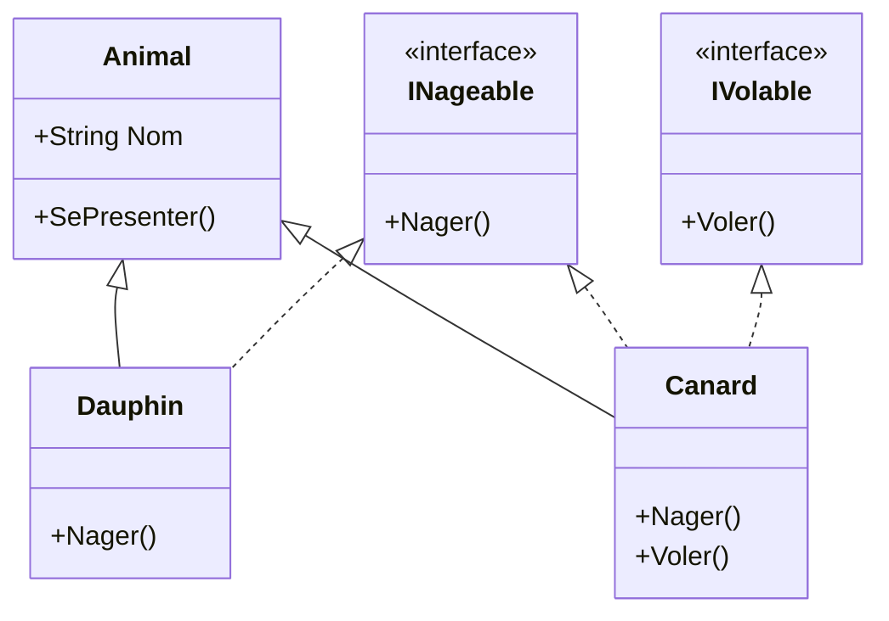
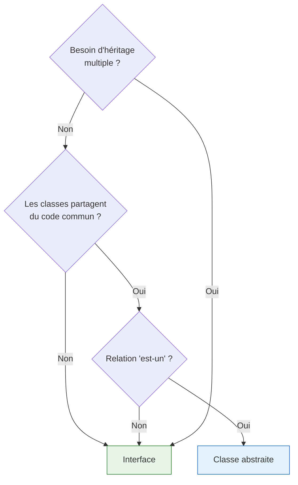

# Interfaces

Les interfaces sont un mécanisme fondamental de la programmation orientée objet. Elles définissent un **contrat** que les classes s'engagent à respecter, permettant de concevoir des systèmes flexibles, extensibles et faiblement couplés.

::: tip 🎯 Ce que vous allez apprendre
- Comprendre ce qu'est une interface et son rôle de contrat
- Déclarer et implémenter des interfaces en C#
- Implémenter plusieurs interfaces dans une même classe
- Comparer interfaces et classes abstraites
- Utiliser les interfaces pour le découplage et la flexibilité
- Connaître les interfaces essentielles de la bibliothèque standard .NET
:::

## Qu'est-ce qu'une interface ?

Une **interface** définit un ensemble de méthodes et propriétés qu'une classe **s'engage à fournir**, sans préciser *comment* elle les implémente. C'est un **contrat** entre l'interface et les classes qui l'adoptent.

### 📝 Analogie : la prise électrique

Pensez à une **prise électrique murale**. La prise définit un *contrat* : "je fournis du courant via trois broches". Tout appareil compatible avec ce standard peut s'y brancher — un grille-pain, un aspirateur, un chargeur de téléphone — sans que la prise ait besoin de savoir quel appareil est branché.

```
┌─────────────────────────────────────────────────────────────────────┐
│                  L'INTERFACE : UN CONTRAT                           │
├─────────────────────────────────────────────────────────────────────┤
│                                                                     │
│   Interface IPriseElectrique                                        │
│   ┌──────────────────────────┐                                      │
│   │  FournirCourant()        │ ← Le contrat                        │
│   │  Tension : 230V          │                                      │
│   └──────────┬───────────────┘                                      │
│              │                                                      │
│     ┌────────┼────────┬───────────┐                                 │
│     ▼        ▼        ▼           ▼                                 │
│  Grille-  Aspira-  Chargeur   Lampe                                 │
│  pain     teur     Téléphone                                        │
│                                                                     │
│  Chaque appareil implémente le contrat à SA façon                   │
└─────────────────────────────────────────────────────────────────────┘
```

::: info 💡 Différence clé avec l'héritage
L'héritage exprime une relation **"est-un"** : un Chien *est un* Animal. Une interface exprime une relation **"sait faire"** ou **"se comporte comme"** : un Chien *sait* nager (`INageable`), un Canard aussi, même s'ils n'ont rien en commun dans leur hiérarchie de classes.
:::

## Déclarer une interface

En C#, une interface se déclare avec le mot-clé `interface`. Par convention, son nom commence par un **I majuscule**.

```csharp
interface IDessinable
{
    void Dessiner();
    void Effacer();
}
```

Une interface ne contient que des **signatures** — pas de code, pas de champs, pas de constructeurs :

```csharp
interface IVehicule
{
    // Propriétés (signatures uniquement)
    string Marque { get; }
    int Vitesse { get; }
    
    // Méthodes (signatures uniquement)
    void Demarrer();
    void Arreter();
    void Accelerer(int kmh);
}
```

::: warning Ce qu'une interface classique ne peut PAS contenir
- ❌ Des champs (`private int _x;`)
- ❌ Des constructeurs
- ❌ Du code dans les méthodes (avant C# 8, voir le chapitre [Interfaces Modernes](./16-interfaces-modernes.md))
- ❌ Des modificateurs d'accès sur les membres (tout est `public` implicitement)
:::

### Caractéristiques d'une interface

| Caractéristique | Détail |
|----------------|--------|
| Mot-clé | `interface` |
| Convention de nommage | Préfixe **I** majuscule (`IVehicule`, `IDessinable`) |
| Membres | Méthodes, propriétés, indexeurs, événements |
| Implémentation | Aucune (uniquement des signatures) |
| Instanciation | Impossible (`new IVehicule()` ❌) |
| Héritage | Une interface peut hériter d'autres interfaces |

## Implémenter une interface

Pour qu'une classe respecte le contrat d'une interface, elle doit **implémenter** tous ses membres. La syntaxe est la même que pour l'héritage : le symbole `:`.

```csharp
interface IAnimal
{
    string Nom { get; }
    void EmettreSon();
    void SeDeplacer();
}

class Chien : IAnimal
{
    // OBLIGATION d'implémenter TOUS les membres de l'interface
    public string Nom { get; set; }
    
    public void EmettreSon()
    {
        Console.WriteLine($"{Nom} aboie : Wouf !");
    }
    
    public void SeDeplacer()
    {
        Console.WriteLine($"{Nom} court à quatre pattes.");
    }
}

class Oiseau : IAnimal
{
    public string Nom { get; set; }
    
    public void EmettreSon()
    {
        Console.WriteLine($"{Nom} chante : Cui cui !");
    }
    
    public void SeDeplacer()
    {
        Console.WriteLine($"{Nom} vole dans les airs.");
    }
}
```

```csharp
// Utilisation polymorphique via l'interface
IAnimal animal1 = new Chien { Nom = "Rex" };
IAnimal animal2 = new Oiseau { Nom = "Piou" };

animal1.EmettreSon();    // Rex aboie : Wouf !
animal2.SeDeplacer();    // Piou vole dans les airs.
```

::: danger Obligation d'implémentation
Si une classe déclare qu'elle implémente une interface mais oublie un membre, le compilateur génère une **erreur** :

```csharp
class Poisson : IAnimal
{
    public string Nom { get; set; }
    public void EmettreSon() { Console.WriteLine("Blub blub"); }
    // ❌ Erreur CS0535 : 'Poisson' does not implement interface member 'IAnimal.SeDeplacer()'
}
```
:::

## Implémenter plusieurs interfaces

Contrairement à l'héritage de classes (limité à **une seule** classe parente en C#), une classe peut implémenter **autant d'interfaces qu'elle le souhaite**.

```csharp
interface INageable
{
    void Nager();
}

interface IVolable
{
    void Voler();
}

interface ICoureur
{
    void Courir();
}

// Le canard sait nager, voler ET courir !
class Canard : INageable, IVolable, ICoureur
{
    public string Nom { get; set; }
    
    public void Nager()
    {
        Console.WriteLine($"{Nom} nage gracieusement.");
    }
    
    public void Voler()
    {
        Console.WriteLine($"{Nom} s'envole dans le ciel.");
    }
    
    public void Courir()
    {
        Console.WriteLine($"{Nom} trottine maladroitement.");
    }
}

// L'autruche court mais ne vole pas
class Autruche : ICoureur
{
    public string Nom { get; set; }
    
    public void Courir()
    {
        Console.WriteLine($"{Nom} court à toute vitesse !");
    }
}
```

```csharp
Canard donald = new Canard { Nom = "Donald" };
donald.Nager();   // Donald nage gracieusement.
donald.Voler();   // Donald s'envole dans le ciel.
donald.Courir();  // Donald trottine maladroitement.

// On peut utiliser n'importe quelle interface comme type
INageable nageur = donald;
nageur.Nager();  // OK

IVolable volant = donald;
volant.Voler();  // OK
```

### Combiner héritage et interfaces

Une classe peut hériter d'une classe **et** implémenter des interfaces. La classe parente se place en premier, suivie des interfaces :

```csharp
class Animal
{
    public string Nom { get; set; }
    
    public virtual void SePresenter()
    {
        Console.WriteLine($"Je suis {Nom}.");
    }
}

class Dauphin : Animal, INageable
{
    public void Nager()
    {
        Console.WriteLine($"{Nom} nage et fait des acrobaties !");
    }
}
```



## Polymorphisme par interface

Le chapitre [Polymorphisme](./08-polymorphisme.md) a introduit le polymorphisme d'héritage (`virtual` / `override`). Les interfaces offrent une **autre forme** de polymorphisme, encore plus flexible.

### Le pouvoir du typage par interface

L'idée clé : on peut manipuler des objets de types très différents via une **interface commune**, sans qu'ils partagent un ancêtre commun.

```csharp
interface ISauvegardable
{
    void Sauvegarder(string chemin);
    void Charger(string chemin);
}

// Ces classes n'ont RIEN en commun dans leur hiérarchie
class Document : ISauvegardable
{
    public string Contenu { get; set; }
    
    public void Sauvegarder(string chemin)
    {
        Console.WriteLine($"Document sauvegardé dans {chemin}");
    }
    
    public void Charger(string chemin)
    {
        Console.WriteLine($"Document chargé depuis {chemin}");
    }
}

class Configuration : ISauvegardable
{
    public Dictionary<string, string> Parametres { get; set; } = new();
    
    public void Sauvegarder(string chemin)
    {
        Console.WriteLine($"Configuration exportée vers {chemin}");
    }
    
    public void Charger(string chemin)
    {
        Console.WriteLine($"Configuration importée depuis {chemin}");
    }
}

class Partie : ISauvegardable
{
    public int Score { get; set; }
    public int Niveau { get; set; }
    
    public void Sauvegarder(string chemin)
    {
        Console.WriteLine($"Partie sauvegardée (Score: {Score}, Niveau: {Niveau})");
    }
    
    public void Charger(string chemin)
    {
        Console.WriteLine($"Partie chargée depuis {chemin}");
    }
}
```

```csharp
// Une seule méthode pour sauvegarder N'IMPORTE QUEL objet sauvegardable
void SauvegarderTout(ISauvegardable[] elements, string dossier)
{
    foreach (ISauvegardable element in elements)
    {
        element.Sauvegarder(dossier);  // Polymorphisme !
    }
}

ISauvegardable[] aExporter = {
    new Document { Contenu = "Hello" },
    new Configuration(),
    new Partie { Score = 9500, Niveau = 12 }
};

SauvegarderTout(aExporter, "/backup");
```

### Vérifier si un objet implémente une interface

On peut utiliser `is` et `as` pour vérifier dynamiquement si un objet implémente une interface :

```csharp
object[] objets = { new Canard { Nom = "Donald" }, "texte", new Autruche { Nom = "Oscar" }, 42 };

foreach (object obj in objets)
{
    if (obj is INageable nageur)
    {
        nageur.Nager();
    }
    else
    {
        Console.WriteLine($"{obj} ne sait pas nager.");
    }
}
// Donald nage gracieusement.
// texte ne sait pas nager.
// Oscar ne sait pas nager.
// 42 ne sait pas nager.
```

## Interfaces et découplage

L'un des plus grands avantages des interfaces est le **découplage** : le code dépend d'une abstraction (l'interface) plutôt que d'une implémentation concrète.

### 🔌 Analogie : le port USB

Un port USB est une interface : votre ordinateur ne sait pas si vous branchez une clé USB, un disque dur, une souris ou un clavier. Il sait seulement que l'appareil respecte le protocole USB. Si demain un nouveau type d'appareil USB est inventé, votre ordinateur le supportera **sans modification**.

### Exemple : système de notification découplé

Sans interface, le code est **fortement couplé** :

```csharp
// ❌ Fortement couplé : dépend directement de la classe concrète
class ServiceCommande
{
    private SmtpEmailService _emailService = new SmtpEmailService();
    
    public void PasserCommande(string produit)
    {
        Console.WriteLine($"Commande passée : {produit}");
        _emailService.EnvoyerEmail("client@mail.com", "Commande confirmée");
        // Et si on veut envoyer un SMS à la place ? Il faut MODIFIER cette classe !
    }
}
```

Avec une interface, le code est **faiblement couplé** :

```csharp
// ✅ Interface : contrat de notification
interface INotificationService
{
    void Notifier(string destinataire, string message);
}

class EmailService : INotificationService
{
    public void Notifier(string destinataire, string message)
    {
        Console.WriteLine($"📧 Email à {destinataire} : {message}");
    }
}

class SmsService : INotificationService
{
    public void Notifier(string destinataire, string message)
    {
        Console.WriteLine($"📱 SMS à {destinataire} : {message}");
    }
}

class PushService : INotificationService
{
    public void Notifier(string destinataire, string message)
    {
        Console.WriteLine($"🔔 Push à {destinataire} : {message}");
    }
}

// La classe dépend de l'INTERFACE, pas de l'implémentation
class ServiceCommande
{
    private INotificationService _notificationService;
    
    public ServiceCommande(INotificationService service)
    {
        _notificationService = service;
    }
    
    public void PasserCommande(string produit)
    {
        Console.WriteLine($"Commande passée : {produit}");
        _notificationService.Notifier("client@mail.com", "Commande confirmée !");
    }
}
```

```csharp
// On peut changer le type de notification SANS modifier ServiceCommande
var commandeEmail = new ServiceCommande(new EmailService());
commandeEmail.PasserCommande("Clavier");   // 📧 Email

var commandeSms = new ServiceCommande(new SmsService());
commandeSms.PasserCommande("Souris");      // 📱 SMS

var commandePush = new ServiceCommande(new PushService());
commandePush.PasserCommande("Écran");      // 🔔 Push
```

```mermaid
flowchart TB
    subgraph "Sans interface (couplé)"
        SC1[ServiceCommande] -->|dépend de| E1[SmtpEmailService]
    end
    
    subgraph "Avec interface (découplé)"
        SC2[ServiceCommande] -->|dépend de| I[INotificationService]
        I <|.. E2[EmailService]
        I <|.. S2[SmsService]
        I <|.. P2[PushService]
    end
    
    style I fill:#f9f,stroke:#333
```

::: tip 💡 Principe de l'inversion de dépendances
Ce principe (le "D" de SOLID) dit : *dépendez des abstractions, pas des implémentations concrètes*. Les interfaces sont l'outil principal pour appliquer ce principe en C#.
:::

## Interfaces vs classes abstraites

Les interfaces et les classes abstraites servent toutes deux à définir des contrats, mais elles ont des différences importantes :

| Aspect | Interface | Classe abstraite |
|--------|-----------|-----------------|
| Mot-clé | `interface` | `abstract class` |
| Héritage multiple | ✅ Une classe peut implémenter **plusieurs** interfaces | ❌ Une classe ne peut hériter que d'**une seule** classe |
| Membres avec code | ❌ Non (avant C# 8) | ✅ Oui (méthodes concrètes + abstraites) |
| Champs d'instance | ❌ Non | ✅ Oui |
| Constructeurs | ❌ Non | ✅ Oui |
| Modificateurs d'accès | Tout est `public` | `public`, `protected`, `private`, etc. |
| Relation | "sait faire" / "se comporte comme" | "est un" |

### Quand utiliser quoi ?



::: tip 💡 Règle empirique
- Utilisez une **classe abstraite** quand les classes partagent du code commun et ont une relation "est-un" naturelle.
- Utilisez une **interface** quand des classes non liées doivent partager un comportement, ou quand vous voulez découpler votre code.
- Vous pouvez **combiner les deux** : une classe abstraite qui implémente une interface.
:::

```csharp
// Combinaison : interface + classe abstraite
interface IExportable
{
    string Exporter();
}

// Classe abstraite qui implémente partiellement l'interface
abstract class DocumentBase : IExportable
{
    public string Titre { get; set; }
    public DateTime DateCreation { get; init; } = DateTime.Now;
    
    // Implémentation partielle : chaque document a un format différent
    public abstract string Exporter();
    
    // Code partagé (pas dans l'interface)
    public void AfficherEntete()
    {
        Console.WriteLine($"=== {Titre} ({DateCreation:d}) ===");
    }
}

class Rapport : DocumentBase
{
    public string Contenu { get; set; }
    
    public override string Exporter() => $"RAPPORT: {Titre}\n{Contenu}";
}

class Facture : DocumentBase
{
    public decimal Montant { get; set; }
    
    public override string Exporter() => $"FACTURE: {Titre} - {Montant:C}";
}
```

## Héritage d'interfaces

Une interface peut hériter d'une ou plusieurs autres interfaces, créant des contrats plus spécialisés :

```csharp
interface ILisible
{
    string Lire();
}

interface IEcrivable
{
    void Ecrire(string contenu);
}

// IFichier combine les deux interfaces
interface IFichier : ILisible, IEcrivable
{
    string NomFichier { get; }
    long Taille { get; }
}
```

Une classe qui implémente `IFichier` doit fournir les membres de `IFichier`, `ILisible` **et** `IEcrivable` :

```csharp
class FichierTexte : IFichier
{
    private string _contenu = "";
    
    public string NomFichier { get; set; }
    public long Taille => _contenu.Length;
    
    public string Lire() => _contenu;
    
    public void Ecrire(string contenu)
    {
        _contenu = contenu;
    }
}
```

## Implémentation explicite d'interface

Quand une classe implémente deux interfaces qui déclarent un membre de même nom, on utilise l'**implémentation explicite** pour distinguer les deux :

```csharp
interface IFrancais
{
    string Saluer();
}

interface IAnglais
{
    string Saluer();
}

class PersonneBilingue : IFrancais, IAnglais
{
    // Implémentations explicites
    string IFrancais.Saluer() => "Bonjour !";
    string IAnglais.Saluer() => "Hello!";
}
```

```csharp
PersonneBilingue personne = new PersonneBilingue();

// Accès via l'interface spécifique
IFrancais fr = personne;
Console.WriteLine(fr.Saluer());   // Bonjour !

IAnglais en = personne;
Console.WriteLine(en.Saluer());   // Hello!

// personne.Saluer();  // ❌ Erreur : ambiguïté
```

::: info 💡 Quand utiliser l'implémentation explicite ?
- Quand deux interfaces ont des membres portant le **même nom**
- Quand on veut **cacher** un membre de l'interface dans l'API publique de la classe
- Les membres explicites ne sont accessibles que via le **type interface**, pas via le type concret
:::

## Interfaces de la bibliothèque .NET

La bibliothèque standard de .NET définit de nombreuses interfaces que vous rencontrerez régulièrement. Connaître les plus courantes est essentiel pour écrire du code C# idiomatique.

### `IComparable` — Rendre les objets comparables

L'interface `IComparable` permet de définir un **ordre naturel** entre les objets d'une classe. Elle est utilisée par les méthodes de tri comme `Array.Sort()` ou `List<T>.Sort()`.

```csharp
interface IComparable
{
    int CompareTo(object other);
    // Retourne :
    //   < 0 si this est "plus petit" que other
    //   = 0 si this est "égal" à other
    //   > 0 si this est "plus grand" que other
}
```

```csharp
class Etudiant : IComparable
{
    public string Nom { get; set; }
    public double Moyenne { get; set; }
    
    // Tri par moyenne décroissante
    public int CompareTo(object obj)
    {
        if (obj is Etudiant autre)
        {
            return autre.Moyenne.CompareTo(this.Moyenne); // Décroissant
        }
        throw new ArgumentException("L'objet n'est pas un Etudiant");
    }
    
    public override string ToString() => $"{Nom} ({Moyenne:F1})";
}
```

```csharp
Etudiant[] promo = {
    new Etudiant { Nom = "Alice", Moyenne = 15.5 },
    new Etudiant { Nom = "Bob", Moyenne = 12.0 },
    new Etudiant { Nom = "Charlie", Moyenne = 18.0 },
    new Etudiant { Nom = "Diana", Moyenne = 14.0 }
};

Array.Sort(promo);  // Utilise CompareTo automatiquement !

foreach (var e in promo)
    Console.WriteLine(e);
// Charlie (18,0)
// Alice (15,5)
// Diana (14,0)
// Bob (12,0)
```

::: info 💡 Version générique
Il existe une version générique `IComparable<T>` qui offre une meilleure sécurité de type. Elle sera présentée dans le chapitre [Classes et Interfaces Génériques](./10-generiques.md).
:::

### `IEquatable` — Personnaliser l'égalité

L'interface `IEquatable` permet de définir quand deux objets sont considérés comme **égaux**. Elle est utilisée par les collections pour la recherche et la déduplication.

```csharp
class Coordonnee : IEquatable<Coordonnee>
{
    public int X { get; set; }
    public int Y { get; set; }
    
    public bool Equals(Coordonnee other)
    {
        if (other is null) return false;
        return X == other.X && Y == other.Y;
    }
    
    public override bool Equals(object obj) => Equals(obj as Coordonnee);
    
    public override int GetHashCode() => HashCode.Combine(X, Y);
    
    public override string ToString() => $"({X}, {Y})";
}
```

```csharp
var c1 = new Coordonnee { X = 3, Y = 5 };
var c2 = new Coordonnee { X = 3, Y = 5 };
var c3 = new Coordonnee { X = 1, Y = 2 };

Console.WriteLine(c1.Equals(c2));  // True (même coordonnées)
Console.WriteLine(c1.Equals(c3));  // False

// Fonctionne avec les collections
var liste = new List<Coordonnee> { c1, c2, c3 };
Console.WriteLine(liste.Contains(new Coordonnee { X = 3, Y = 5 }));  // True
```

### `IEnumerable` — Rendre un objet parcourable

L'interface `IEnumerable` permet de parcourir un objet avec `foreach`. Nous la reverrons en détail dans le chapitre [Concepts Avancés](./11-concepts-avances.md) avec les itérateurs.

```csharp
using System.Collections;
using System.Collections.Generic;

class Deck : IEnumerable<string>
{
    private string[] _cartes = { "As", "Roi", "Dame", "Valet", "10" };
    
    public IEnumerator<string> GetEnumerator()
    {
        foreach (string carte in _cartes)
            yield return carte;
    }
    
    IEnumerator IEnumerable.GetEnumerator() => GetEnumerator();
}
```

```csharp
Deck monDeck = new Deck();

foreach (string carte in monDeck)
{
    Console.Write($"{carte} ");  // As Roi Dame Valet 10
}
```

### `IDisposable` — Libérer les ressources

L'interface `IDisposable` permet de libérer proprement les ressources non gérées (fichiers, connexions réseau, bases de données). Elle est utilisée avec l'instruction `using`.

```csharp
class FichierLog : IDisposable
{
    private StreamWriter _writer;
    
    public FichierLog(string chemin)
    {
        _writer = new StreamWriter(chemin, append: true);
        Console.WriteLine("Fichier ouvert.");
    }
    
    public void Ecrire(string message)
    {
        _writer.WriteLine($"[{DateTime.Now:HH:mm:ss}] {message}");
    }
    
    // Libération des ressources
    public void Dispose()
    {
        _writer?.Dispose();
        Console.WriteLine("Fichier fermé proprement.");
    }
}
```

```csharp
// L'instruction using appelle Dispose() automatiquement à la fin du bloc
using (var log = new FichierLog("app.log"))
{
    log.Ecrire("Application démarrée");
    log.Ecrire("Traitement en cours...");
}  // ← Dispose() est appelé ici automatiquement

// Syntaxe simplifiée (C# 8+)
using var log2 = new FichierLog("app.log");
log2.Ecrire("Encore un message");
// Dispose() appelé à la fin du scope
```

### `ICloneable` — Copier des objets

L'interface `ICloneable` permet de créer une copie d'un objet :

```csharp
class Personnage : ICloneable
{
    public string Nom { get; set; }
    public int PointsDeVie { get; set; }
    public List<string> Inventaire { get; set; } = new();
    
    public object Clone()
    {
        // Copie profonde : on crée une nouvelle liste
        return new Personnage
        {
            Nom = this.Nom,
            PointsDeVie = this.PointsDeVie,
            Inventaire = new List<string>(this.Inventaire)
        };
    }
    
    public override string ToString() 
        => $"{Nom} (PV: {PointsDeVie}, Items: {Inventaire.Count})";
}
```

```csharp
var original = new Personnage { Nom = "Hero", PointsDeVie = 100 };
original.Inventaire.Add("Épée");
original.Inventaire.Add("Bouclier");

var copie = (Personnage)original.Clone();
copie.Nom = "Hero Clone";
copie.Inventaire.Add("Potion");

Console.WriteLine(original);  // Hero (PV: 100, Items: 2)
Console.WriteLine(copie);     // Hero Clone (PV: 100, Items: 3)
// Les inventaires sont indépendants !
```

### `IFormattable` — Formatage personnalisé

L'interface `IFormattable` permet de contrôler comment un objet se convertit en chaîne avec des formats personnalisés :

```csharp
class Temperature : IFormattable
{
    public double Celsius { get; set; }
    
    public double Fahrenheit => Celsius * 9 / 5 + 32;
    public double Kelvin => Celsius + 273.15;
    
    public string ToString(string format, IFormatProvider provider)
    {
        return format?.ToUpper() switch
        {
            "F" => $"{Fahrenheit:F1}°F",
            "K" => $"{Kelvin:F1}K",
            "C" or null => $"{Celsius:F1}°C",
            _ => throw new FormatException($"Format '{format}' non supporté")
        };
    }
    
    public override string ToString() => ToString("C", null);
}
```

```csharp
var temp = new Temperature { Celsius = 25.0 };

Console.WriteLine($"{temp:C}");   // 25,0°C
Console.WriteLine($"{temp:F}");   // 77,0°F
Console.WriteLine($"{temp:K}");   // 298,1K
```

### Récapitulatif des interfaces .NET courantes

| Interface | Rôle | Méthode principale |
|-----------|------|-------------------|
| `IComparable` | Ordre naturel pour le tri | `CompareTo(object)` |
| `IEquatable<T>` | Égalité personnalisée | `Equals(T)` |
| `IEnumerable<T>` | Parcourir avec `foreach` | `GetEnumerator()` |
| `IDisposable` | Libérer les ressources | `Dispose()` |
| `ICloneable` | Copier un objet | `Clone()` |
| `IFormattable` | Formatage personnalisé | `ToString(string, IFormatProvider)` |
| `INotifyPropertyChanged` | Notification de changement | `PropertyChanged` (événement) |

## Exemple complet : système de média

```csharp
interface ILisible
{
    string Titre { get; }
    TimeSpan Duree { get; }
    void Lire();
}

interface ITelechargeable
{
    long TailleMo { get; }
    void Telecharger(string destination);
}

interface IPartageable
{
    void Partager(string destinataire);
}

// Un morceau de musique peut être lu, téléchargé et partagé
class Chanson : ILisible, ITelechargeable, IPartageable
{
    public string Titre { get; set; }
    public string Artiste { get; set; }
    public TimeSpan Duree { get; set; }
    public long TailleMo { get; set; }
    
    public void Lire()
    {
        Console.WriteLine($"🎵 Lecture : {Artiste} - {Titre} ({Duree:mm\\:ss})");
    }
    
    public void Telecharger(string destination)
    {
        Console.WriteLine($"⬇️ Téléchargement de {Titre} ({TailleMo} Mo) vers {destination}");
    }
    
    public void Partager(string destinataire)
    {
        Console.WriteLine($"📤 Partage de '{Titre}' avec {destinataire}");
    }
}

// Un podcast peut être lu et téléchargé, mais pas partagé
class Podcast : ILisible, ITelechargeable
{
    public string Titre { get; set; }
    public string Animateur { get; set; }
    public TimeSpan Duree { get; set; }
    public long TailleMo { get; set; }
    
    public void Lire()
    {
        Console.WriteLine($"🎙️ Lecture du podcast : {Titre} par {Animateur}");
    }
    
    public void Telecharger(string destination)
    {
        Console.WriteLine($"⬇️ Téléchargement du podcast ({TailleMo} Mo)");
    }
}

// Un flux radio peut seulement être lu
class FluxRadio : ILisible
{
    public string Titre { get; set; }
    public TimeSpan Duree => TimeSpan.MaxValue; // En continu
    public string Frequence { get; set; }
    
    public void Lire()
    {
        Console.WriteLine($"📻 Écoute de {Titre} ({Frequence})");
    }
}
```

```csharp
// Lecteur universel : lit n'importe quel média
void LirePlaylist(ILisible[] medias)
{
    Console.WriteLine("=== Playlist ===");
    foreach (ILisible media in medias)
    {
        media.Lire();
    }
}

// Gestionnaire de téléchargement : télécharge ce qui est téléchargeable
void TelechargerTout(ITelechargeable[] elements, string dossier)
{
    Console.WriteLine("=== Téléchargements ===");
    foreach (ITelechargeable t in elements)
    {
        t.Telecharger(dossier);
    }
}

// Utilisation
ILisible[] playlist = {
    new Chanson { Titre = "Bohemian Rhapsody", Artiste = "Queen", Duree = TimeSpan.FromMinutes(5.55), TailleMo = 12 },
    new Podcast { Titre = "Tech Talk", Animateur = "Marie", Duree = TimeSpan.FromMinutes(45), TailleMo = 95 },
    new FluxRadio { Titre = "Classic FM", Frequence = "104.9 MHz" }
};

LirePlaylist(playlist);
```

## Exercices

### Exercice 1 : Système de formes dessinables

Créez les interfaces `IDessinable` (avec `Dessiner()`) et `IRedimensionnable` (avec `Redimensionner(double facteur)`). Implémentez-les dans des classes `Cercle`, `Rectangle` et `Triangle`.

Créez une méthode qui dessine toutes les formes d'un tableau, puis une autre qui redimensionne uniquement les formes qui sont `IRedimensionnable`.

::: details 💡 Solution Exercice 1

```csharp
interface IDessinable
{
    void Dessiner();
}

interface IRedimensionnable
{
    void Redimensionner(double facteur);
}

class Cercle : IDessinable, IRedimensionnable
{
    public double Rayon { get; set; }
    
    public void Dessiner()
    {
        Console.WriteLine($"⭕ Cercle (rayon: {Rayon:F1})");
    }
    
    public void Redimensionner(double facteur)
    {
        Rayon *= facteur;
        Console.WriteLine($"   → Nouveau rayon: {Rayon:F1}");
    }
}

class Rectangle : IDessinable, IRedimensionnable
{
    public double Largeur { get; set; }
    public double Hauteur { get; set; }
    
    public void Dessiner()
    {
        Console.WriteLine($"🔲 Rectangle ({Largeur:F1} x {Hauteur:F1})");
    }
    
    public void Redimensionner(double facteur)
    {
        Largeur *= facteur;
        Hauteur *= facteur;
        Console.WriteLine($"   → Nouvelle taille: {Largeur:F1} x {Hauteur:F1}");
    }
}

class Triangle : IDessinable
{
    public double Base { get; set; }
    public double Hauteur { get; set; }
    
    public void Dessiner()
    {
        Console.WriteLine($"🔺 Triangle (base: {Base:F1}, hauteur: {Hauteur:F1})");
    }
}

// Méthodes polymorphiques
void DessinerTout(IDessinable[] formes)
{
    Console.WriteLine("=== Dessin ===");
    foreach (IDessinable forme in formes)
    {
        forme.Dessiner();
    }
}

void RedimensionnerTout(IDessinable[] formes, double facteur)
{
    Console.WriteLine($"\n=== Redimensionnement (×{facteur}) ===");
    foreach (IDessinable forme in formes)
    {
        if (forme is IRedimensionnable redim)
        {
            forme.Dessiner();
            redim.Redimensionner(facteur);
        }
    }
}

// Test
IDessinable[] formes = {
    new Cercle { Rayon = 5 },
    new Rectangle { Largeur = 10, Hauteur = 3 },
    new Triangle { Base = 6, Hauteur = 4 }
};

DessinerTout(formes);
RedimensionnerTout(formes, 2.0);
DessinerTout(formes);
```
:::

### Exercice 2 : File d'attente avec interface

Créez une interface `IFileAttente` avec :
- `void Ajouter(string personne)` — ajoute une personne à la file
- `string Retirer()` — retire et retourne la première personne
- `int NombreEnAttente { get; }` — nombre de personnes dans la file
- `bool EstVide { get; }` — indique si la file est vide

Implémentez deux versions : `FileNormale` (FIFO classique) et `FilePrioritaire` (les VIP passent en premier).

::: details 💡 Solution Exercice 2

```csharp
interface IFileAttente
{
    void Ajouter(string personne);
    string Retirer();
    int NombreEnAttente { get; }
    bool EstVide { get; }
}

class FileNormale : IFileAttente
{
    private Queue<string> _file = new();
    
    public int NombreEnAttente => _file.Count;
    public bool EstVide => _file.Count == 0;
    
    public void Ajouter(string personne)
    {
        _file.Enqueue(personne);
        Console.WriteLine($"  + {personne} ajouté(e) à la file.");
    }
    
    public string Retirer()
    {
        if (EstVide) throw new InvalidOperationException("La file est vide !");
        string personne = _file.Dequeue();
        Console.WriteLine($"  - {personne} servi(e).");
        return personne;
    }
}

class FilePrioritaire : IFileAttente
{
    private List<string> _vip = new();
    private Queue<string> _normaux = new();
    
    public int NombreEnAttente => _vip.Count + _normaux.Count;
    public bool EstVide => NombreEnAttente == 0;
    
    public void AjouterVip(string personne)
    {
        _vip.Add(personne);
        Console.WriteLine($"  + {personne} ajouté(e) en VIP !");
    }
    
    public void Ajouter(string personne)
    {
        _normaux.Enqueue(personne);
        Console.WriteLine($"  + {personne} ajouté(e) à la file.");
    }
    
    public string Retirer()
    {
        if (EstVide) throw new InvalidOperationException("La file est vide !");
        
        if (_vip.Count > 0)
        {
            string vip = _vip[0];
            _vip.RemoveAt(0);
            Console.WriteLine($"  - {vip} servi(e) en priorité (VIP).");
            return vip;
        }
        
        string personne = _normaux.Dequeue();
        Console.WriteLine($"  - {personne} servi(e).");
        return personne;
    }
}

// Test polymorphique
void TraiterFile(IFileAttente file)
{
    Console.WriteLine($"\nTraitement ({file.NombreEnAttente} personne(s) en attente) :");
    while (!file.EstVide)
    {
        file.Retirer();
    }
    Console.WriteLine("File vide !");
}

// File normale
Console.WriteLine("=== File Normale ===");
IFileAttente fileNormale = new FileNormale();
fileNormale.Ajouter("Alice");
fileNormale.Ajouter("Bob");
fileNormale.Ajouter("Charlie");
TraiterFile(fileNormale);

// File prioritaire
Console.WriteLine("\n=== File Prioritaire ===");
var filePrio = new FilePrioritaire();
filePrio.Ajouter("Dave");
filePrio.AjouterVip("Emma");
filePrio.Ajouter("Frank");
filePrio.AjouterVip("Grace");
TraiterFile(filePrio);
// Grace servie en priorité, Emma en priorité, Dave, Frank
```
:::

### Exercice 3 : Système de conversion

Créez une interface `IConvertisseur` avec `double Convertir(double valeur)` et `string Description { get; }`.

Implémentez plusieurs convertisseurs (`CelsiusVersFahrenheit`, `KmVersMiles`, `EurosVersDollars`). Créez une méthode qui reçoit un tableau de `IConvertisseur` et une valeur, et affiche toutes les conversions.

::: details 💡 Solution Exercice 3

```csharp
interface IConvertisseur
{
    double Convertir(double valeur);
    string Description { get; }
    string UniteSource { get; }
    string UniteCible { get; }
}

class CelsiusVersFahrenheit : IConvertisseur
{
    public string Description => "Celsius → Fahrenheit";
    public string UniteSource => "°C";
    public string UniteCible => "°F";
    
    public double Convertir(double valeur) => valeur * 9 / 5 + 32;
}

class KmVersMiles : IConvertisseur
{
    public string Description => "Kilomètres → Miles";
    public string UniteSource => "km";
    public string UniteCible => "mi";
    
    public double Convertir(double valeur) => valeur * 0.621371;
}

class EurosVersDollars : IConvertisseur
{
    public double Taux { get; set; } = 1.08;
    
    public string Description => $"Euros → Dollars (taux: {Taux})";
    public string UniteSource => "€";
    public string UniteCible => "$";
    
    public double Convertir(double valeur) => valeur * Taux;
}

class KgVersLivres : IConvertisseur
{
    public string Description => "Kilogrammes → Livres";
    public string UniteSource => "kg";
    public string UniteCible => "lb";
    
    public double Convertir(double valeur) => valeur * 2.20462;
}

// Méthode polymorphique
void AfficherConversions(IConvertisseur[] convertisseurs, double valeur)
{
    Console.WriteLine($"=== Conversions pour {valeur} ===\n");
    
    foreach (IConvertisseur conv in convertisseurs)
    {
        double resultat = conv.Convertir(valeur);
        Console.WriteLine($"  {conv.Description}");
        Console.WriteLine($"    {valeur} {conv.UniteSource} = {resultat:F2} {conv.UniteCible}\n");
    }
}

// Test
IConvertisseur[] convertisseurs = {
    new CelsiusVersFahrenheit(),
    new KmVersMiles(),
    new EurosVersDollars(),
    new KgVersLivres()
};

AfficherConversions(convertisseurs, 100);
```
:::
