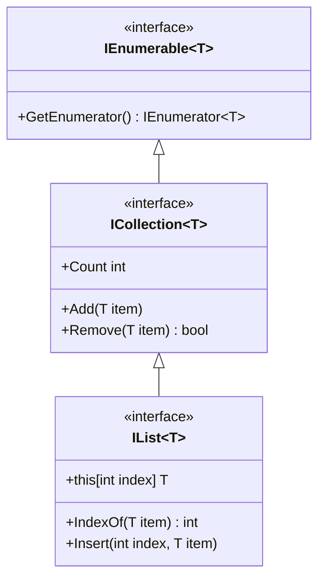

# Classes et Interfaces Génériques

Les **génériques** permettent de créer des classes, interfaces et méthodes qui fonctionnent avec **n'importe quel type**, tout en conservant la sécurité de type à la compilation. C'est l'un des mécanismes les plus puissants de C# pour écrire du code réutilisable.

::: tip 🎯 Ce que vous allez apprendre
- Comprendre le problème résolu par les génériques
- Créer des classes et méthodes génériques
- Déclarer et implémenter des interfaces génériques
- Utiliser les contraintes (`where`) pour restreindre les types
- Connaître les types génériques courants de la bibliothèque .NET
:::

## Pourquoi les génériques ?

### Le problème : duplication de code

Imaginez que vous devez créer une boîte qui contient un seul élément. Sans les génériques, vous devez créer une classe par type :

```csharp
// ❌ Sans génériques : une classe par type
class BoiteEntier
{
    public int Contenu { get; set; }
}

class BoiteString
{
    public string Contenu { get; set; }
}

class BoiteDate
{
    public DateTime Contenu { get; set; }
}
// Et si on a besoin d'une boîte pour un autre type ? Encore une classe...
```

### La "solution" `object` et ses dangers

On pourrait utiliser `object` comme type universel :

```csharp
// ⚠️ Avec object : perte de la sécurité de type
class BoiteUniverselle
{
    public object Contenu { get; set; }
}

BoiteUniverselle boite = new BoiteUniverselle();
boite.Contenu = 42;

// Problème 1 : boxing/unboxing (perte de performance pour les types valeur)
int valeur = (int)boite.Contenu;

// Problème 2 : aucune vérification à la compilation
boite.Contenu = "texte";
int erreur = (int)boite.Contenu;  // ❌ InvalidCastException à l'exécution !
```

### 📦 Analogie : le conteneur universel

Imaginez un **service de livraison** :
- Sans génériques : vous avez un camion pour les meubles, un autre pour les livres, un autre pour la nourriture — beaucoup de véhicules à gérer !
- Avec `object` : un seul camion qui transporte "quelque chose" — mais quand on ouvre à l'arrivée, on ne sait pas ce qu'il contient !
- Avec les génériques : un camion **étiqueté** `Camion<Meuble>`, `Camion<Livre>` — un seul modèle de camion, mais l'étiquette garantit le contenu.

```
┌─────────────────────────────────────────────────────────────────────┐
│                    LES GÉNÉRIQUES EN IMAGE                          │
├─────────────────────────────────────────────────────────────────────┤
│                                                                     │
│   Sans génériques          Avec object         Avec génériques      │
│   ┌──────────────┐        ┌──────────┐        ┌──────────────┐     │
│   │ Boite<int>   │        │  Boite   │        │  Boite<T>    │     │
│   │ Boite<string>│        │ (object) │        │              │     │
│   │ Boite<Date>  │        │          │        │  T = int     │     │
│   │ Boite<...>   │        │  ???     │        │  T = string  │     │
│   └──────────────┘        └──────────┘        │  T = Date    │     │
│                                               │  T = ...     │     │
│   N classes               Pas de sécurité     └──────────────┘     │
│   à maintenir             de type             1 seule classe       │
│                                               Type-safe ✅         │
└─────────────────────────────────────────────────────────────────────┘
```

### La solution : les génériques

```csharp
// ✅ Avec génériques : une seule classe pour tous les types
class Boite<T>
{
    public T Contenu { get; set; }
    
    public override string ToString() => $"Boite contenant : {Contenu}";
}
```

```csharp
Boite<int> boiteEntier = new Boite<int>();
boiteEntier.Contenu = 42;
int valeur = boiteEntier.Contenu;  // Pas de cast nécessaire !

Boite<string> boiteTexte = new Boite<string>();
boiteTexte.Contenu = "Bonjour";
string texte = boiteTexte.Contenu;  // Type-safe !

// boiteEntier.Contenu = "texte";  // ❌ Erreur de compilation ! Sécurité garantie.

Boite<DateTime> boiteDate = new Boite<DateTime>();
boiteDate.Contenu = DateTime.Now;
```

## Classes génériques

### Syntaxe

Une classe générique déclare un ou plusieurs **paramètres de type** entre chevrons `< >` :

```csharp
class NomClasse<T>
{
    // T peut être utilisé comme type de propriété, paramètre, retour...
}
```

Le `T` est une convention pour "Type", mais vous pouvez utiliser n'importe quel nom. Les conventions courantes sont :

| Paramètre | Usage courant |
|-----------|--------------|
| `T` | Type unique |
| `TKey`, `TValue` | Clé et valeur (dictionnaires) |
| `TInput`, `TOutput` | Entrée et sortie |
| `TSource`, `TResult` | Source et résultat |

### Exemple : une paire de valeurs

```csharp
class Paire<T1, T2>
{
    public T1 Premier { get; set; }
    public T2 Second { get; set; }
    
    public Paire(T1 premier, T2 second)
    {
        Premier = premier;
        Second = second;
    }
    
    public override string ToString() => $"({Premier}, {Second})";
}
```

```csharp
Paire<string, int> age = new Paire<string, int>("Alice", 25);
Console.WriteLine(age);  // (Alice, 25)

Paire<int, int> coordonnees = new Paire<int, int>(10, 20);
Console.WriteLine(coordonnees);  // (10, 20)

Paire<string, bool> reponse = new Paire<string, bool>("Actif", true);
Console.WriteLine(reponse);  // (Actif, True)
```

### Exemple : pile générique personnalisée

```csharp
class Pile<T>
{
    private T[] _elements;
    private int _sommet;
    
    public Pile(int capacite = 16)
    {
        _elements = new T[capacite];
        _sommet = 0;
    }
    
    public int Count => _sommet;
    public bool EstVide => _sommet == 0;
    
    public void Empiler(T element)
    {
        if (_sommet >= _elements.Length)
            throw new InvalidOperationException("La pile est pleine !");
        
        _elements[_sommet] = element;
        _sommet++;
    }
    
    public T Depiler()
    {
        if (EstVide)
            throw new InvalidOperationException("La pile est vide !");
        
        _sommet--;
        T element = _elements[_sommet];
        _elements[_sommet] = default;  // Nettoyage
        return element;
    }
    
    public T Sommet()
    {
        if (EstVide)
            throw new InvalidOperationException("La pile est vide !");
        return _elements[_sommet - 1];
    }
}
```

```csharp
// Pile d'entiers
Pile<int> nombres = new Pile<int>();
nombres.Empiler(10);
nombres.Empiler(20);
nombres.Empiler(30);
Console.WriteLine(nombres.Depiler());  // 30 (dernier entré, premier sorti)
Console.WriteLine(nombres.Sommet());   // 20

// Pile de chaînes
Pile<string> historique = new Pile<string>();
historique.Empiler("google.com");
historique.Empiler("github.com");
historique.Empiler("stackoverflow.com");
Console.WriteLine(historique.Depiler());  // stackoverflow.com (retour en arrière)
```

## Méthodes génériques

Une méthode peut être générique indépendamment de sa classe. Les paramètres de type sont déclarés après le nom de la méthode :

```csharp
class Utilitaires
{
    // Méthode générique : échange les valeurs de deux variables
    public static void Echanger<T>(ref T a, ref T b)
    {
        T temp = a;
        a = b;
        b = temp;
    }
    
    // Méthode générique : trouve le premier élément qui satisfait une condition
    public static T Trouver<T>(T[] tableau, Func<T, bool> condition)
    {
        foreach (T element in tableau)
        {
            if (condition(element))
                return element;
        }
        return default;
    }
    
    // Méthode générique : affiche un tableau
    public static void Afficher<T>(T[] tableau)
    {
        Console.Write("[ ");
        foreach (T element in tableau)
        {
            Console.Write($"{element} ");
        }
        Console.WriteLine("]");
    }
}
```

```csharp
int a = 5, b = 10;
Utilitaires.Echanger(ref a, ref b);  // Le type <int> est inféré automatiquement
Console.WriteLine($"a={a}, b={b}");  // a=10, b=5

string x = "Hello", y = "World";
Utilitaires.Echanger(ref x, ref y);
Console.WriteLine($"x={x}, y={y}");  // x=World, y=Hello

int[] nombres = { 3, 7, 2, 9, 4 };
int premierPair = Utilitaires.Trouver(nombres, n => n % 2 == 0);
Console.WriteLine(premierPair);  // 2

Utilitaires.Afficher(nombres);  // [ 3 7 2 9 4 ]
```

::: info 💡 Inférence de type
Le compilateur C# peut souvent **deviner** le type générique à partir des arguments. On écrit `Echanger(ref a, ref b)` au lieu de `Echanger<int>(ref a, ref b)`. Cette capacité s'appelle l'**inférence de type**.
:::

## Interfaces génériques

Les interfaces peuvent aussi être génériques. Cela permet de définir des contrats qui fonctionnent avec n'importe quel type.

### Déclarer une interface générique

```csharp
interface IRepository<T>
{
    T GetById(int id);
    void Add(T entity);
    void Update(T entity);
    void Delete(int id);
    T[] GetAll();
}
```

### Implémenter une interface générique

Quand on implémente une interface générique, on peut soit **fixer** le type, soit **propager** le paramètre :

```csharp
// Option 1 : fixer le type
class EtudiantRepository : IRepository<Etudiant>
{
    private List<Etudiant> _etudiants = new();
    
    public Etudiant GetById(int id) 
        => _etudiants.FirstOrDefault(e => e.Id == id);
    
    public void Add(Etudiant entity) => _etudiants.Add(entity);
    public void Update(Etudiant entity) { /* ... */ }
    public void Delete(int id) => _etudiants.RemoveAll(e => e.Id == id);
    public Etudiant[] GetAll() => _etudiants.ToArray();
}

// Option 2 : propager le paramètre de type
class MemoryRepository<T> : IRepository<T>
{
    private List<T> _elements = new();
    
    public T GetById(int id) => _elements.ElementAtOrDefault(id);
    public void Add(T entity) => _elements.Add(entity);
    public void Update(T entity) { /* ... */ }
    public void Delete(int id) => _elements.RemoveAt(id);
    public T[] GetAll() => _elements.ToArray();
}
```

```csharp
// Utilisation avec type fixé
IRepository<Etudiant> repoEtudiants = new EtudiantRepository();

// Utilisation avec type propagé
IRepository<string> repoTextes = new MemoryRepository<string>();
repoTextes.Add("Premier");
repoTextes.Add("Deuxième");
```

### `IComparable<T>` — La version générique

Le chapitre [Interfaces](./09-interfaces.md) a présenté `IComparable` (non générique). Voici la version générique, plus sûre et plus performante :

```csharp
// IComparable non générique : utilise object, nécessite un cast
interface IComparable
{
    int CompareTo(object other);  // ⚠️ Pas de sécurité de type
}

// IComparable<T> générique : typé, pas de cast
interface IComparable<T>
{
    int CompareTo(T other);  // ✅ Type-safe
}
```

```csharp
class Temperature : IComparable<Temperature>
{
    public double Celsius { get; set; }
    
    public int CompareTo(Temperature other)
    {
        return Celsius.CompareTo(other.Celsius);
    }
    
    public override string ToString() => $"{Celsius}°C";
}
```

```csharp
Temperature[] meteo = {
    new Temperature { Celsius = 22.5 },
    new Temperature { Celsius = 15.0 },
    new Temperature { Celsius = 30.2 },
    new Temperature { Celsius = 8.7 }
};

Array.Sort(meteo);  // Utilise CompareTo<Temperature> automatiquement

foreach (var t in meteo)
    Console.Write($"{t}  ");
// 8,7°C  15°C  22,5°C  30,2°C
```

## Contraintes de type (`where`)

Par défaut, un paramètre de type `T` peut être **n'importe quel type**. Parfois, on a besoin de garanties supplémentaires. Les **contraintes** permettent de restreindre les types acceptés.

### Syntaxe

```csharp
class MaClasse<T> where T : contrainte
{
    // ...
}
```

### Les différentes contraintes

| Contrainte | Signification | Exemple |
|-----------|---------------|---------|
| `where T : class` | `T` doit être un type référence | Classes, interfaces, delegates |
| `where T : struct` | `T` doit être un type valeur | `int`, `double`, `bool`, `DateTime`, structs |
| `where T : new()` | `T` doit avoir un constructeur sans paramètre | Permet `new T()` |
| `where T : NomClasse` | `T` doit hériter de `NomClasse` | `where T : Animal` |
| `where T : IInterface` | `T` doit implémenter `IInterface` | `where T : IComparable<T>` |
| `where T : notnull` | `T` ne peut pas être `null` | Types valeur ou référence non nullables |

### Exemples de contraintes

#### Contrainte d'interface : exiger `IComparable<T>`

```csharp
class ListeTriee<T> where T : IComparable<T>
{
    private List<T> _elements = new();
    
    public void Ajouter(T element)
    {
        _elements.Add(element);
        _elements.Sort();  // Possible car T implémente IComparable<T>
    }
    
    public T Min => _elements[0];
    public T Max => _elements[_elements.Count - 1];
    
    public void Afficher()
    {
        Console.WriteLine(string.Join(", ", _elements));
    }
}
```

```csharp
ListeTriee<int> nombres = new ListeTriee<int>();
nombres.Ajouter(5);
nombres.Ajouter(2);
nombres.Ajouter(8);
nombres.Ajouter(1);
nombres.Afficher();  // 1, 2, 5, 8
Console.WriteLine($"Min: {nombres.Min}, Max: {nombres.Max}");  // Min: 1, Max: 8

ListeTriee<string> mots = new ListeTriee<string>();
mots.Ajouter("Banane");
mots.Ajouter("Cerise");
mots.Ajouter("Ananas");
mots.Afficher();  // Ananas, Banane, Cerise
```

#### Contrainte de constructeur : exiger `new()`

```csharp
class Fabrique<T> where T : new()
{
    public T Creer()
    {
        return new T();  // Possible grâce à la contrainte new()
    }
    
    public T[] CreerPlusieurs(int count)
    {
        T[] elements = new T[count];
        for (int i = 0; i < count; i++)
        {
            elements[i] = new T();
        }
        return elements;
    }
}
```

```csharp
Fabrique<StringBuilder> fabrique = new Fabrique<StringBuilder>();
StringBuilder sb = fabrique.Creer();
sb.Append("Créé par la fabrique !");
Console.WriteLine(sb);
```

#### Contraintes multiples

On peut combiner plusieurs contraintes :

```csharp
class Cache<TKey, TValue> 
    where TKey : notnull 
    where TValue : class, new()
{
    private Dictionary<TKey, TValue> _cache = new();
    
    public TValue GetOrCreate(TKey key)
    {
        if (!_cache.ContainsKey(key))
        {
            _cache[key] = new TValue();
        }
        return _cache[key];
    }
}
```

#### Contrainte de classe de base

```csharp
abstract class Forme
{
    public abstract double CalculerAire();
}

class CollectionFormes<T> where T : Forme
{
    private List<T> _formes = new();
    
    public void Ajouter(T forme) => _formes.Add(forme);
    
    public double AireTotale()
    {
        double total = 0;
        foreach (T forme in _formes)
        {
            total += forme.CalculerAire();  // Possible car T hérite de Forme
        }
        return total;
    }
}
```

## Types génériques de la bibliothèque .NET

La bibliothèque standard de .NET fournit de nombreux types génériques que vous utilisez quotidiennement.

### Collections génériques

| Type | Description | Usage |
|------|------------|-------|
| `List<T>` | Liste dynamique | Collection redimensionnable |
| `Dictionary<TKey, TValue>` | Dictionnaire clé-valeur | Associations rapides |
| `Queue<T>` | File (FIFO) | Premier entré, premier sorti |
| `Stack<T>` | Pile (LIFO) | Dernier entré, premier sorti |
| `HashSet<T>` | Ensemble sans doublons | Valeurs uniques |
| `LinkedList<T>` | Liste chaînée | Insertions/suppressions rapides |
| `SortedList<TKey, TValue>` | Liste triée par clé | Dictionnaire toujours trié |

```csharp
// List<T> : la plus courante
List<string> courses = new List<string> { "Pain", "Lait", "Beurre" };
courses.Add("Fromage");
courses.Remove("Lait");

// Dictionary<TKey, TValue> : associations clé-valeur
Dictionary<string, int> scores = new Dictionary<string, int>
{
    ["Alice"] = 95,
    ["Bob"] = 82,
    ["Charlie"] = 91
};
Console.WriteLine(scores["Alice"]);  // 95

// Queue<T> : file d'attente
Queue<string> fileAttente = new Queue<string>();
fileAttente.Enqueue("Premier");
fileAttente.Enqueue("Deuxième");
Console.WriteLine(fileAttente.Dequeue());  // Premier

// Stack<T> : pile
Stack<string> historique = new Stack<string>();
historique.Push("Page 1");
historique.Push("Page 2");
Console.WriteLine(historique.Pop());  // Page 2

// HashSet<T> : pas de doublons
HashSet<int> uniques = new HashSet<int> { 1, 2, 3, 2, 1 };
Console.WriteLine(uniques.Count);  // 3
```

### Interfaces génériques courantes

| Interface | Rôle | Détail |
|-----------|------|--------|
| `IEnumerable<T>` | Parcourir une séquence | Utilisé par `foreach` et LINQ |
| `ICollection<T>` | Collection avec Count, Add, Remove | Hérite de `IEnumerable<T>` |
| `IList<T>` | Collection avec accès par index | Hérite de `ICollection<T>` |
| `IDictionary<TKey, TValue>` | Dictionnaire générique | Association clé-valeur |
| `IComparable<T>` | Comparaison pour le tri | Méthode `CompareTo(T)` |
| `IEquatable<T>` | Égalité typée | Méthode `Equals(T)` |



### Délégués génériques : `Func`, `Action` et `Predicate`

.NET fournit des délégués génériques prédéfinis qui évitent de déclarer vos propres types de délégué :

```csharp
// Action<T> : méthode sans retour avec paramètres
Action<string> afficher = message => Console.WriteLine(message);
afficher("Bonjour !");  // Bonjour !

Action<string, int> afficherN = (texte, n) =>
{
    for (int i = 0; i < n; i++) Console.Write(texte);
    Console.WriteLine();
};
afficherN("Ha", 3);  // HaHaHa

// Func<T, TResult> : méthode avec retour
Func<int, int> carre = x => x * x;
Console.WriteLine(carre(5));  // 25

Func<int, int, int> max = (a, b) => a > b ? a : b;
Console.WriteLine(max(10, 20));  // 20

Func<string, int> longueur = s => s.Length;
Console.WriteLine(longueur("Hello"));  // 5

// Predicate<T> : méthode qui retourne un bool
Predicate<int> estPair = n => n % 2 == 0;
Console.WriteLine(estPair(4));   // True
Console.WriteLine(estPair(7));   // False

// Utilisation avec les collections
List<int> nombres = new List<int> { 1, 2, 3, 4, 5, 6, 7, 8, 9, 10 };
List<int> pairs = nombres.FindAll(estPair);  // [2, 4, 6, 8, 10]
```

| Délégué | Signature | Usage |
|---------|-----------|-------|
| `Action` | `void ()` | Aucun paramètre, aucun retour |
| `Action<T>` | `void (T)` | Un paramètre, aucun retour |
| `Action<T1, T2>` | `void (T1, T2)` | Deux paramètres, aucun retour |
| `Func<TResult>` | `TResult ()` | Aucun paramètre, un retour |
| `Func<T, TResult>` | `TResult (T)` | Un paramètre, un retour |
| `Func<T1, T2, TResult>` | `TResult (T1, T2)` | Deux paramètres, un retour |
| `Predicate<T>` | `bool (T)` | Un paramètre, retour booléen |

## Exemple complet : collection observable

```csharp
interface IObservable<T>
{
    void AjouterObservateur(Action<T> observateur);
    void RetirerObservateur(Action<T> observateur);
}

class CollectionObservable<T> : IObservable<T>
{
    private List<T> _elements = new();
    private List<Action<T>> _observateurs = new();
    
    public int Count => _elements.Count;
    
    public void AjouterObservateur(Action<T> observateur)
    {
        _observateurs.Add(observateur);
    }
    
    public void RetirerObservateur(Action<T> observateur)
    {
        _observateurs.Remove(observateur);
    }
    
    private void Notifier(T element)
    {
        foreach (Action<T> obs in _observateurs)
        {
            obs(element);
        }
    }
    
    public void Ajouter(T element)
    {
        _elements.Add(element);
        Notifier(element);
    }
    
    public T this[int index] => _elements[index];
    
    public List<T> Filtrer(Predicate<T> condition)
    {
        return _elements.FindAll(condition);
    }
    
    public List<TResult> Transformer<TResult>(Func<T, TResult> transformation)
    {
        List<TResult> resultats = new();
        foreach (T element in _elements)
        {
            resultats.Add(transformation(element));
        }
        return resultats;
    }
}
```

```csharp
// Utilisation
CollectionObservable<string> taches = new CollectionObservable<string>();

// Observer les ajouts
taches.AjouterObservateur(t => Console.WriteLine($"📌 Nouvelle tâche : {t}"));
taches.AjouterObservateur(t => Console.WriteLine($"📊 Total : {taches.Count} tâche(s)"));

taches.Ajouter("Lire le chapitre 10");
// 📌 Nouvelle tâche : Lire le chapitre 10
// 📊 Total : 1 tâche(s)

taches.Ajouter("Faire les exercices");
// 📌 Nouvelle tâche : Faire les exercices
// 📊 Total : 2 tâche(s)

taches.Ajouter("Relire le chapitre 9");
// 📌 Nouvelle tâche : Relire le chapitre 9
// 📊 Total : 3 tâche(s)

// Filtrer
var chapitres = taches.Filtrer(t => t.Contains("chapitre"));
// ["Lire le chapitre 10", "Relire le chapitre 9"]

// Transformer
var longueurs = taches.Transformer(t => t.Length);
// [20, 20, 22]
```

## Covariance et contravariance (aperçu)

Les notions de **covariance** (`out T`) et de **contravariance** (`in T`) permettent une plus grande flexibilité dans l'utilisation des types génériques. Voici un aperçu simplifié :

```csharp
// Covariance (out T) : permet d'utiliser un type plus dérivé
// IEnumerable<out T> est covariant
IEnumerable<string> chaines = new List<string> { "a", "b", "c" };
IEnumerable<object> objets = chaines;  // ✅ string hérite de object

// Contravariance (in T) : permet d'utiliser un type plus général
// Action<in T> est contravariant
Action<object> afficherObjet = o => Console.WriteLine(o);
Action<string> afficherChaine = afficherObjet;  // ✅ On peut traiter un string comme un object
afficherChaine("Hello");
```

::: info 💡 En bref
- **Covariance** (`out`) : un `IEnumerable<Chien>` peut être utilisé comme `IEnumerable<Animal>` (vers le haut)
- **Contravariance** (`in`) : un `Action<Animal>` peut être utilisé comme `Action<Chien>` (vers le bas)

Ces concepts seront utiles quand vous travaillerez avec LINQ et les collections de manière avancée.
:::

## Exercices

### Exercice 1 : File générique

Créez une classe générique `FileAttente<T>` qui implémente une file (FIFO : First In, First Out) avec :
- `Enfiler(T element)` — ajoute un élément à la fin
- `Defiler()` — retire et retourne le premier élément
- `Premier` — propriété qui retourne le premier élément sans le retirer
- `Count` — nombre d'éléments
- `EstVide` — indique si la file est vide

Testez avec différents types (`int`, `string`, une classe personnalisée).

::: details 💡 Solution Exercice 1

```csharp
class FileAttente<T>
{
    private List<T> _elements = new();
    
    public int Count => _elements.Count;
    public bool EstVide => _elements.Count == 0;
    
    public T Premier
    {
        get
        {
            if (EstVide) throw new InvalidOperationException("La file est vide !");
            return _elements[0];
        }
    }
    
    public void Enfiler(T element)
    {
        _elements.Add(element);
    }
    
    public T Defiler()
    {
        if (EstVide) throw new InvalidOperationException("La file est vide !");
        T element = _elements[0];
        _elements.RemoveAt(0);
        return element;
    }
    
    public override string ToString()
    {
        return $"[{string.Join(" → ", _elements)}] ({Count} éléments)";
    }
}

// Test avec des entiers
FileAttente<int> fileEntiers = new FileAttente<int>();
fileEntiers.Enfiler(10);
fileEntiers.Enfiler(20);
fileEntiers.Enfiler(30);
Console.WriteLine(fileEntiers);          // [10 → 20 → 30] (3 éléments)
Console.WriteLine(fileEntiers.Defiler()); // 10
Console.WriteLine(fileEntiers);          // [20 → 30] (2 éléments)

// Test avec des chaînes
FileAttente<string> fileChaines = new FileAttente<string>();
fileChaines.Enfiler("Alice");
fileChaines.Enfiler("Bob");
Console.WriteLine(fileChaines.Premier);  // Alice
Console.WriteLine(fileChaines.Defiler()); // Alice
Console.WriteLine(fileChaines.Defiler()); // Bob
Console.WriteLine(fileChaines.EstVide);   // True

// Test avec une classe
class Commande
{
    public int Id { get; set; }
    public string Produit { get; set; }
    public override string ToString() => $"#{Id} ({Produit})";
}

FileAttente<Commande> fileCommandes = new FileAttente<Commande>();
fileCommandes.Enfiler(new Commande { Id = 1, Produit = "Clavier" });
fileCommandes.Enfiler(new Commande { Id = 2, Produit = "Souris" });
Console.WriteLine(fileCommandes);  // [#1 (Clavier) → #2 (Souris)] (2 éléments)
```
:::

### Exercice 2 : Dictionnaire avec valeur par défaut

Créez une classe `DictionnaireDefaut<TKey, TValue>` qui :
- Fonctionne comme un dictionnaire classique
- Retourne une **valeur par défaut** (configurable) quand une clé n'existe pas, au lieu de lever une exception
- Contrainte : `TKey` doit être `notnull`

::: details 💡 Solution Exercice 2

```csharp
class DictionnaireDefaut<TKey, TValue> where TKey : notnull
{
    private Dictionary<TKey, TValue> _dict = new();
    private TValue _valeurDefaut;
    
    public DictionnaireDefaut(TValue valeurDefaut)
    {
        _valeurDefaut = valeurDefaut;
    }
    
    public TValue this[TKey key]
    {
        get => _dict.ContainsKey(key) ? _dict[key] : _valeurDefaut;
        set => _dict[key] = value;
    }
    
    public bool ContientCle(TKey key) => _dict.ContainsKey(key);
    public int Count => _dict.Count;
    
    public void Supprimer(TKey key) => _dict.Remove(key);
    
    public void Afficher()
    {
        Console.WriteLine($"Dictionnaire ({Count} entrées, défaut: {_valeurDefaut}) :");
        foreach (var kvp in _dict)
        {
            Console.WriteLine($"  {kvp.Key} → {kvp.Value}");
        }
    }
}

// Test : compteur de mots (défaut = 0)
DictionnaireDefaut<string, int> compteur = new DictionnaireDefaut<string, int>(0);

string[] mots = { "le", "chat", "mange", "le", "poisson", "du", "chat" };
foreach (string mot in mots)
{
    compteur[mot] = compteur[mot] + 1;
}

compteur.Afficher();
// le → 2
// chat → 2
// mange → 1
// poisson → 1
// du → 1

Console.WriteLine(compteur["inexistant"]);  // 0 (valeur par défaut, pas d'exception !)

// Test : configuration avec défaut
DictionnaireDefaut<string, string> config = new DictionnaireDefaut<string, string>("non défini");
config["langue"] = "fr";
config["theme"] = "sombre";

Console.WriteLine(config["langue"]);     // fr
Console.WriteLine(config["police"]);     // non défini
```
:::

### Exercice 3 : Interface `ITransformable<TInput, TOutput>`

Créez une interface générique `ITransformable<TInput, TOutput>` avec une méthode `TOutput Transformer(TInput input)`.

Implémentez plusieurs transformateurs :
- `ParseurEntier` : `string` → `int`
- `Majusculeur` : `string` → `string`
- `MesureurLongueur` : `string` → `int`

Créez une méthode générique qui applique un transformateur à un tableau d'entrées.

::: details 💡 Solution Exercice 3

```csharp
interface ITransformable<TInput, TOutput>
{
    TOutput Transformer(TInput input);
}

class ParseurEntier : ITransformable<string, int>
{
    public int Transformer(string input)
    {
        if (int.TryParse(input, out int resultat))
            return resultat;
        return 0;
    }
}

class Majusculeur : ITransformable<string, string>
{
    public string Transformer(string input) => input.ToUpper();
}

class MesureurLongueur : ITransformable<string, int>
{
    public int Transformer(string input) => input.Length;
}

class Doubleur : ITransformable<int, int>
{
    public int Transformer(int input) => input * 2;
}

// Méthode générique qui applique un transformateur
static TOutput[] AppliquerTransformation<TInput, TOutput>(
    TInput[] entrees, 
    ITransformable<TInput, TOutput> transformateur)
{
    TOutput[] sorties = new TOutput[entrees.Length];
    for (int i = 0; i < entrees.Length; i++)
    {
        sorties[i] = transformateur.Transformer(entrees[i]);
    }
    return sorties;
}

// Tests
string[] textes = { "Hello", "World", "Csharp" };

// String → String (majuscules)
string[] majuscules = AppliquerTransformation(textes, new Majusculeur());
Console.WriteLine(string.Join(", ", majuscules));  // HELLO, WORLD, CSHARP

// String → Int (longueurs)
int[] longueurs = AppliquerTransformation(textes, new MesureurLongueur());
Console.WriteLine(string.Join(", ", longueurs));  // 5, 5, 6

// String → Int (parsing)
string[] nombres = { "10", "20", "abc", "40" };
int[] entiers = AppliquerTransformation(nombres, new ParseurEntier());
Console.WriteLine(string.Join(", ", entiers));  // 10, 20, 0, 40

// Int → Int (doubler)
int[] valeurs = { 1, 2, 3, 4, 5 };
int[] doubles = AppliquerTransformation(valeurs, new Doubleur());
Console.WriteLine(string.Join(", ", doubles));  // 2, 4, 6, 8, 10
```
:::
