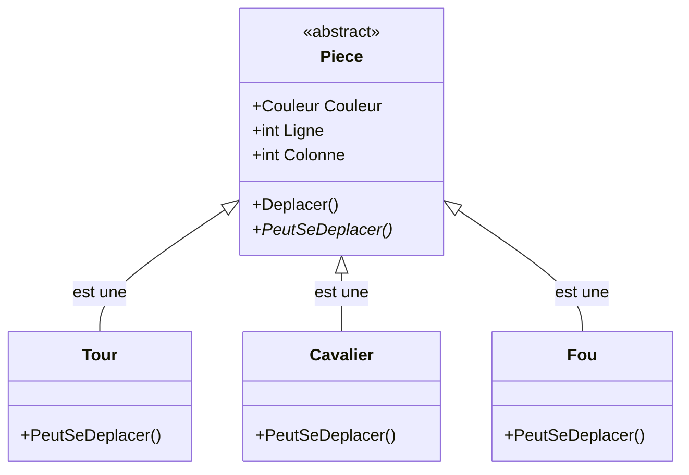

# Étape 2 : Héritage et Abstraction

Dans l'étape précédente, nous avons identifié un problème majeur : notre méthode `PeutSeDeplacer` contient un `switch` géant qui mélange la logique de toutes les pièces. 

Dans cette étape, nous allons résoudre ce problème grâce à l'**héritage** et l'**abstraction**.

::: tip 🎯 Objectifs de cette étape
- Comprendre pourquoi l'héritage est la solution à notre problème
- Créer une classe abstraite `Piece` qui définit un contrat
- Implémenter des classes spécialisées pour chaque type de pièce
- Voir comment le code devient plus organisé et maintenable
:::

::: info 📦 Télécharger le code source
Le code complet de cette étape est disponible sur GitHub : [**Voir sur GitHub**](https://github.com/fpluquet/csharp-oo-syllabus/tree/main/docs/public/codes/etape2-heritage)

Pour l'exécuter : `dotnet run` dans le dossier téléchargé.
:::

## Rappel du problème

Voici ce que nous avions à la fin de l'étape 1 :

```csharp
public class Piece
{
    public bool PeutSeDeplacer(int versLigne, int versColonne)
    {
        switch (Type)  // 😰 Ce switch va grossir indéfiniment !
        {
            case TypePiece.Tour:     // logique tour
            case TypePiece.Fou:      // logique fou
            case TypePiece.Dame:     // logique dame
            case TypePiece.Roi:      // logique roi
            case TypePiece.Cavalier: // logique cavalier
            case TypePiece.Pion:     // logique pion
        }
    }
}
```

Le problème fondamental : **une seule classe essaie de gérer tous les comportements**.

## L'idée de l'héritage

Réfléchissons différemment. Dans le monde réel :
- Un **cavalier** EST une pièce d'échecs
- Une **tour** EST une pièce d'échecs
- Un **pion** EST une pièce d'échecs

Toutes sont des pièces, mais chacune a ses propres règles de déplacement.

L'héritage modélise exactement cette relation "**est-un**" :



Chaque classe dérivée **hérite** des caractéristiques communes (couleur, position) mais **implémente** sa propre logique de déplacement.

## Étape par étape : transformer notre code

### 1. Rendre la classe Piece abstraite

Commençons par modifier notre classe `Piece`. Le mot-clé `abstract` indique qu'on ne peut pas créer directement un objet `Piece` — on doit créer un type spécifique (Tour, Cavalier, etc.).

```csharp
public abstract class Piece  // ← Ajout de 'abstract'
{
    public Couleur Couleur { get; }
    public int Ligne { get; private set; }
    public int Colonne { get; private set; }

    protected Piece(Couleur couleur, int ligne, int colonne)
    {
        Couleur = couleur;
        Ligne = ligne;
        Colonne = colonne;
    }
    
    // ... le reste
}
```

::: info 💡 Pourquoi `protected` pour le constructeur ?
Le modificateur `protected` permet aux classes dérivées d'appeler ce constructeur, mais empêche le code externe de l'utiliser directement. C'est logique : on ne veut pas créer une "Piece" générique, mais toujours un type spécifique.
:::

### 2. Définir une méthode abstraite

Ensuite, transformons la méthode `PeutSeDeplacer` en méthode **abstraite**. Une méthode abstraite n'a pas d'implémentation — elle définit un **contrat** que les classes dérivées doivent respecter.

```csharp
public abstract class Piece
{
    // ... propriétés et constructeur ...

    // ❌ On SUPPRIME le switch géant !
    
    // ✅ On le remplace par une méthode abstraite :
    public abstract bool PeutSeDeplacer(int versLigne, int versColonne);
}
```

Cette ligne dit : "Toute pièce DOIT pouvoir répondre à la question 'peux-tu te déplacer vers cette position ?', mais CHAQUE pièce décide comment répondre."

### 3. Transformer le symbole en propriété abstraite

De même, chaque pièce a son propre symbole. Transformons `GetSymbole()` en une propriété abstraite :

```csharp
public abstract class Piece
{
    // ... 
    
    public abstract char Symbole { get; }  // Chaque pièce définit son symbole
}
```

### 4. Ajouter des méthodes utilitaires

Pour faciliter le calcul des déplacements, ajoutons des méthodes protégées que toutes les pièces pourront utiliser :

```csharp
public abstract class Piece
{
    // ... propriétés, constructeur, méthodes abstraites ...

    // Méthodes utilitaires pour les classes dérivées
    protected int DeltaLigne(int versLigne) => Math.Abs(versLigne - Ligne);
    protected int DeltaColonne(int versColonne) => Math.Abs(versColonne - Colonne);
}
```

Le mot-clé `protected` rend ces méthodes accessibles aux classes dérivées, mais pas au code externe.

## Créer les classes dérivées

Maintenant, créons une classe pour chaque type de pièce. Chacune hérite de `Piece` et implémente sa propre logique.

### La Tour

La tour se déplace en ligne droite : soit horizontalement, soit verticalement.

```csharp
// Fichier: Pieces/Tour.cs
namespace Echecs.Pieces;

public class Tour : Piece  // ← Hérite de Piece
{
    // Implémentation de la propriété abstraite
    public override char Symbole => Couleur == Couleur.Blanc ? '♖' : '♜';

    // Constructeur : appelle le constructeur parent avec 'base'
    public Tour(Couleur couleur, int ligne, int colonne) 
        : base(couleur, ligne, colonne) 
    { }

    // Implémentation de la méthode abstraite
    public override bool PeutSeDeplacer(int versLigne, int versColonne)
    {
        // La tour se déplace en ligne droite uniquement
        // → soit la ligne ne change pas, soit la colonne ne change pas
        return DeltaLigne(versLigne) == 0 || DeltaColonne(versColonne) == 0;
    }
}
```

Décortiquons les éléments clés :

1. **`: Piece`** — indique que `Tour` hérite de `Piece`
2. **`override`** — indique qu'on redéfinit un membre de la classe parent
3. **`: base(...)`** — appelle le constructeur de la classe parent

### Le Fou

Le fou se déplace uniquement en diagonale :

```csharp
// Fichier: Pieces/Fou.cs
namespace Echecs.Pieces;

public class Fou : Piece
{
    public override char Symbole => Couleur == Couleur.Blanc ? '♗' : '♝';

    public Fou(Couleur couleur, int ligne, int colonne) 
        : base(couleur, ligne, colonne) 
    { }

    public override bool PeutSeDeplacer(int versLigne, int versColonne)
    {
        int dL = DeltaLigne(versLigne);
        int dC = DeltaColonne(versColonne);
        
        // Diagonale = même déplacement horizontal que vertical
        // Et il faut bouger d'au moins une case
        return dL == dC && dL > 0;
    }
}
```

### La Dame

La dame combine les mouvements de la tour et du fou :

```csharp
// Fichier: Pieces/Dame.cs
namespace Echecs.Pieces;

public class Dame : Piece
{
    public override char Symbole => Couleur == Couleur.Blanc ? '♕' : '♛';

    public Dame(Couleur couleur, int ligne, int colonne) 
        : base(couleur, ligne, colonne) 
    { }

    public override bool PeutSeDeplacer(int versLigne, int versColonne)
    {
        int dL = DeltaLigne(versLigne);
        int dC = DeltaColonne(versColonne);
        
        // Comme une tour (ligne droite)
        bool commeTour = dL == 0 || dC == 0;
        
        // Ou comme un fou (diagonale)
        bool commeFou = dL == dC && dL > 0;
        
        return commeTour || commeFou;
    }
}
```

### Le Roi

Le roi se déplace d'une seule case dans toutes les directions :

```csharp
// Fichier: Pieces/Roi.cs
namespace Echecs.Pieces;

public class Roi : Piece
{
    public override char Symbole => Couleur == Couleur.Blanc ? '♔' : '♚';

    public Roi(Couleur couleur, int ligne, int colonne) 
        : base(couleur, ligne, colonne) 
    { }

    public override bool PeutSeDeplacer(int versLigne, int versColonne)
    {
        int dL = DeltaLigne(versLigne);
        int dC = DeltaColonne(versColonne);
        
        // Maximum 1 case dans chaque direction
        // Mais il faut bouger !
        return dL <= 1 && dC <= 1 && (dL > 0 || dC > 0);
    }
}
```

### Le Cavalier

Le cavalier a un mouvement unique en "L" :

```csharp
// Fichier: Pieces/Cavalier.cs
namespace Echecs.Pieces;

public class Cavalier : Piece
{
    public override char Symbole => Couleur == Couleur.Blanc ? '♘' : '♞';

    public Cavalier(Couleur couleur, int ligne, int colonne) 
        : base(couleur, ligne, colonne) 
    { }

    public override bool PeutSeDeplacer(int versLigne, int versColonne)
    {
        int dL = DeltaLigne(versLigne);
        int dC = DeltaColonne(versColonne);
        
        // Mouvement en L : 2 cases + 1 case perpendiculaire
        return (dL == 2 && dC == 1) || (dL == 1 && dC == 2);
    }
}
```

### Le Pion

Le pion est la pièce la plus complexe ! Il a plusieurs règles spéciales :
- Il avance toujours dans la même direction (jamais en arrière)
- Il avance de 1 case normalement
- Il peut avancer de 2 cases depuis sa position de départ
- Il capture en diagonale (pas implémenté ici pour simplifier)

```csharp
// Fichier: Pieces/Pion.cs
namespace Echecs.Pieces;

public class Pion : Piece
{
    public override char Symbole => Couleur == Couleur.Blanc ? '♙' : '♟';

    public Pion(Couleur couleur, int ligne, int colonne) 
        : base(couleur, ligne, colonne) 
    { }

    public override bool PeutSeDeplacer(int versLigne, int versColonne)
    {
        // Le pion ne change pas de colonne (hors capture)
        if (DeltaColonne(versColonne) != 0)
            return false;

        // Direction selon la couleur
        int direction = Couleur == Couleur.Blanc ? 1 : -1;
        int deltaLigne = versLigne - Ligne;

        // Avance d'une case dans la bonne direction
        if (deltaLigne == direction)
            return true;

        // Avance de deux cases depuis la position initiale
        int ligneInitiale = Couleur == Couleur.Blanc ? 1 : 6;
        if (Ligne == ligneInitiale && deltaLigne == 2 * direction)
            return true;

        return false;
    }
}
```

## Mise à jour du Plateau

Le plateau doit maintenant créer les bonnes classes de pièces :

```csharp
// Fichier: Plateau.cs
using Echecs.Pieces;  // ← Nouveau namespace

namespace Echecs;

public class Plateau
{
    private readonly Piece?[,] _cases = new Piece?[8, 8];

    public Plateau()
    {
        InitialiserPieces();
    }

    private void InitialiserPieces()
    {
        // Pièces blanches
        PlacerRangeeArriere(0, Couleur.Blanc);
        PlacerPions(1, Couleur.Blanc);

        // Pièces noires
        PlacerPions(6, Couleur.Noir);
        PlacerRangeeArriere(7, Couleur.Noir);
    }

    private void PlacerRangeeArriere(int ligne, Couleur couleur)
    {
        // ✅ On crée maintenant des objets du type spécifique !
        _cases[ligne, 0] = new Tour(couleur, ligne, 0);
        _cases[ligne, 1] = new Cavalier(couleur, ligne, 1);
        _cases[ligne, 2] = new Fou(couleur, ligne, 2);
        _cases[ligne, 3] = new Dame(couleur, ligne, 3);
        _cases[ligne, 4] = new Roi(couleur, ligne, 4);
        _cases[ligne, 5] = new Fou(couleur, ligne, 5);
        _cases[ligne, 6] = new Cavalier(couleur, ligne, 6);
        _cases[ligne, 7] = new Tour(couleur, ligne, 7);
    }

    private void PlacerPions(int ligne, Couleur couleur)
    {
        for (int col = 0; col < 8; col++)
        {
            _cases[ligne, col] = new Pion(couleur, ligne, col);
        }
    }
    
    // ... le reste du code reste identique !
}
```

Remarquez que la méthode `TenterDeplacement` **n'a pas changé** :

```csharp
public bool TenterDeplacement(int deLigne, int deColonne, 
                               int versLigne, int versColonne)
{
    Piece? piece = GetPiece(deLigne, deColonne);
    
    if (piece == null)
        return false;

    // ✨ Ici, le polymorphisme fait sa magie !
    // piece.PeutSeDeplacer appelle la bonne version automatiquement
    if (!piece.PeutSeDeplacer(versLigne, versColonne))
        return false;

    // ... reste du code
}
```

Le code appelle `piece.PeutSeDeplacer()` sans savoir quel type de pièce c'est. C'est le **polymorphisme** en action — nous l'approfondirons à l'étape 3.

## Test de notre nouveau code

```csharp
using Echecs;

Plateau plateau = new();
plateau.Afficher();

// Test 1 : Cavalier (mouvement en L)
Console.WriteLine("\n--- Cavalier b1 → c3 (mouvement en L) ---");
bool r1 = plateau.TenterDeplacement(0, 1, 2, 2);
Console.WriteLine(r1 ? "✓ Réussi" : "✗ Échoué");

// Test 2 : Pion (avance de 2 cases au départ)
Console.WriteLine("\n--- Pion e2 → e4 (2 cases au départ) ---");
bool r2 = plateau.TenterDeplacement(1, 4, 3, 4);
Console.WriteLine(r2 ? "✓ Réussi" : "✗ Échoué");

// Test 3 : Tour (mouvement invalide en diagonale)
Console.WriteLine("\n--- Tour a1 → c3 (diagonale = invalide) ---");
bool r3 = plateau.TenterDeplacement(0, 0, 2, 2);
Console.WriteLine(r3 ? "✓ Réussi" : "✗ Échoué");

plateau.Afficher();
```

**Résultat :**

```
--- Cavalier b1 → c3 (mouvement en L) ---
✓ Réussi

--- Pion e2 → e4 (2 cases au départ) ---
✓ Réussi

--- Tour a1 → c3 (diagonale = invalide) ---
✗ Échoué
```

Chaque pièce applique ses propres règles ! 🎉

## ✅ Bilan de l'étape 2

### Ce que nous avons gagné

| Avant (Étape 1) | Après (Étape 2) |
|-----------------|-----------------|
| 1 classe avec un switch géant | 7 classes spécialisées |
| Modifier `Piece` pour chaque pièce | Ajouter une nouvelle classe |
| Logique mélangée | Chaque fichier = 1 pièce |
| Difficile à tester | Chaque pièce testable isolément |

### Structure du projet

```
Echecs/
├── Couleur.cs
├── Plateau.cs
└── Pieces/
    ├── Piece.cs      (abstraite)
    ├── Roi.cs
    ├── Dame.cs
    ├── Tour.cs
    ├── Fou.cs
    ├── Cavalier.cs
    └── Pion.cs
```

::: tip ✨ Principe ouvert/fermé respecté !
Pour ajouter une nouvelle pièce (exemple : une "Amazone" qui combine dame et cavalier), il suffit de :
1. Créer `Amazone.cs`
2. Hériter de `Piece`
3. Implémenter `PeutSeDeplacer` et `Symbole`

**Aucune modification des classes existantes !**
:::

## ❌ Ce qui reste à améliorer

Notre code est mieux structuré, mais un aspect reste mystérieux. Regardez ce code :

```csharp
Piece? piece = GetPiece(ligne, colonne);  // piece est de type Piece
piece.PeutSeDeplacer(...)                  // Mais appelle Tour, Cavalier, etc.
```

La variable `piece` est déclarée comme `Piece` (la classe abstraite), mais quand on appelle `PeutSeDeplacer`, c'est la version de la classe concrète (Tour, Cavalier...) qui s'exécute.

**Comment C# sait-il quelle méthode appeler ?**

C'est le **polymorphisme** — et nous allons l'explorer en détail à l'étape suivante.

De plus, nous avons un autre problème latent : notre classe `Plateau` fait **trop de choses** :
- Stocker les pièces
- Valider les déplacements  
- **Afficher** le plateau ← Problème !

Que se passe-t-il si on veut une interface graphique au lieu de la console ? Il faudrait modifier `Plateau`, ce qui n'est pas idéal.

## 🎯 Vers l'étape 3

Rendez-vous à l'[Étape 3 : Polymorphisme](./16c-etape3-polymorphisme.md) pour comprendre comment C# choisit dynamiquement la bonne méthode !

## 📝 Code complet de l'étape 2

::: details Cliquez pour voir le code complet

**Pieces/Piece.cs**
```csharp
namespace Echecs.Pieces;

public abstract class Piece
{
    public Couleur Couleur { get; }
    public int Ligne { get; private set; }
    public int Colonne { get; private set; }

    public abstract char Symbole { get; }

    protected Piece(Couleur couleur, int ligne, int colonne)
    {
        Couleur = couleur;
        Ligne = ligne;
        Colonne = colonne;
    }

    public void Deplacer(int nouvelleLigne, int nouvelleColonne)
    {
        Ligne = nouvelleLigne;
        Colonne = nouvelleColonne;
    }

    public abstract bool PeutSeDeplacer(int versLigne, int versColonne);

    protected int DeltaLigne(int versLigne) => Math.Abs(versLigne - Ligne);
    protected int DeltaColonne(int versColonne) => Math.Abs(versColonne - Colonne);
}
```

**Pieces/Tour.cs**
```csharp
namespace Echecs.Pieces;

public class Tour : Piece
{
    public override char Symbole => Couleur == Couleur.Blanc ? '♖' : '♜';

    public Tour(Couleur couleur, int ligne, int colonne) 
        : base(couleur, ligne, colonne) { }

    public override bool PeutSeDeplacer(int versLigne, int versColonne)
    {
        return DeltaLigne(versLigne) == 0 || DeltaColonne(versColonne) == 0;
    }
}
```

**Pieces/Fou.cs**
```csharp
namespace Echecs.Pieces;

public class Fou : Piece
{
    public override char Symbole => Couleur == Couleur.Blanc ? '♗' : '♝';

    public Fou(Couleur couleur, int ligne, int colonne) 
        : base(couleur, ligne, colonne) { }

    public override bool PeutSeDeplacer(int versLigne, int versColonne)
    {
        int dL = DeltaLigne(versLigne);
        int dC = DeltaColonne(versColonne);
        return dL == dC && dL > 0;
    }
}
```

**Pieces/Dame.cs**
```csharp
namespace Echecs.Pieces;

public class Dame : Piece
{
    public override char Symbole => Couleur == Couleur.Blanc ? '♕' : '♛';

    public Dame(Couleur couleur, int ligne, int colonne) 
        : base(couleur, ligne, colonne) { }

    public override bool PeutSeDeplacer(int versLigne, int versColonne)
    {
        int dL = DeltaLigne(versLigne);
        int dC = DeltaColonne(versColonne);
        
        bool commeTour = dL == 0 || dC == 0;
        bool commeFou = dL == dC && dL > 0;
        
        return commeTour || commeFou;
    }
}
```

**Pieces/Roi.cs**
```csharp
namespace Echecs.Pieces;

public class Roi : Piece
{
    public override char Symbole => Couleur == Couleur.Blanc ? '♔' : '♚';

    public Roi(Couleur couleur, int ligne, int colonne) 
        : base(couleur, ligne, colonne) { }

    public override bool PeutSeDeplacer(int versLigne, int versColonne)
    {
        int dL = DeltaLigne(versLigne);
        int dC = DeltaColonne(versColonne);
        return dL <= 1 && dC <= 1 && (dL > 0 || dC > 0);
    }
}
```

**Pieces/Cavalier.cs**
```csharp
namespace Echecs.Pieces;

public class Cavalier : Piece
{
    public override char Symbole => Couleur == Couleur.Blanc ? '♘' : '♞';

    public Cavalier(Couleur couleur, int ligne, int colonne) 
        : base(couleur, ligne, colonne) { }

    public override bool PeutSeDeplacer(int versLigne, int versColonne)
    {
        int dL = DeltaLigne(versLigne);
        int dC = DeltaColonne(versColonne);
        return (dL == 2 && dC == 1) || (dL == 1 && dC == 2);
    }
}
```

**Pieces/Pion.cs**
```csharp
namespace Echecs.Pieces;

public class Pion : Piece
{
    public override char Symbole => Couleur == Couleur.Blanc ? '♙' : '♟';

    public Pion(Couleur couleur, int ligne, int colonne) 
        : base(couleur, ligne, colonne) { }

    public override bool PeutSeDeplacer(int versLigne, int versColonne)
    {
        if (DeltaColonne(versColonne) != 0)
            return false;

        int direction = Couleur == Couleur.Blanc ? 1 : -1;
        int deltaLigne = versLigne - Ligne;

        if (deltaLigne == direction)
            return true;

        int ligneInitiale = Couleur == Couleur.Blanc ? 1 : 6;
        if (Ligne == ligneInitiale && deltaLigne == 2 * direction)
            return true;

        return false;
    }
}
```

**Plateau.cs**
```csharp
using Echecs.Pieces;

namespace Echecs;

public class Plateau
{
    private readonly Piece?[,] _cases = new Piece?[8, 8];

    public Plateau()
    {
        InitialiserPieces();
    }

    private void InitialiserPieces()
    {
        PlacerRangeeArriere(0, Couleur.Blanc);
        PlacerPions(1, Couleur.Blanc);
        PlacerPions(6, Couleur.Noir);
        PlacerRangeeArriere(7, Couleur.Noir);
    }

    private void PlacerRangeeArriere(int ligne, Couleur couleur)
    {
        _cases[ligne, 0] = new Tour(couleur, ligne, 0);
        _cases[ligne, 1] = new Cavalier(couleur, ligne, 1);
        _cases[ligne, 2] = new Fou(couleur, ligne, 2);
        _cases[ligne, 3] = new Dame(couleur, ligne, 3);
        _cases[ligne, 4] = new Roi(couleur, ligne, 4);
        _cases[ligne, 5] = new Fou(couleur, ligne, 5);
        _cases[ligne, 6] = new Cavalier(couleur, ligne, 6);
        _cases[ligne, 7] = new Tour(couleur, ligne, 7);
    }

    private void PlacerPions(int ligne, Couleur couleur)
    {
        for (int col = 0; col < 8; col++)
        {
            _cases[ligne, col] = new Pion(couleur, ligne, col);
        }
    }

    public Piece? GetPiece(int ligne, int colonne)
    {
        if (ligne < 0 || ligne > 7 || colonne < 0 || colonne > 7)
            return null;
        return _cases[ligne, colonne];
    }

    public bool TenterDeplacement(int deLigne, int deColonne, 
                                   int versLigne, int versColonne)
    {
        Piece? piece = GetPiece(deLigne, deColonne);
        
        if (piece == null)
            return false;

        if (!piece.PeutSeDeplacer(versLigne, versColonne))
            return false;

        _cases[versLigne, versColonne] = piece;
        _cases[deLigne, deColonne] = null;
        piece.Deplacer(versLigne, versColonne);
        
        return true;
    }

    public void Afficher()
    {
        Console.WriteLine("  a b c d e f g h");
        Console.WriteLine("  ─────────────────");
        
        for (int ligne = 7; ligne >= 0; ligne--)
        {
            Console.Write($"{ligne + 1}│");
            for (int col = 0; col < 8; col++)
            {
                Piece? piece = _cases[ligne, col];
                if (piece != null)
                {
                    Console.Write($"{piece.Symbole} ");
                }
                else
                {
                    Console.Write((ligne + col) % 2 == 0 ? "□ " : "■ ");
                }
            }
            Console.WriteLine($"│{ligne + 1}");
        }
        
        Console.WriteLine("  ─────────────────");
        Console.WriteLine("  a b c d e f g h");
    }
}
```
:::
