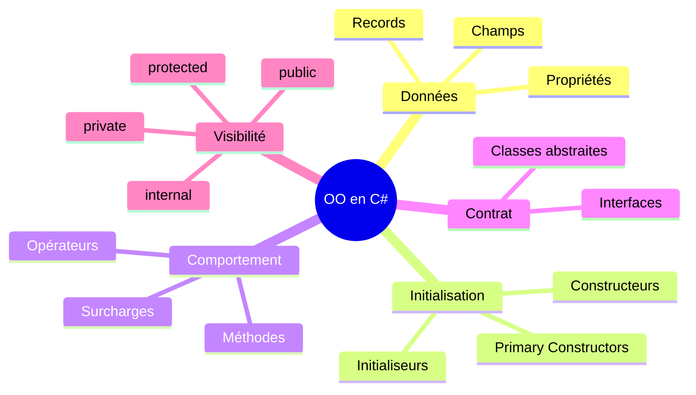

# Programmation Orientée Objet en C# - BA1
## M. Frédéric Pluquet

Bienvenue dans le cours de Programmation Orientée Objet pour les étudiants de première année!

Ce syllabus fait suite au [cours d'introduction à la programmation C#](https://fpluquet.github.io/csharp-intro-syllabus/) et couvre les concepts essentiels de la programmation orientée objet.

::: tip Prérequis
Ce cours suppose que vous maîtrisez les bases de C# : variables, types, opérateurs, structures de contrôle, tableaux, fonctions et gestion des exceptions.
:::

## Objectifs du cours

À la fin de ce cours, vous serez capable de :
- Comprendre et appliquer les principes de la programmation orientée objet
- Concevoir et implémenter des classes en C#
- Utiliser l'encapsulation pour protéger vos données
- Maîtriser les fonctionnalités modernes de C# (records, pattern matching, etc.)

## Contenu du cours

### Partie I - Les Fondamentaux de l'OO

1. [Introduction à l'OO](./01-introduction-oo.md) - Du procédural à l'objet
2. [Classes et Objets](./02-classes-objets.md) - Anatomie d'une classe et instanciation
3. [Constructeurs](./03-constructeurs.md) - Le cycle de vie des objets
4. [Encapsulation et Propriétés](./04-encapsulation.md) - Protection et accès aux données
5. [Membres Statiques](./05-membres-statiques.md) - Données et comportements partagés
6. [Passage de Paramètres](./06-passage-parametres.md) - ref, out et paramètres optionnels
7. [Concepts Avancés](./07-concepts-avances.md) - Surcharge d'opérateurs, itérateurs

### Partie II - Extensions Modernes de l'OO (C# 8.0 à 12.0)

8. [Records](./08-records.md) - Objets immuables et comparaison par valeur
9. [Primary Constructors](./09-primary-constructors.md) - Syntaxe concise C# 12+
10. [Nullable Reference Types](./10-nullable-reference-types.md) - Sécurité du null
11. [Propriétés Init-Only](./11-proprietes-init.md) - Immutabilité contrôlée
12. [Interfaces Modernes](./12-interfaces-modernes.md) - Implémentation par défaut
13. [Pattern Matching](./13-pattern-matching.md) - Filtrage par motif

## Synthèse visuelle de la structure OO

## Ressources complémentaires

- [Documentation officielle C#](https://docs.microsoft.com/fr-fr/dotnet/csharp/)
- [C# Programming Guide](https://docs.microsoft.com/fr-fr/dotnet/csharp/programming-guide/)
