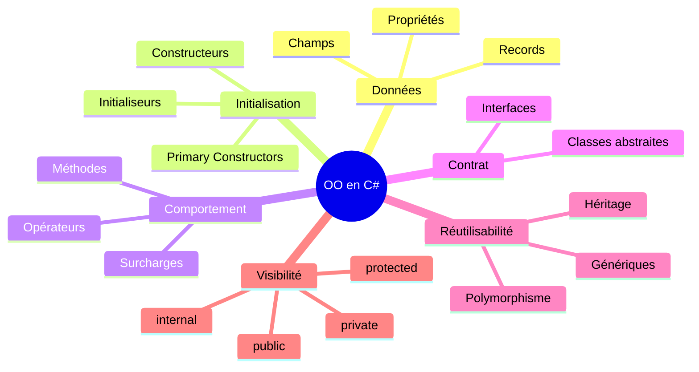

# Programmation Orientée Objet en C# - BA1
## M. Frédéric Pluquet

Bienvenue dans le cours de Programmation Orientée Objet pour les étudiants de première année!

Ce syllabus fait suite au [cours d'introduction à la programmation C#](https://fpluquet.github.io/csharp-intro-syllabus/) et couvre les concepts essentiels de la programmation orientée objet.

::: tip Prérequis
Ce cours suppose que vous maîtrisez les bases de C# : variables, types, opérateurs, structures de contrôle, tableaux, fonctions et gestion des exceptions.
:::

## Objectifs du cours

À la fin de ce cours, vous serez capable de :
- Comprendre et appliquer les principes de la programmation orientée objet
- Concevoir et implémenter des classes en C#
- Utiliser l'encapsulation pour protéger vos données
- Définir et implémenter des interfaces pour découpler votre code
- Créer des classes et interfaces génériques réutilisables
- Maîtriser les fonctionnalités modernes de C# (records, pattern matching, etc.)

## Contenu du cours

### Partie I - Les Fondamentaux de l'OO

1. [Introduction à l'OO](./01-introduction-oo.md) - Du procédural à l'objet
2. [Classes et Objets](./02-classes-objets.md) - Anatomie d'une classe et instanciation
3. [Constructeurs](./03-constructeurs.md) - Le cycle de vie des objets
4. [Encapsulation et Propriétés](./04-encapsulation.md) - Protection et accès aux données
5. [Membres Statiques](./05-membres-statiques.md) - Données et comportements partagés
6. [Passage de Paramètres](./06-passage-parametres.md) - ref, out et paramètres optionnels
7. [Héritage](./07-heritage.md) - Réutilisation de code et hiérarchies
8. [Polymorphisme](./08-polymorphisme.md) - Comportements polymorphes et virtuels
9. [Interfaces](./09-interfaces.md) - Contrats, découplage et interfaces .NET
10. [Classes et Interfaces Génériques](./10-generiques.md) - Réutilisabilité et sécurité de type
11. [Concepts Avancés](./11-concepts-avances.md) - Surcharge d'opérateurs, itérateurs

### Partie II - Extensions Modernes de l'OO (C# 8.0 à 12.0)

12. [Records](./12-records.md) - Objets immuables et comparaison par valeur
13. [Primary Constructors](./13-primary-constructors.md) - Syntaxe concise C# 12+
14. [Nullable Reference Types](./14-nullable-reference-types.md) - Sécurité du null
15. [Propriétés Init-Only](./15-proprietes-init.md) - Immutabilité contrôlée
16. [Interfaces Modernes](./16-interfaces-modernes.md) - Implémentation par défaut
17. [Pattern Matching](./17-pattern-matching.md) - Filtrage par motif

### Partie III - Projet Fil Rouge

18. [Projet : Jeu d'Échecs](./18-projet-echecs.md) - Application complète des concepts OO

## Synthèse visuelle de la structure OO

```mermaid
mindmap
  root((OO en C#))
    Données
      Champs
      Propriétés
      Records
    Initialisation
      Constructeurs
      Primary Constructors
      Initialiseurs
    Comportement
      Méthodes
      Surcharges
      Opérateurs
    Contrat
      Interfaces
      Classes abstraites
    Réutilisabilité
      Héritage
      Génériques
      Polymorphisme
    Visibilité
      public
      private
      protected
      internal
```

## Ressources complémentaires

- [Documentation officielle C#](https://docs.microsoft.com/fr-fr/dotnet/csharp/)
- [C# Programming Guide](https://docs.microsoft.com/fr-fr/dotnet/csharp/programming-guide/)
